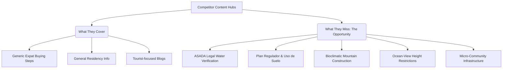
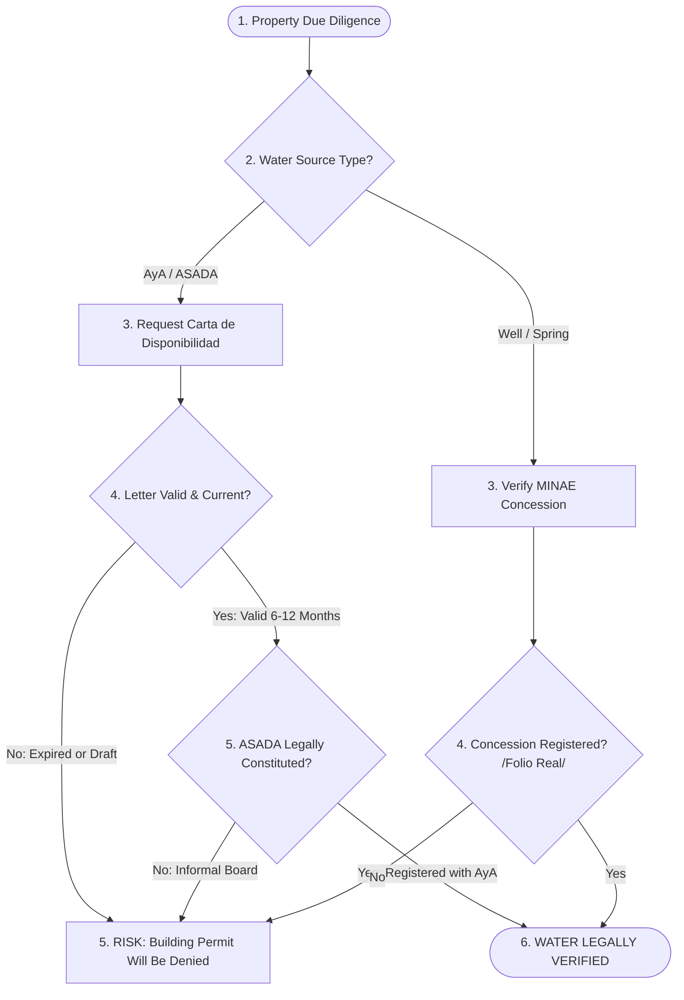

# Competitor SERP & Content Gap Findings Report
## Real Estate Landscape in Pérez Zeledón & Dominical

This report provides a systematic analysis of the search engine results pages (SERPs) and content gaps for real estate searches in the **Pérez Zeledón** (San Isidro de El General / mountain valley) and **Dominical** (coastal/surf lifestyle) regions of Costa Rica. 

By analyzing the current positioning of organic search competitors, their blind spots, and high-intent topical gaps, this report outlines a comprehensive strategy to position **REMAX Altitud's Lifestyle & Relocation Content Hub** as the leading authority in the Southern Zone.

---

## 1. Executive Summary

The real estate market in the Southern Zone of Costa Rica—stretching from the agricultural, high-altitude valley of Pérez Zeledón to the eco-luxury, world-class surf coast of Dominical—has stabilized into a mature, buyer-favorable landscape. Foreign expats, retirees, digital nomads, and eco-conscious investors are seeking transactional security, sustainable building options, and clear local context.

However, a systematic SERP audit reveals a **critical information asymmetry**:
* **Portal and Agency Sites** are optimized for standard search queries (e.g., "Dominical ocean view land for sale") and generic buying steps.
* **BUT they fail completely to provide granular, reliable due diligence and lifestyle context** regarding municipal regulations, local water laws, sustainable construction standards, and community-specific nuances.

> [!IMPORTANT]
> This "information gap" represents a major opportunity for **REMAX Altitud**. By producing hyper-local, authoritative, and regulatory-focused lifestyle guides, REMAX Altitud can capture high-intent, long-tail organic search traffic and establish unparalleled trust before a buyer even makes their first inquiry.

---

## 2. SERP Competitor Profiling

We analyzed organic search results for primary keywords like `"Pérez Zeledón real estate"`, `"Perez Zeledon properties"`, `"Dominical real estate"`, and `"Dominical homes for sale"`. The competitive landscape consists of three distinct tiers:

### Competitor Profiling Matrix

| Competitor Name | URL | Regional Focus | Content Strengths | Critical Weaknesses |
| :--- | :--- | :--- | :--- | :--- |
| **Coldwell Banker Vesta Group** *(Dominical Realty)* | `dominicalrealty.com` | Dominical, Uvita, Ojochal | Strong organic coastal SERP presence; excellent listing categorization. | Superficial blog content; lack of regulatory due diligence; minimal Pérez Zeledón coverage. |
| **2 Costa Rica Real Estate** | `2costaricarealestate.com` | National (with Southern Zone focus) | High-quality regional overview guides; professional design. | Focused heavily on national/luxury trends; misses hyper-local water & zoning mechanics. |
| **Century 21 Ballena Properties** | `c21ballenaproperties.com` | San Isidro (PZ) & Ballena Coast | Physical offices in both zones; localized listing inventory. | Standard corporate blog; no structured lifestyle content; outdated buying guides. |
| **LX Costa Rica** | `lxcostarica.com` | National / Ultra-Luxury | Premium presentation; targets high-net-worth individuals. | Extremely low coverage of PZ; completely ignores the mid-market and eco-construction realities. |
| **Local Boutiques** *(We Sell Paradise, Exclusive Homes)* | Various | Costa Ballena | Strong community feel; beach-lifestyle focus. | Low domain authority; erratic blogging; lack of technical depth on regulations. |

### SERP Competitor Summary
* **Dominical SERPs:** Dominated heavily by established global brands (Coldwell Banker/Dominical Realty, REMAX Costa Rica regional pages) and regional portals. Their focus is 95% listing-driven with a generic blog presence focusing on tourist attractions.
* **Pérez Zeledón SERPs:** Significantly less competitive. National portals and regional coastal agencies rank for PZ keywords with simple landing pages, meaning **the Pérez Zeledón organic landscape is ripe for disruption by a dedicated, content-rich hub.**

---

## 3. Competitor Content Audit & Blind Spots

A comprehensive review of competitor blogs, area guides, and resource hubs was conducted. The findings show that while competitors successfully cover superficial topics, they systematically ignore the technical, legal, and operational realities of relocating and building in the region.

### The "Superficiality Trap" (What Competitors Do)
* **Foreign Buyer Basics:** Nearly every site has an article titled *"Can Foreigners Buy Property in Costa Rica?"* covering the basic "Fee Simple" property rights.
* **Outdated Residency Specs:** Many sites still reference the old $200,000 USD residency investment threshold, rather than the updated **$150,000 USD** under Law 9996, creating a trust gap.
* **Surface-level Tourism Guides:** Articles focus on *"Top 5 Restaurants in Dominical"* or *"Hiking in Chirripó,"* which target top-of-funnel tourists rather than high-intent property buyers.

### Major Blind Spots (What Competitors Fail to Provide)
1. **The Legal Reality of Water (ASADAs):** Competitors list properties as having "water access" or a "water meter" but never explain the legally binding due diligence required to verify water availability for construction permits.
2. **Municipal Zoning Mechanics:** Competitors explain what a zoning plan is generally, but fail to explain how to obtain or interpret a **Certificado de Uso de Suelo** (Land Use Certificate) in Pérez Zeledón or Osa.
3. **Height & View Protections:** In Dominical/Costa Ballena, ocean views command million-dollar premiums. Yet, no competitor details the specific local height restrictions and setback rules that protect (or threaten) these views.
4. **Mountain-Specific Construction Dynamics:** While Pérez Zeledón is growing rapidly as an eco-sustainable building destination, no competitor provides technical guides on soil erosion, landslide risks, bioclimatic design, or sustainable community specifications.

---

## 4. Key "Topical Gaps" & Content Strategy

To establish REMAX Altitud's lifestyle content hub as the absolute authority, we must produce comprehensive, high-value, and SEO-optimized resources addressing these major blind spots. Below are the five core "topical gap" blueprints.

---

### Gap 1: The "ASADA Water Legality & Verification" Guide

Water is the single most critical asset in Costa Rican real estate. Without verified, legally registered water, a buyer cannot obtain a municipal construction permit, rendering raw land practically worthless.

* **Target Keywords:** `ASADA water letter Costa Rica`, `how to check water availability Costa Rica real estate`, `Carta de Disponibilidad de Agua Costa Rica`, `AyA vs ASADA water`.
* **Core Educational Content to Cover:**
  * **AyA vs. ASADAs:** Explain that while the national water authority (AyA) manages urban grids, rural and semi-rural areas (like the mountains of PZ and coastal ridges of Dominical) rely on community-managed water boards called **ASADAs**.
  * **The "Water Availability Letter" (Carta de Disponibilidad):** Clarify the massive misconception that having a physical water meter or pipe on the property means the property has legal building rights. Buyers must secure an official, up-to-date *Carta de Disponibilidad de Agua* issued by the ASADA.
  * **ASADA Legitimacy Check:** Highlight that the buyer's attorney must verify that the issuing ASADA is legally registered and authorized by AyA. Unregistered, informal ASADAs cannot issue valid letters for municipal building permits.
  * **Expiration Timelines:** Inform buyers that these letters are typically only valid for **6 to 12 months**. Buyers must understand the transaction risk of letting a letter expire before submitting construction plans.
  * **Red Flags to Avoid:** Warn against seller claims like *"water is just 50 meters away,"* *"we share a water concession,"* or *"you can easily dig a hand-well."* None of these constitute legal water rights for building.

---

### Gap 2: Zoning Regulations & Land Use Certificates (Uso de Suelo)

Understanding municipal regulatory plans (*Plan Regulador*) is essential to protect real estate investments. Buyers in Pérez Zeledón and Osa must navigate completely different local regulatory environments.

* **Target Keywords:** `Uso de Suelo Costa Rica real estate`, `Perez Zeledon zoning Plan Regulador`, `Dominical ocean-view height restrictions`, `Osa municipality building permits`.
* **Core Educational Content to Cover:**
  * **The Power of the "Uso de Suelo":** Define the *Certificado de Uso de Suelo* as the ultimate municipal zoning document. It dictates density, maximum property coverage (footprint), boundary setbacks (front, side, rear), and authorized uses (residential, commercial, agricultural).
  * **Pérez Zeledón Zoning Structure:** Detail the canton's *Plan Regulador* which dictates stricter rules in urban centers like San Isidro de El General and Daniel Flores, versus rural mountain districts (e.g., Rivas, General Viejo).
  * **Dominical Coastal Zoning (Osa Municipality):** 
    * Explain the **Maritime Zone Law (ZMT)**: the first 50 meters from high tide is public (undevelopable), and the next 150 meters is concession land (leasehold).
    * Detail the titled mountain developments in **Escaleras** and **Lagunas**, explaining municipal height restrictions (usually a maximum of 2 to 3 stories / 9 to 10 meters) designed to protect neighborhood ocean views and ensure structural stability on steep slopes.
  * **Agricultural Subdivisions (Uso Agropecuario):** Explain the minimum lot sizes for agricultural subdivisions and the involvement of INDER/IDA, which prevents buyers from subdividing large fincas into dense residential lots without proper authorization.

---

### Gap 3: Eco-Sustainable & Bioclimatic Construction in Pérez Zeledón

Pérez Zeledón is emerging as a premier destination for off-grid, sustainable communities, yet no competitor provides technical information on how to design and build in harmony with the local climate.

* **Target Keywords:** `sustainable developments Perez Zeledon`, `eco building Costa Rica mountains`, `bioclimatic architecture Costa Rica`, `Ecomaderas Perez Zeledon wood construction`.
* **Core Educational Content to Cover:**
  * **The "Valle del General" Climate Advantage:** Highlight that Pérez Zeledón’s elevation (700m - 1,200m+) offers a cooler, less humid mountain microclimate compared to the coast. This allows for true **bioclimatic architecture** (natural cross-ventilation, optimized sun angles) that minimizes or eliminates the need for expensive air conditioning.
  * **Sustainable Local Materials:** Introduce builders to regional building resources:
    * **Certified Timber:** Highlighting companies like *Ecomaderas del Sur* which provide local, pressure-treated, sustainably harvested wood.
    * **Alternative Materials:** The use of structural bamboo, thermal clay bricks, and hempcrete to naturally insulate mountain homes.
  * **Water & Energy Self-Sufficiency:** Detailed strategies for off-grid living:
    * Integration of **rainwater harvesting** and greywater filtration systems to maintain agricultural gardens.
    * Solar energy systems optimized for mountain cloud-cover cycles, featuring hybrid backup batteries.
  * **Slope Engineering & Soils:** Warn buyers about the necessity of soil mechanics tests (*estudio de suelos*) and structural retaining systems when building on steep mountain slopes to prevent landslides and soil erosion during heavy rains.

---

### Gap 4: Coastal (Dominical) vs. Mountain (Pérez Zeledón) Living

Expats are often torn between the dramatic coast of Dominical and the lush mountain valley of Pérez Zeledón. A structured comparison guide will capture high-intent buyers in the early decision-making phase.

* **Target Keywords:** `living in Dominical vs Perez Zeledon`, `coastal vs mountain Costa Rica real estate`, `Perez Zeledon expat cost of living`, `Dominical ocean-view property ROI`.
* **Core Educational Content to Cover:**

| Comparison Factor | Dominical (Coast) | Pérez Zeledón (Mountain Valley) |
| :--- | :--- | :--- |
| **Climate & Humidty** | Hot, tropical beach climate (80-90°F); high humidity; constant ocean breezes. | Fresh mountain/valley microclimates (65-80°F); lower humidity; cooler nights. |
| **Lifestyle & Vibe** | Bohemian, surf-centric, wellness & yoga-focused, luxury-villa tourism. | Deep cultural immersion, traditional agricultural center, community-focused, active. |
| **Property Valuation** | Premium pricing; high cost per square foot; strong luxury rental yields. | Significantly lower entry prices; larger land parcels (fincas) available; stable valuation. |
| **Rental Income Yield** | High seasonal vacation rental income ($40K - $80K/year for ocean-view villas). | Focused on long-term expat rentals or digital nomad retreats; lower yields but highly stable. |
| **Infrastructure** | Tourist amenities, restaurants, boutique shops, basic clinics. | Full municipal services, major hospitals, international schools, extensive commerce. |

* **The Route 243 Connection (The Synergy):** Emphasize that buyers do not have to compromise. **Route 243** connects San Isidro de El General to Dominical in a scenic, fully paved **35-minute drive**. A homeowner in Pérez Zeledón can easily enjoy a cooler, more affordable mountain lifestyle while remaining minutes from world-class surf.

---

### Gap 5: Hyper-Local Surf Lifestyle & Ocean-View Protections in Dominical

Buyers looking at Dominical are purchasing a lifestyle, not just real estate. High-intent search traffic exists for specific surf and topography details linked to real estate values.

* **Target Keywords:** `Dominical surf real estate`, `ocean view land Escaleras Dominical`, `best surf breaks Costa Ballena`, `protecting ocean view Costa Rica property`.
* **Core Educational Content to Cover:**
  * **Surf Break Real Estate Correlation:** Provide an interactive mapping or breakdown of Dominical's legendary breaks:
    * **Playa Dominical (Main Break):** World-class, powerful, consistent beach break. Appeals to advanced surfers, driving high rental yields for villas overlooking this sector.
    * **Dominicalito (The Bay):** Protected bay with calmer, beginner-friendly waves. Highly popular for families seeking beachfront land.
    * **Playa Hermosa (Dominical):** Long, beautiful sandy beach break perfect for intermediate surfers. Nearby land is highly prized.
  * **Ocean-View Security:** How to protect a million-dollar ocean view:
    * Warn buyers about **"view obstruction risk."** Explain that in Costa Rica, you do not automatically own the rights to the air/view space in front of your property.
    * Recommend buyers purchase adjacent view corridors or verify that the land in front of their plot is either undevelopable protected reserve (*Zona de Protección*) or has height restrictions in the municipal *Uso de Suelo* that prevent obstruction.

---

## 5. Actionable Recommendations for REMAX Altitud

To transform these insights into a high-converting organic search machine, REMAX Altitud should execute the following roadmap:

### 1. Build the "Altitud Lifestyle & Relocation Hub"
* **Structure:** Create a beautifully designed, dedicated sub-directory on the website: `remax-altitud.com/relocation-hub`.
* **Layout:** Organize content into clean hubs: *Legal & Due Diligence*, *Sustainable Building*, *Coastal vs. Mountain*, and *Surf & Lifestyle Guides*.
* **Interactive Tooling:** Develop simple, high-engagement tools to capture leads:
  * **Water Verification Flowchart:** An interactive wizard that asks buyers questions about their property’s water setup and outputs a custom "ASADA Due Diligence PDF" in exchange for their email.
  * **Closing Cost Calculator:** A tool calculating Costa Rican transfer taxes, notary fees, and VAT based on the purchase price.
  * **Mountain vs. Beach Quiz:** A interactive lifestyle quiz directing users to listings in Pérez Zeledón or Dominical based on their preferences.

### 2. Multi-Language (EN/ES) Synchronization
* Ensure all guides are professionally translated and indexed in both English and Spanish. Spanish-language guides targeting keywords like `plan regulador perez zeledon construccion` or `disponibilidad de agua de ASADA` will capture local Costa Rican investors and local attorneys seeking reference information, driving high-quality local backlinks.

### 3. Integrate Educational Lead Magnets into Listing Pages
* Place context-aware banners on property search and listing pages.
  * *On a raw land listing in Pérez Zeledón:* *"Before you buy raw land, download our free ASADA Water Availability Due Diligence Guide."*
  * *On an ocean-view villa listing in Escaleras:* *"Learn how Osa Municipality height restrictions protect this property's ocean view. Click here."*

---

### Conclusion
By filling these critical regulatory and hyper-local lifestyle information gaps, REMAX Altitud will transcend standard listing portals. The content hub will capture high-intent buyers during their initial research phase, build immediate authority, and ensure that when they are ready to purchase, REMAX Altitud is the only agency they trust to guide them through the process.
