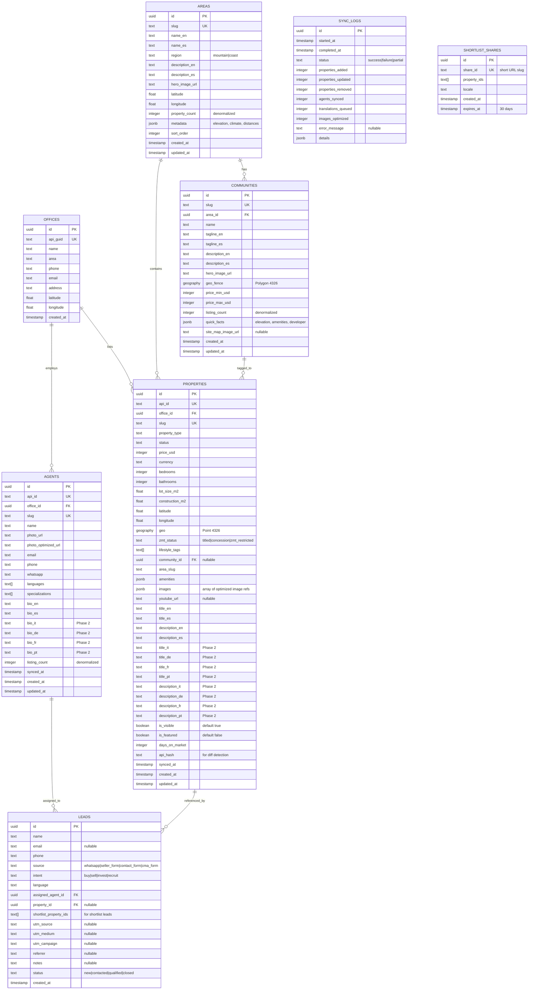

# Software Architecture Document — RE/MAX Altitud

**Author:** Nico
**Date:** 2026-04-08
**Status:** Draft — Ready for Review

---

## 1. Executive Summary

### System Purpose

RE/MAX Altitud is a multilingual, map-first real estate platform for Costa Rica's Southern Zone. The system replaces a static WordPress site with a Next.js 15 application that unifies two offices — RE/MAX Altitud (Pérez Zeledón) and RE/MAX Altitud Cero (Dominical/Uvita) — supports 6 languages via AI translation, and generates qualified leads through WhatsApp-first contact flows.

### Architecture Philosophy

```
SEO-first → Performance-first → Developer-velocity-first
```

Every architectural decision optimizes for three constraints in this priority order:

1. **SEO dominance** — Pre-rendered pages, structured data, hreflang, daily-refreshed content
2. **Mobile performance** — LCP <2.5s on $150 Android, <150KB app JS, edge-cached assets
3. **Solo developer velocity** — Type-safe stack, copy-paste components, managed infrastructure

### Key Architectural Decisions

| # | Decision | Rationale |
|---|----------|-----------|
| AD-1 | Next.js 15 App Router | SSG + ISR for SEO; React Server Components for minimal client JS |
| AD-2 | Supabase (PostgreSQL + PostGIS) | Geospatial queries for map search; built-in auth, storage, real-time |
| AD-3 | Mapbox GL JS via react-map-gl | 50K free map loads/mo; 3D terrain; custom styling; superior clustering |
| AD-4 | next-intl for i18n | App Router native; type-safe; server component support; per-route loading |
| AD-5 | Drizzle ORM | Type-safe SQL; lightweight; PostGIS support; git-based migrations |
| AD-6 | shadcn/ui + Tailwind CSS v4 | Copy-paste components; design token control; tree-shakeable CSS |
| AD-7 | Vercel (Pro plan) | Native Next.js host; edge CDN; ISR; Cron Jobs; 300s function timeout |
| AD-8 | DeepL API + GPT-4 translation | DeepL for accuracy + glossary; GPT-4 for creative/SEO content |
| AD-9 | Vercel Cron + ISR revalidation | Daily sync at 6 AM CST; on-demand revalidation after sync |
| AD-10 | localStorage for shortlist | No user accounts for MVP; persist shortlist client-side |

---

## 2. System Architecture Overview

### High-Level Architecture

```
┌─────────────────────────────────────────────────────────────────────┐
│                           CLIENTS                                   │
│  ┌──────────┐  ┌──────────┐  ┌──────────┐  ┌──────────────────┐   │
│  │  Mobile   │  │  Tablet  │  │ Desktop  │  │ Search Crawlers  │   │
│  │  (60-70%) │  │          │  │          │  │ (Google, Bing)   │   │
│  └─────┬─────┘  └─────┬────┘  └────┬─────┘  └────────┬─────────┘   │
└────────┼──────────────┼───────────┼────────────────┼────────────────┘
         │              │           │                │
         ▼              ▼           ▼                ▼
┌─────────────────────────────────────────────────────────────────────┐
│                     VERCEL EDGE NETWORK                              │
│  ┌─────────────────────────────────────────────────────────────┐    │
│  │  Edge CDN — static assets, ISR pages, image optimization    │    │
│  └─────────────────────────────────────────────────────────────┘    │
│  ┌─────────────────────────────────────────────────────────────┐    │
│  │  Next.js 15 App Router                                      │    │
│  │  ┌──────────┐ ┌──────────┐ ┌──────────┐ ┌──────────────┐  │    │
│  │  │   SSG    │ │   ISR    │ │   CSR    │ │  API Routes  │  │    │
│  │  │ (static  │ │ (listing │ │ (search  │ │  /api/sync   │  │    │
│  │  │  pages)  │ │  pages)  │ │  + map)  │ │  /api/leads  │  │    │
│  │  └──────────┘ └──────────┘ └──────────┘ └──────────────┘  │    │
│  └─────────────────────────────────────────────────────────────┘    │
│  ┌─────────────────────────────────────────────────────────────┐    │
│  │  Vercel Cron — 0 6 * * * (daily sync trigger)              │    │
│  └─────────────────────────────────────────────────────────────┘    │
└─────────────────────────┬───────────────────────────────────────────┘
                          │
                          ▼
┌─────────────────────────────────────────────────────────────────────┐
│                     DATA LAYER                                       │
│  ┌──────────────────┐  ┌──────────────────┐  ┌─────────────────┐   │
│  │    Supabase       │  │  Supabase        │  │  Supabase       │   │
│  │    PostgreSQL     │  │  Storage         │  │  Auth           │   │
│  │    + PostGIS      │  │  (images)        │  │  (admin only)   │   │
│  └──────────────────┘  └──────────────────┘  └─────────────────┘   │
└─────────────────────────────────────────────────────────────────────┘
                          │
                          ▼
┌─────────────────────────────────────────────────────────────────────┐
│                   EXTERNAL SERVICES                                  │
│  ┌──────────────┐  ┌──────────────┐  ┌───────────────────────────┐ │
│  │ RE/MAX CCA   │  │ DeepL API    │  │ Mapbox GL JS              │ │
│  │ API (JSON)   │  │ (translation)│  │ (map tiles, geocoding)    │ │
│  └──────────────┘  └──────────────┘  └───────────────────────────┘ │
│  ┌──────────────┐  ┌──────────────┐  ┌───────────────────────────┐ │
│  │ OpenAI API   │  │ Sentry       │  │ Google Search Console     │ │
│  │ (GPT-4)      │  │ (monitoring) │  │ + Analytics               │ │
│  └──────────────┘  └──────────────┘  └───────────────────────────┘ │
└─────────────────────────────────────────────────────────────────────┘
```

### Rendering Strategy Matrix

| Page Type | Strategy | Revalidation | Cache | Rationale |
|-----------|----------|-------------|-------|-----------|
| Homepage | ISR | 1 hour | Edge | Featured listings change; must feel fresh |
| Listing detail (`/property/[slug]`) | SSG + ISR | On-demand (after sync) | Edge | SEO-critical; data changes daily |
| Search/Map (`/search`) | CSR | N/A (client-side) | API cache | Interactive filters, map state, dynamic results |
| Area guides (`/areas/[slug]`) | SSG | Build-time (manual) | Edge | Content rarely changes |
| Community pages (`/areas/[area]/communities/[slug]`) | SSG + ISR | On-demand (after sync) | Edge | Property availability changes daily |
| Agent profiles (`/agents/[slug]`) | SSG + ISR | On-demand (after sync) | Edge | Listings on agent pages change |
| Seller form (`/sell`) | SSG | Build-time | Edge | Static form structure |
| Static pages (about, services, contact, join) | SSG | Build-time | Edge | Content rarely changes |

---

## 3. Project Structure

### Directory Architecture

```
remax-altitud/
├── .env.local                          # Environment variables (never committed)
├── .env.example                        # Template for env vars
├── next.config.ts                      # Next.js configuration
├── postcss.config.ts                   # PostCSS config (Tailwind v4 plugin)
├── drizzle.config.ts                   # Drizzle ORM configuration
├── vercel.json                         # Cron jobs, redirects, headers
├── middleware.ts                        # i18n locale detection + redirects
│
├── public/
│   ├── locales/                        # Static locale assets (flags, etc.)
│   ├── images/                         # Static images (logos, icons)
│   ├── sitemap.xml                     # Auto-generated
│   └── robots.txt
│
├── src/
│   ├── app/
│   │   ├── [locale]/                   # Locale-prefixed routes
│   │   │   ├── layout.tsx              # Root layout with i18n provider
│   │   │   ├── page.tsx                # Homepage
│   │   │   ├── search/
│   │   │   │   └── page.tsx            # Search/Map page (CSR)
│   │   │   ├── property/
│   │   │   │   └── [slug]/
│   │   │   │       └── page.tsx        # Listing detail (ISR)
│   │   │   ├── areas/
│   │   │   │   ├── page.tsx            # Area index
│   │   │   │   └── [slug]/
│   │   │   │       ├── page.tsx        # Area guide (SSG)
│   │   │   │       └── communities/
│   │   │   │           └── [community]/
│   │   │   │               └── page.tsx # Community page (ISR)
│   │   │   ├── agents/
│   │   │   │   ├── page.tsx            # Agent listing
│   │   │   │   └── [slug]/
│   │   │   │       └── page.tsx        # Agent profile (ISR)
│   │   │   ├── communities/
│   │   │   │   └── page.tsx            # Community index
│   │   │   ├── sell/
│   │   │   │   └── page.tsx            # Seller landing + form
│   │   │   ├── shortlist/
│   │   │   │   ├── page.tsx            # Shortlist comparison
│   │   │   │   └── [shareId]/
│   │   │   │       └── page.tsx        # Shared shortlist
│   │   │   ├── about/page.tsx
│   │   │   ├── services/page.tsx
│   │   │   ├── contact/page.tsx
│   │   │   └── join/page.tsx
│   │   │
│   │   ├── api/
│   │   │   ├── sync/
│   │   │   │   └── route.ts            # Daily sync endpoint (Vercel Cron)
│   │   │   ├── leads/
│   │   │   │   └── route.ts            # Lead capture endpoint
│   │   │   ├── shortlist/
│   │   │   │   └── route.ts            # Shortlist share URL generation
│   │   │   ├── revalidate/
│   │   │   │   └── route.ts            # On-demand ISR revalidation
│   │   │   └── og/
│   │   │       └── route.tsx           # Dynamic OG image generation
│   │   │
│   │   ├── sitemap.ts                  # Dynamic sitemap generation
│   │   └── not-found.tsx               # 404 page
│   │
│   ├── components/
│   │   ├── ui/                         # shadcn/ui primitives (themed)
│   │   │   ├── button.tsx
│   │   │   ├── sheet.tsx
│   │   │   ├── dialog.tsx
│   │   │   ├── badge.tsx
│   │   │   ├── skeleton.tsx
│   │   │   ├── tabs.tsx
│   │   │   ├── toast.tsx
│   │   │   ├── command.tsx
│   │   │   ├── accordion.tsx
│   │   │   ├── dropdown-menu.tsx
│   │   │   ├── input.tsx
│   │   │   ├── select.tsx
│   │   │   ├── checkbox.tsx
│   │   │   ├── radio-group.tsx
│   │   │   ├── switch.tsx
│   │   │   ├── progress.tsx
│   │   │   ├── tooltip.tsx
│   │   │   └── avatar.tsx
│   │   │
│   │   ├── property/                   # Property domain components
│   │   │   ├── property-card.tsx
│   │   │   ├── property-card-skeleton.tsx
│   │   │   ├── property-gallery.tsx
│   │   │   ├── property-specs.tsx
│   │   │   ├── property-badges.tsx
│   │   │   └── similar-properties.tsx
│   │   │
│   │   ├── search/                     # Search domain components
│   │   │   ├── search-bar.tsx
│   │   │   ├── search-filters.tsx
│   │   │   ├── search-results.tsx
│   │   │   ├── filter-chips.tsx
│   │   │   ├── sort-dropdown.tsx
│   │   │   └── near-me-button.tsx
│   │   │
│   │   ├── map/                        # Map domain components
│   │   │   ├── map-view.tsx
│   │   │   ├── map-pull-up-sheet.tsx
│   │   │   ├── map-property-popup.tsx
│   │   │   ├── map-cluster-pin.tsx
│   │   │   └── map-price-pin.tsx
│   │   │
│   │   ├── agent/                      # Agent domain components
│   │   │   ├── agent-card.tsx
│   │   │   ├── agent-selection-modal.tsx
│   │   │   └── agent-listings.tsx
│   │   │
│   │   ├── lead/                       # Lead capture components
│   │   │   ├── whatsapp-cta.tsx
│   │   │   ├── email-cta.tsx
│   │   │   ├── seller-form.tsx
│   │   │   ├── contact-form.tsx
│   │   │   └── sticky-mobile-cta.tsx
│   │   │
│   │   ├── shortlist/                  # Shortlist components
│   │   │   ├── shortlist-page.tsx
│   │   │   ├── shortlist-icon.tsx
│   │   │   └── save-button.tsx
│   │   │
│   │   ├── community/                  # Community components
│   │   │   ├── community-card.tsx
│   │   │   ├── community-quick-facts.tsx
│   │   │   └── community-lot-list.tsx
│   │   │
│   │   ├── area/                       # Area guide components
│   │   │   ├── area-guide-card.tsx
│   │   │   └── similar-areas-slider.tsx
│   │   │
│   │   └── layout/                     # Layout components
│   │       ├── header.tsx
│   │       ├── footer.tsx
│   │       ├── mobile-nav.tsx
│   │       ├── breadcrumbs.tsx
│   │       ├── split-hero.tsx
│   │       ├── language-toggle.tsx
│   │       └── unit-toggle.tsx
│   │
│   ├── lib/
│   │   ├── db/
│   │   │   ├── schema.ts               # Drizzle schema definitions
│   │   │   ├── client.ts               # Supabase/Drizzle client
│   │   │   ├── migrations/             # SQL migrations
│   │   │   └── queries/
│   │   │       ├── properties.ts       # Property query functions
│   │   │       ├── agents.ts           # Agent query functions
│   │   │       ├── leads.ts            # Lead query functions
│   │   │       ├── communities.ts      # Community query functions
│   │   │       └── sync-log.ts         # Sync log queries
│   │   │
│   │   ├── sync/
│   │   │   ├── pipeline.ts             # Main sync orchestrator
│   │   │   ├── api-client.ts           # RE/MAX CCA API client
│   │   │   ├── differ.ts               # Diff detection (new/updated/removed)
│   │   │   ├── translator.ts           # DeepL + GPT-4 translation
│   │   │   ├── image-optimizer.ts      # Image download + optimization
│   │   │   ├── geo-tagger.ts           # Community geo-fence matching
│   │   │   ├── lifestyle-tagger.ts     # Auto lifestyle tag assignment
│   │   │   └── alert.ts               # Admin notification on failure
│   │   │
│   │   ├── i18n/
│   │   │   ├── config.ts               # next-intl configuration
│   │   │   ├── request.ts              # Server-side i18n utilities
│   │   │   └── navigation.ts           # Localized link/redirect helpers
│   │   │
│   │   ├── map/
│   │   │   ├── config.ts               # Mapbox configuration
│   │   │   ├── styles.ts               # Custom map styles
│   │   │   └── geo-utils.ts            # Bounding box, clustering utils
│   │   │
│   │   ├── seo/
│   │   │   ├── metadata.ts             # generateMetadata helpers
│   │   │   ├── structured-data.ts      # JSON-LD generators
│   │   │   └── redirects.ts            # WordPress 301 redirect map
│   │   │
│   │   ├── utils/
│   │   │   ├── units.ts                # m² ↔ acres ↔ ft² ↔ hectares
│   │   │   ├── currency.ts             # USD → EUR conversion
│   │   │   ├── whatsapp.ts             # Message builder
│   │   │   ├── utm.ts                  # UTM parameter extraction
│   │   │   └── shortlist.ts            # localStorage shortlist manager
│   │   │
│   │   └── constants/
│   │       ├── offices.ts              # Office GUIDs, metadata
│   │       ├── areas.ts                # Area hierarchy definitions
│   │       ├── lifestyle-tags.ts       # Tag definitions + auto-tag rules
│   │       └── glossary.ts             # Translation glossary terms
│   │
│   ├── hooks/
│   │   ├── use-shortlist.ts            # Shortlist state management
│   │   ├── use-map-bounds.ts           # Map viewport tracking
│   │   ├── use-search-params.ts        # URL search state sync
│   │   ├── use-geolocation.ts          # Browser Geolocation API
│   │   └── use-locale-units.ts         # Locale-aware unit conversion
│   │
│   ├── messages/
│   │   ├── en.json                     # English UI strings
│   │   └── es.json                     # Spanish UI strings
│   │
│   ├── types/
│   │   ├── property.ts                 # Property types
│   │   ├── agent.ts                    # Agent types
│   │   ├── lead.ts                     # Lead types
│   │   ├── community.ts               # Community types
│   │   ├── search.ts                   # Search filter/result types
│   │   └── api.ts                      # RE/MAX API response types
│   │
│   └── styles/
│       └── globals.css                 # Tailwind v4 CSS-first config: @import, @theme directives, design tokens
│
├── tests/
│   ├── e2e/                            # Playwright E2E tests
│   ├── unit/                           # Vitest unit tests
│   └── fixtures/                       # Test data fixtures
│
└── docs/
    ├── api/                            # RE/MAX API documentation
    └── redirects/                      # WordPress URL mapping
```

---

## 4. Database Schema

### Entity Relationship Diagram



### Key Indexes

```sql
-- Geospatial index for map search (bounding box queries)
CREATE INDEX idx_properties_geo ON properties USING GIST (geo);

-- Composite index for filtered search
CREATE INDEX idx_properties_search ON properties (
  is_visible, property_type, price_usd, area_slug
) WHERE is_visible = true;

-- Lifestyle tag search (GIN for array containment)
CREATE INDEX idx_properties_tags ON properties USING GIN (lifestyle_tags);

-- Community property lookup
CREATE INDEX idx_properties_community ON properties (community_id) WHERE community_id IS NOT NULL;

-- Agent office lookup
CREATE INDEX idx_agents_office ON agents (office_id);

-- Lead assignment lookup
CREATE INDEX idx_leads_agent ON leads (assigned_agent_id, created_at DESC);

-- Slug lookups (unique indexes created by UK constraint)
-- properties.slug, agents.slug, areas.slug, communities.slug
```

### PostGIS Spatial Queries

```sql
-- Properties within map viewport (bounding box)
SELECT * FROM properties
WHERE is_visible = true
  AND geo && ST_MakeEnvelope(:west, :south, :east, :north, 4326)
ORDER BY price_usd;

-- Properties within radius of user location (Near Me)
SELECT *, ST_Distance(geo, ST_SetSRID(ST_MakePoint(:lng, :lat), 4326)) AS distance
FROM properties
WHERE is_visible = true
  AND ST_DWithin(geo, ST_SetSRID(ST_MakePoint(:lng, :lat), 4326), :radius_meters)
ORDER BY distance;

-- Auto-tag properties to communities (geo-fence matching)
UPDATE properties p
SET community_id = c.id
FROM communities c
WHERE ST_Within(p.geo, c.geo_fence)
  AND p.community_id IS NULL;
```

---

## 5. Data Sync Pipeline

### Pipeline Architecture

```
┌──────────────┐
│ Vercel Cron  │  Trigger: 0 6 * * * (6 AM CST daily)
│ POST /api/sync│
└──────┬───────┘
       │
       ▼
┌──────────────────────────────────────────────────────────────┐
│  STEP 1: FETCH                                                │
│  ├── GET AgentsPerOffice/{PZ_GUID}                           │
│  ├── GET AgentsPerOffice/{DOM_GUID}                          │
│  ├── GET PropertiesPerOffice/{PZ_GUID}                       │
│  └── GET PropertiesPerOffice/{DOM_GUID}                      │
│  Retry: 3 attempts with exponential backoff (2s, 4s, 8s)    │
└──────┬───────────────────────────────────────────────────────┘
       │
       ▼
┌──────────────────────────────────────────────────────────────┐
│  STEP 2: VALIDATE                                             │
│  ├── Schema validation (required fields: id, title, lat/lng) │
│  ├── Data anomaly detection (price=0, missing coords)        │
│  ├── Reject invalid records → log + alert admin              │
│  └── Stats: {valid: N, rejected: M, reasons: [...]}          │
└──────┬───────────────────────────────────────────────────────┘
       │
       ▼
┌──────────────────────────────────────────────────────────────┐
│  STEP 3: DIFF                                                 │
│  ├── Hash API response per property (SHA-256 of key fields)  │
│  ├── Compare against stored api_hash in DB                   │
│  ├── Classify: NEW | UPDATED | UNCHANGED | REMOVED           │
│  └── Stats: {new: N, updated: M, removed: K, unchanged: L}  │
└──────┬───────────────────────────────────────────────────────┘
       │
       ▼
┌──────────────────────────────────────────────────────────────┐
│  STEP 4: TRANSLATE (only NEW + UPDATED content)               │
│  ├── DeepL API: titles + descriptions → ES (if API is EN)    │
│  ├── DeepL glossary: ZMT, titled, concession (consistent)    │
│  ├── Phase 2: DeepL → IT, DE, FR, PT                         │
│  ├── Rate limit: exponential backoff on 429                  │
│  └── Fallback: skip translation, serve original, flag admin  │
└──────┬───────────────────────────────────────────────────────┘
       │
       ▼
┌──────────────────────────────────────────────────────────────┐
│  STEP 5: OPTIMIZE IMAGES (only NEW + UPDATED listings)        │
│  ├── Download from Azure CDN (original API source)            │
│  ├── Generate sizes: 1200×800, 800×533, 400×267 (WebP)      │
│  ├── Generate LQIP blur placeholder (20×13px, base64)        │
│  ├── Upload to Supabase Storage                               │
│  └── Store optimized URLs + blur hash in images JSONB        │
└──────┬───────────────────────────────────────────────────────┘
       │
       ▼
┌──────────────────────────────────────────────────────────────┐
│  STEP 6: GEO-TAG + LIFESTYLE-TAG                              │
│  ├── PostGIS: match property coords → community polygons      │
│  ├── Auto-assign community_id (new/moved properties)          │
│  ├── Apply lifestyle tag rules:                               │
│  │   ├── Condo in Altitud Cero (Dominical/Uvita) → "Rental Potential"│
│  │   ├── Land > 5000m² → "Investment Property"               │
│  │   ├── House with "retirement" in description → "Retire"   │
│  │   └── (configurable rules in constants/lifestyle-tags.ts) │
│  └── Preserve manual overrides (admin-set tags/communities)  │
└──────┬───────────────────────────────────────────────────────┘
       │
       ▼
┌──────────────────────────────────────────────────────────────┐
│  STEP 7: UPSERT + HANDLE REMOVALS                             │
│  ├── Upsert NEW + UPDATED properties to Supabase             │
│  ├── Removed properties: set is_visible = false (soft delete) │
│  │   └── URL preserved for SEO → serves "No longer available" │
│  ├── Upsert agents (new/updated)                             │
│  ├── Update denormalized counts (listing_count, etc.)         │
│  └── Write sync_log entry                                    │
└──────┬───────────────────────────────────────────────────────┘
       │
       ▼
┌──────────────────────────────────────────────────────────────┐
│  STEP 8: REVALIDATE + NOTIFY                                  │
│  ├── revalidateTag('properties')                             │
│  ├── revalidateTag('agents')                                 │
│  ├── revalidateTag('communities')                            │
│  ├── Regenerate sitemap                                      │
│  ├── On success: log summary                                 │
│  └── On failure: send alert (email/WhatsApp to admin)        │
└──────────────────────────────────────────────────────────────┘
```

### Sync Execution Constraints

| Constraint | Value | Mitigation |
|-----------|-------|------------|
| Vercel Pro function timeout | 300s | Batch processing; parallel API calls |
| DeepL rate limit | 500K chars/mo (Starter) | Translate only changed content; cache translations |
| Supabase Storage free tier | 1GB | WebP compression; max 12 images/listing |
| Expected sync duration | 60-120s (300 listings) | Monitor; alert if >180s |
| Fallback for timeout | Inngest durable functions | Evaluate if sync exceeds 300s consistently |

---

## 6. API Design

### Internal API Routes

| Endpoint | Method | Purpose | Auth |
|----------|--------|---------|------|
| `/api/sync` | POST | Daily sync pipeline trigger | Vercel Cron secret |
| `/api/leads` | POST | Lead capture (all forms + WhatsApp clicks) | None (public) |
| `/api/shortlist` | POST | Generate shareable shortlist URL | None (public) |
| `/api/revalidate` | POST | On-demand ISR revalidation | API secret |
| `/api/og` | GET | Dynamic OG image generation | None (public) |

### Search Query API (Server Action)

Instead of a REST API endpoint, property search uses a **Next.js Server Action** that queries Supabase directly with PostGIS:

```typescript
// src/lib/db/queries/properties.ts
export async function searchProperties(filters: SearchFilters) {
  const query = db
    .select()
    .from(properties)
    .where(and(
      eq(properties.isVisible, true),
      filters.type ? eq(properties.propertyType, filters.type) : undefined,
      filters.priceMin ? gte(properties.priceUsd, filters.priceMin) : undefined,
      filters.priceMax ? lte(properties.priceUsd, filters.priceMax) : undefined,
      filters.bedrooms ? gte(properties.bedrooms, filters.bedrooms) : undefined,
      filters.areaSlug ? eq(properties.areaSlug, filters.areaSlug) : undefined,
      filters.tags?.length
        ? sql`${properties.lifestyleTags} && ${filters.tags}`
        : undefined,
      filters.bounds
        ? sql`${properties.geo} && ST_MakeEnvelope(
            ${filters.bounds.west}, ${filters.bounds.south},
            ${filters.bounds.east}, ${filters.bounds.north}, 4326
          )`
        : undefined,
    ))
    .orderBy(
      filters.sort === 'price_asc' ? asc(properties.priceUsd) :
      filters.sort === 'price_desc' ? desc(properties.priceUsd) :
      desc(properties.createdAt)
    )
    .limit(filters.limit ?? 50)
    .offset(filters.offset ?? 0);

  return query;
}
```

### RE/MAX CCA API Integration

| Endpoint | Method | Response | Caching |
|----------|--------|----------|---------|
| `AgentsPerOffice/{GUID}` | GET | Agent[] (name, photo, phone, email, language) | No cache (synced daily) |
| `PropertiesPerOffice/{GUID}` | GET | Property[] (bilingual, GPS, amenities, images, pricing) | No cache (synced daily) |

**Office GUIDs:**
- Pérez Zeledón: `{PZ_OFFICE_GUID}` (env var)
- RE/MAX Altitud Cero (Dominical/Uvita): `{DOM_OFFICE_GUID}` (env var)

---

## 7. Internationalization Architecture

### Locale Routing

```
middleware.ts
  ├── Detect browser Accept-Language header
  ├── Match against supported locales: ['en', 'es']
  ├── Default: 'en' (international audience primary)
  ├── Redirect: / → /en/ (or /es/ based on detection)
  └── Phase 2 adds: ['it', 'de', 'fr', 'pt']
```

### URL Structure

```
/en/                          → English homepage
/es/                          → Spanish homepage
/en/property/mountain-villa   → English listing
/es/propiedad/villa-montana   → Spanish listing (localized slug)
/en/areas/perez-zeledon       → English area guide
/es/areas/perez-zeledon       → Spanish area guide (slug same)
/en/agents/emma-bennett       → English agent profile
/es/agentes/emma-bennett      → Spanish agent profile
```

### Translation Architecture

| Content Type | Source | Translation Method | Storage |
|-------------|--------|-------------------|---------|
| **UI strings** (nav, labels, CTAs) | `messages/en.json`, `messages/es.json` | Manual (developer-authored) | JSON files in repo |
| **Listing content** (title, description) | RE/MAX CCA API (EN+ES) | API provides both | `title_en`, `title_es` columns |
| **Phase 2 listing translations** | EN source | DeepL API with glossary | `title_it`, `title_de`, etc. columns |
| **Area/community descriptions** | Manual content | Developer-authored in both languages | `description_en`, `description_es` columns |
| **SEO metadata** (title, description) | Derived from content | GPT-4 locale-specific prompts | Generated in `generateMetadata()` |

### hreflang Implementation

```typescript
// src/lib/seo/metadata.ts
export function generateAlternateLanguages(path: string) {
  const locales = ['en', 'es']; // Phase 2: add it, de, fr, pt
  return locales.map(locale => ({
    hrefLang: locale,
    href: `https://remax-altitud.cr/${locale}${path}`,
  }));
}
```

---

## 8. Frontend Architecture

### Component Hierarchy

```
RootLayout (Server Component)
├── LocaleProvider (next-intl)
├── Header (Server Component)
│   ├── Logo
│   ├── Navigation (max 5 items)
│   ├── SearchBarCompact (Client)
│   ├── ShortlistIcon (Client)
│   └── LanguageToggle (Client)
│
├── [Page Content] (varies by route)
│
└── Footer (Server Component)
    ├── OfficeInfo
    ├── QuickLinks
    ├── SocialLinks
    └── LanguageToggle
```

### Client vs. Server Component Split

| Server Components (RSC) | Client Components (`'use client'`) |
|-------------------------|-----------------------------------|
| All page layouts | MapView + map components |
| PropertyCard (static data) | SearchFilters + filter state |
| AgentCard (static data) | MapPullUpSheet (gesture) |
| AreaGuideCard | PropertyGallery (swipe, fullscreen) |
| Breadcrumbs | ShortlistIcon + SaveButton (localStorage) |
| Footer, Header structure | LanguageToggle |
| SimilarProperties | UnitToggle |
| CommunityCard | SellerForm (multi-step state) |
| SEO metadata generation | WhatsAppCTA (message builder) |
| | StickyMobileCTA (IntersectionObserver) |
| | NearMeButton (Geolocation API) |
| | SearchBar (mode toggle state) |

### State Management

| State | Storage | Scope | Rationale |
|-------|---------|-------|-----------|
| **Search filters** | URL query params | Per-session, shareable | Bookmarkable, shareable URLs |
| **Map viewport** | React state (zustand) | Per-session | Map bounds sync with search |
| **Shortlist** | localStorage | Persistent, client-only | No user accounts for MVP |
| **Language** | URL path (`/en/`, `/es/`) | Persistent, shareable | SEO-friendly locale routing |
| **Unit preference** | localStorage | Persistent, client-only | m²/acres/ft² toggle |
| **Search mode** | React context | Per-session | Smart/Traditional toggle sync |
| **Form state** | React state (react-hook-form) | Per-form | Multi-step seller form |

### Performance Budget

| Metric | Target | Enforcement |
|--------|--------|-------------|
| **LCP** | <2.5s on 4G | Lighthouse CI gate |
| **CLS** | <0.1 | aspect-ratio on images; skeleton loaders |
| **FID/INP** | <200ms | React Server Components; minimal hydration |
| **App JS bundle** | <150KB gzipped | Code splitting; dynamic imports |
| **Mapbox GL JS** | Lazy-loaded (~230KB) | `dynamic(() => import(), { ssr: false })` |
| **PropertyGallery** | Lazy-loaded | `dynamic(() => import(), { ssr: false })` |
| **CSS** | <30KB gzipped | Tailwind tree-shaking |
| **Largest image** | <200KB | WebP via next/image |

### Code Splitting Strategy

```
Initial page load (SSR/ISR):
├── Framework runtime (~80KB)
├── Page-specific server-rendered HTML
├── Design tokens + Tailwind CSS (<30KB)
└── Minimal client JS (interactivity only)

Lazy-loaded on demand:
├── MapView + Mapbox GL JS (~230KB) ← search page only
├── PropertyGallery (~25KB) ← listing detail only
├── SellerForm (~15KB) ← seller page only
├── AgentSelectionModal (~5KB) ← shortlist CTA only
└── @use-gesture/react (~5KB) ← pull-up sheet only
```

---

## 9. SEO Architecture

### URL Strategy

| Page | URL Pattern | SEO Value |
|------|-------------|-----------|
| Homepage | `/{locale}/` | Brand search target |
| Search | `/{locale}/search?type=house&area=perez-zeledon` | Filter-shareable but not indexed |
| Listing | `/{locale}/property/{slug}` | High — individual listing pages |
| Area guide | `/{locale}/areas/{slug}` | High — area keyword targeting |
| Community | `/{locale}/areas/{area}/communities/{slug}` | High — development name targeting |
| Agent | `/{locale}/agents/{slug}` | Medium — agent name search |
| Seller | `/{locale}/sell` | High — "vender propiedad" keyword |

### WordPress 301 Redirect Strategy

```typescript
// vercel.json redirects (or Next.js redirects in next.config.ts)
{
  "redirects": [
    { "source": "/property/:id", "destination": "/en/property/:slug", "permanent": true },
    { "source": "/agent/:name", "destination": "/en/agents/:slug", "permanent": true },
    { "source": "/contact", "destination": "/en/contact", "permanent": true },
    // ... complete mapping from WordPress URL audit
  ]
}
```

### Structured Data (JSON-LD)

| Page | Schema Type | Key Properties |
|------|-------------|---------------|
| Listing detail | `RealEstateListing` | price, address, geo, images, description |
| Agent profile | `RealEstateAgent` | name, image, telephone, areaServed |
| Area guide | `Place` | name, description, geo, containedIn |
| Homepage | `RealEstateAgent` (organization) | name, address, areaServed |
| All pages | `BreadcrumbList` | Navigation hierarchy |

### Sitemap Strategy

```
/sitemap.xml (sitemap index)
├── /sitemap-pages.xml          ← static pages (all locales)
├── /sitemap-properties-en.xml  ← EN listings
├── /sitemap-properties-es.xml  ← ES listings
├── /sitemap-agents-en.xml      ← EN agent profiles
├── /sitemap-agents-es.xml      ← ES agent profiles
├── /sitemap-areas-en.xml       ← EN area guides
└── /sitemap-areas-es.xml       ← ES area guides
```

Auto-regenerated after each daily sync via `app/sitemap.ts`.

---

## 10. Security Architecture

### Authentication & Authorization

| Actor | Auth Method | Access Scope |
|-------|-----------|-------------|
| **Public visitors** | None | Read all published content; submit forms |
| **Admin (Nico)** | Supabase Auth (email/password) | Supabase dashboard for DB management |
| **Vercel Cron** | `CRON_SECRET` env var | Trigger `/api/sync` |
| **API routes** | `API_SECRET` header check | Trigger `/api/revalidate` |

### Data Security

| Concern | Implementation |
|---------|---------------|
| **Lead PII encryption** | Supabase column-level encryption for email, phone |
| **API keys** | Environment variables; never in client-side code |
| **HTTPS** | Vercel enforces TLS on all routes |
| **Rate limiting** | Vercel WAF + custom rate limiting on lead submission |
| **Input validation** | Zod schemas on all API route inputs |
| **XSS prevention** | React's default escaping + CSP headers |
| **CSRF** | SameSite cookies (Supabase Auth default) |

### Environment Variables

```
# Database
SUPABASE_URL=
SUPABASE_ANON_KEY=
SUPABASE_SERVICE_ROLE_KEY=
DATABASE_URL=

# RE/MAX API
REMAX_API_BASE_URL=
PZ_OFFICE_GUID=
DOM_OFFICE_GUID=

# Translation
DEEPL_API_KEY=
OPENAI_API_KEY=

# Maps
NEXT_PUBLIC_MAPBOX_TOKEN=

# Vercel
CRON_SECRET=
API_SECRET=

# Monitoring
SENTRY_DSN=
NEXT_PUBLIC_GA_MEASUREMENT_ID=
```

---

## 11. Monitoring & Observability

### Monitoring Stack

| Tool | Purpose | Alert Triggers |
|------|---------|---------------|
| **Sentry** | Error tracking, performance | Unhandled exceptions; P95 latency >3s |
| **Vercel Analytics** | Core Web Vitals, page performance | LCP >2.5s; CLS >0.1 |
| **Google Search Console** | SEO indexing, search performance | Coverage errors; ranking drops |
| **Supabase Dashboard** | DB metrics, query performance | Storage >80%; slow queries |
| **Custom sync_logs table** | Sync pipeline monitoring | status='failure'; zero properties synced |

### Admin Alert Flow

```
Sync failure → sync_logs entry (status='failure')
  ├── Email notification to admin
  ├── WhatsApp notification to admin (wa.me link in email)
  └── Site continues serving existing data (resilience pattern)
```

---

## 12. Infrastructure & Deployment

### Deployment Architecture

```
GitHub (main branch)
  │
  ├── Push to main → Vercel auto-deploy (production)
  ├── Push to PR → Vercel preview deployment
  │
  └── CI Pipeline:
      ├── TypeScript compile check
      ├── ESLint
      ├── Vitest unit tests
      ├── Lighthouse CI (score ≥ 80 gate)
      └── Build verification
```

### Cost Projection (Monthly)

| Service | Plan | Cost | Notes |
|---------|------|------|-------|
| Vercel | Pro | $20/mo | 300s timeout, custom domains, analytics |
| Supabase | Pro | $25/mo | 8GB DB, 100GB storage, daily backups |
| Mapbox | Free tier | $0 | 50K map loads/mo |
| DeepL API | Starter | ~€5.49/mo | + usage-based translation |
| OpenAI API | Pay-as-you-go | ~$5-15/mo | Translation + SEO metadata |
| Sentry | Free tier | $0 | 5K errors/mo |
| Domain | remaxaltitud.com | ~$1/mo | Annual billing |
| **Total** | | **~$55-65/mo** | |

---

## 13. Technical Risks & Mitigations

| # | Risk | Impact | Probability | Mitigation |
|---|------|--------|-------------|------------|
| R1 | RE/MAX CCA API downtime | Stale listings (no new sync) | Low | Supabase DB is source of truth; site serves cached data; admin alerted |
| R2 | Vercel function timeout (>300s) | Sync fails for large batch | Low | Batch processing; parallel API calls; Inngest fallback |
| R3 | Translation API rate limits | Untranslated content | Medium | Translate only changed content; queue with backoff; serve original as fallback |
| R4 | Mapbox cost at scale (>50K loads) | Budget overrun | Low (initially) | Monitor monthly; cache tiles; evaluate Google Maps if needed |
| R5 | SEO traffic loss during migration | Lost leads (60-day risk) | Medium | Complete 301 redirect map; sitemap transition; SC monitoring; 100% recovery target in 60 days |
| R6 | PostGIS query performance | Slow map search | Low | GiST spatial index; bounding box pre-filter; pagination |
| R7 | hreflang complexity (Phase 2) | Indexing issues | Medium | Tech spike before Phase 2; automated sitemap generation; SC audits |
| R8 | Single admin bus factor | Platform knowledge concentration | Medium | Supabase dashboard = standard tooling; architecture documented; onboardable |

---

## 14. Architecture Decision Records (ADRs)

### ADR-1: Next.js 15 over Astro

**Context:** Both SSG-capable frameworks were evaluated. Astro excels at static content; Next.js excels at hybrid rendering.

**Decision:** Next.js 15 with App Router.

**Rationale:** The search page requires CSR (interactive map + filters). The listing pages need ISR (daily refresh). Next.js handles both rendering strategies natively. Astro would require React islands for interactivity and lacks native ISR.

### ADR-2: Supabase over PlanetScale/Turso

**Context:** Three database platforms evaluated for managed PostgreSQL/SQL.

**Decision:** Supabase (PostgreSQL + PostGIS).

**Rationale:** PostGIS is required for geospatial queries (map search, geo-fence matching). PlanetScale (MySQL) and Turso (SQLite) lack equivalent spatial extensions. Supabase also provides auth, storage, and auto-generated REST API.

### ADR-3: Drizzle ORM over Prisma

**Context:** Both provide TypeScript-safe database access.

**Decision:** Drizzle ORM.

**Rationale:** Drizzle generates no runtime abstraction — queries compile to raw SQL. This matters for PostGIS queries where we need raw SQL access for spatial functions. Prisma's abstraction layer complicates custom PostGIS queries and adds bundle weight.

### ADR-4: localStorage Shortlist over Server-Side State

**Context:** Shortlist (♡ save) needs persistence without user accounts.

**Decision:** localStorage for MVP; shareable shortlists via server-generated short URLs.

**Rationale:** No user accounts in MVP (explicit Out of Scope). localStorage provides instant client-side persistence. Shareable shortlist URLs (`/shortlist/abc123`) encode property IDs server-side for cross-device sharing. Phase 2 can migrate to user accounts.

### ADR-5: Server Actions over REST API for Search

**Context:** Search queries need to run against PostGIS with complex filters.

**Decision:** Next.js Server Actions querying Supabase directly via Drizzle.

**Rationale:** Server Actions eliminate the need for a separate API layer. The search query runs server-side (zero client-side DB connection), benefits from Vercel edge caching, and maintains type safety end-to-end. The search page (CSR) calls the Server Action which executes on the server.

### ADR-6: Soft Delete for Removed Listings

**Context:** Listings removed from the RE/MAX API need graceful handling.

**Decision:** Soft delete (`is_visible = false`); preserve URL; serve "No longer available" page.

**Rationale:** Hard deleting creates 404s that hurt SEO. Soft delete preserves the URL for search engines and shared links. The page shows "No longer available" with similar property suggestions and agent CTA — converting dead links into leads.

---

## 15. Implementation Sequence

### Phase 1: Foundation (Sprint 1-2)

```
1. Project setup (Next.js 15, TypeScript, Tailwind, shadcn/ui)
2. Database schema (Drizzle + Supabase migrations)
3. i18n setup (next-intl, EN/ES locale routing, middleware)
4. Design system (tokens, themed shadcn/ui components)
5. Layout (header, footer, mobile nav, breadcrumbs)
6. WordPress 301 redirect map
```

### Phase 2: Core Product (Sprint 3-5)

```
7. Data sync pipeline (API → validate → diff → upsert → revalidate)
8. Search page with MapView (Mapbox GL, pins, clustering, filters)
9. Property listing detail page (gallery, specs, agent card)
10. Homepage (split-hero, featured listings, area highlights)
```

### Phase 3: Lead Generation (Sprint 6-7)

```
11. WhatsApp CTA (message builder, floating mobile CTA)
12. Seller form (3-step progressive, agent matching)
13. Contact form + lead capture pipeline
14. Agent profiles + listings + WhatsApp/Email CTAs
```

### Phase 4: Engagement (Sprint 8-9)

```
15. Shortlist (♡ save, comparison page, share URL)
16. Smart agent routing (shortlist → agent selection)
17. Area guide pages (hero, description, properties, similar)
18. Community pages (quick facts, geo-fence, lot list)
```

### Phase 5: Polish & Launch (Sprint 10-11)

```
19. SEO (structured data, sitemaps, OG images, hreflang)
20. Static pages (about, services, contact, join)
21. Performance optimization (Lighthouse CI, bundle analysis)
22. Testing (E2E, accessibility audit, device testing)
23. WordPress migration (DNS, 301 verification, SC monitoring)
```

---

## 16. Appendix

### Technology Version Pinning

| Technology | Version | Lock Strategy |
|-----------|---------|--------------|
| Next.js | 15.x | `package.json` exact version |
| React | 19.x | Peer dependency of Next.js |
| TypeScript | 5.x | `package.json` exact version |
| Tailwind CSS | 4.x | `package.json` exact version |
| Drizzle ORM | latest stable | `package.json` exact version |
| Mapbox GL JS | 3.x | `package.json` exact version |
| next-intl | latest stable | `package.json` exact version |
| react-map-gl | 7.x | `package.json` exact version |
| @use-gesture/react | 10.x | `package.json` exact version |
| zod | 3.x | `package.json` exact version |
| react-hook-form | 7.x | `package.json` exact version |

### Glossary

| Term | Definition |
|------|-----------|
| **ISR** | Incremental Static Regeneration — pre-rendered pages that revalidate on demand |
| **SSG** | Static Site Generation — pages built at compile time |
| **CSR** | Client-Side Rendering — pages rendered in the browser |
| **PostGIS** | PostgreSQL extension for geospatial data and queries |
| **ZMT** | Zona Marítimo Terrestre — Costa Rica's maritime zone restriction on coastal property |
| **LQIP** | Low-Quality Image Placeholder — tiny blurred preview for progressive image loading |
| **Geo-fence** | Geographic boundary polygon used to auto-assign properties to communities |
