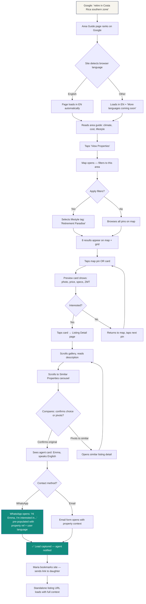
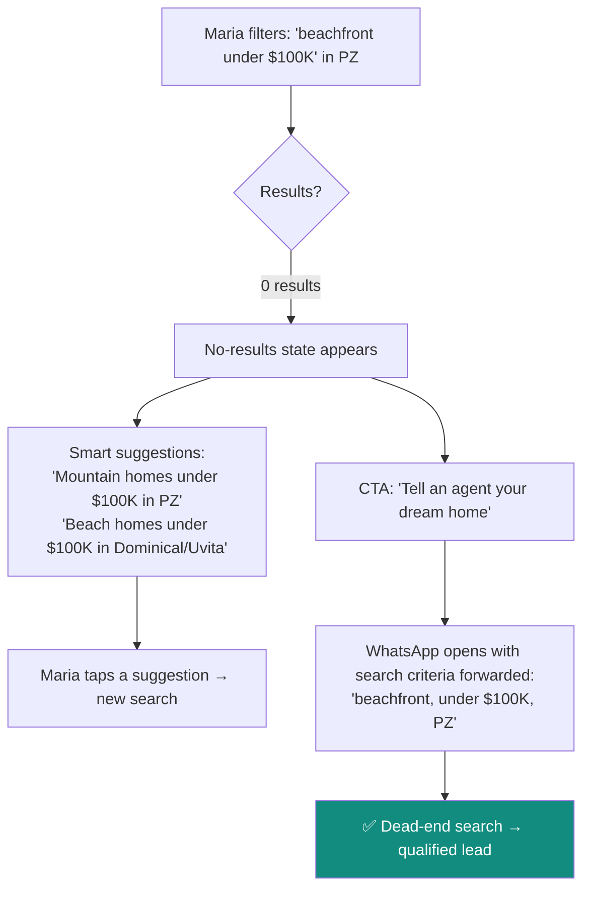
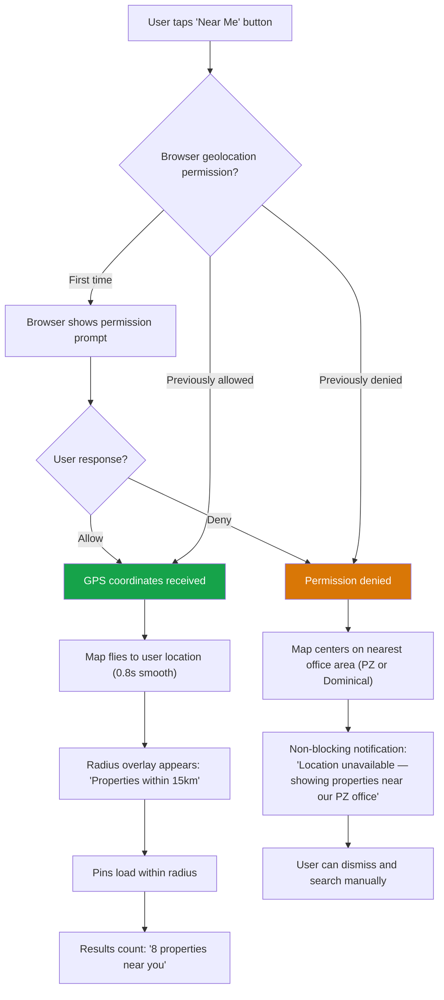

# UX Design Specification — RE/MAX Altitud

**Author:** Sebicas
**Date:** 2026-03-27

---

## Executive Summary

### Project Vision

RE/MAX Altitud is building a multilingual, map-first real estate platform for Costa Rica's Southern Zone — replacing a limited WordPress site with a Next.js application that unifies the Pérez Zeledón (mountain) and Dominical/Uvita (coast) offices. The platform converts curiosity into trust and trust into qualified leads — across buyers, sellers, and investors, in up to 6 languages.

The UX must make unfamiliar geography visually accessible, surface legal property status (ZMT/titled) as trust signals, and collapse the traditional lead funnel into one-tap WhatsApp conversations — all while performing flawlessly on $150 Android phones and iPads alike.

### Target Users

The platform serves 8 personas organized into **design priority tiers**:

**Tier 1 — Design Drivers** (these personas shape every navigation, CTA, and mobile interaction decision):

- 🇺🇸 **Maria** (International Buyer) — 62, retired teacher, iPad, no Spanish. Needs map-first visual discovery, English UX, area guides, and one-tap WhatsApp to an English-speaking agent. Represents the **Explore mode** entry path — emotional, visual, discovery-driven.
- 🇨🇷 **Carlos** (Local Seller) — 48, farmer, $150 Android, Spanish only. Needs "Vende tu propiedad" visible immediately, a seller form completable in 90 seconds, phone/WhatsApp contact. Represents the **Execute mode** entry path — practical, transactional, efficiency-driven.

**Tier 2 — Design Validators** (validate decisions against specific filter/display needs):

- 🇨🇷 **Andrés** (Local Buyer) — 35, Android, Spanish. Knows the geography — skips the map, uses grid view with price/type filters. Title status critical for mortgage qualification.
- 🇩🇪 **Hans** (Investor) — 55, analytical, metric units. Investment filters, price/m², titled status. English fallback until Phase 2 German support.

**Tier 3 — Verify Only** (confirm the platform works for them; don't design around them):

- 👩‍💼 **Laura** (Active Agent) — shareable profile page, lead notifications, professional presence.
- 👩 **Sofia** (Recruit) — "Join Our Team" page, agent profiles as proof points.
- 🏢 **Nico** (Admin) — sync monitoring, lead management via admin dashboard.
- 🇺🇸 **Jennifer** (Expat Seller) — remote seller flow validates the same form Carlos uses.

### Primary UX Architecture: Two Entry Paths

The platform resolves its multi-persona, multi-intent complexity through **two primary entry paths**:

| Mode | Users | Behavior | UX Priority |
|------|-------|----------|-------------|
| **Explore** | Maria, Hans | Visual discovery, map-first, lifestyle tags, area browsing, emotional engagement | Inspiring imagery, 3D terrain, storytelling through geography |
| **Execute** | Carlos, Andrés, Jennifer | Direct search, filters, forms, WhatsApp contact, transactional efficiency | Speed, simplicity, mobile-first forms, immediate CTA visibility |

The homepage must telegraph both modes within 3 seconds: **"Dream here"** (hero imagery, area showcase, lifestyle discovery) + **"Act here"** (search bar, "Vende tu propiedad" CTA, agent contact).

### Key Design Challenges

1. **Dual audience tech spectrum** — Serving iPad retirees and $150 Android farmers with equal quality requires progressive enhancement and ruthless performance optimization.

2. **Emotional range design** — Maria is dreaming at 10 PM on her iPad; Carlos is solving a practical problem at noon on a basic phone. The same platform must inspire dreamers AND serve pragmatists — this goes beyond responsive design into intent-aware UX.

3. **Map-first vs. grid-first** — Desktop: split-view default (Zillow-style) with full-map and full-grid toggles. Mobile: map-first with a **pull-up sheet pattern** (Google Maps/Airbnb) for listings — a proven mobile pattern users already know.

4. **Three intents, one interface** — Buy, Sell, and Invest CTAs must coexist without cognitive overload. **Seller intent must be visually separated** in the navigation — "Vende tu propiedad" / "List with us" must be immediately visible without navigating a search engine.

5. **Trust through clarity** — ZMT badges, titled property indicators, agent language matching, and RE/MAX branding are conversion-critical trust signals in a market where foreigners are buying property in an unfamiliar legal system.

6. **Mobile-dominant (60-70% traffic)** — Every interaction (gallery, map, forms, WhatsApp CTAs) must be touch-optimized with LCP < 2.5s on 4G.

7. **Multilingual graceful degradation** — EN/ES at MVP; 4 more languages in Phase 2. Language detection with fallback must feel intentional, not broken.

8. **No-results as core flow** — With ~300-400 listings across two offices, 15-25% of searches will return zero results. This is not an edge case — it's a quarter of traffic. Every no-result state must offer alternative suggestions and a WhatsApp CTA with forwarded search criteria to convert dead ends into leads.

9. **Two loading profiles** — The search/map page (CSR) and listing detail pages (SSG/ISR) have fundamentally different performance characteristics. Search needs loading skeletons that prevent CLS during Mapbox/filter bootstrap. Listing pages should feel instant (pre-rendered at the edge). The UX must account for this asymmetry.

### Design Opportunities

1. **Map as storytelling** — 3D terrain makes unfamiliar geography emotionally accessible (mountain ridges, ocean proximity, hospital markers). The map sells the lifestyle, not just the location.

2. **Lifestyle tags as discovery** — "Retirement Paradise," "Investment Property," "Rental Potential" transcend traditional filters — a UX innovation unmatched by competitors.

3. **WhatsApp as primary CTA** — Pre-populated messages with property/search context collapse the lead funnel into one tap. In Costa Rica, WhatsApp IS how real estate works.

4. **Agent profiles as mini-sites** — Shareable landing pages that function as personal brand tools. Laura shares her profile on Instagram → it works as a professional portfolio with listings, languages, and one-tap contact.

5. **Smart no-results states** — Zero-result searches become leads via alternative area/filter suggestions + WhatsApp CTA with forwarded search criteria.

6. **Mobile pull-up sheet** — Proven map-search pattern (Google Maps, Airbnb) where listings appear as a draggable sheet over the map. Users already know this interaction — zero learning curve.

7. **Homepage as dual-mode gateway** — "Dream here" (hero, areas, lifestyle) + "Act here" (search, sell CTA, contact) within 3 seconds of landing.

## Core User Experience

### Defining Experience

The core user loop is **Discover → Evaluate → Connect**:

- **Discover** — Map pins, lifestyle tags, area guides, smart search presets
- **Evaluate** — Photo gallery, specs, ZMT/title status, area context, localized units
- **Connect** — WhatsApp with pre-populated message referencing the property, in the user's language

The defining interaction: three taps from discovery to agent conversation (map pin → preview card → WhatsApp CTA). If this flow feels effortless, the platform succeeds. If it has friction, leads die.

### Platform Strategy

| Dimension | Decision | Rationale |
|-----------|----------|----------|
| **Primary platform** | Mobile web (responsive) | 60-70% mobile traffic; no native app for MVP |
| **Input modality** | Touch-first, mouse-compatible | Mobile dominant; map must work with touch gestures |
| **Offline** | Not required | Listings need fresh data |
| **Performance floor** | $150 Android, 2GB RAM, 4G connection | Carlos persona defines the minimum viable device |
| **Performance targets** | LCP < 2.5s, CLS < 0.1, map + pins in 3s on 4G | NFRs from PRD |
| **Rendering split** | SSG/ISR for listings/agents (instant), CSR for search/map (loading states) | Two different performance profiles requiring two UX strategies |

### Effortless Interactions

1. **Auto-language detection** — Site loads in your language with no pop-up or manual selection. Graceful fallback (German user → English + "More languages coming soon") feels intentional.
2. **Map → Listing → WhatsApp** — Three taps from discovery to agent conversation. Pin tap → preview card → WhatsApp with pre-populated message in user's language.
3. **Zero-config localization** — Units (m²/acres/hectares), currency (USD/EUR), and language adapt automatically based on browser locale. Nobody configures anything.
4. **90-second seller form** — Name, WhatsApp, property type, location. No email required, no account creation. Completable under 90 seconds on basic Android.
5. **Smart presets** — "Beach homes under $300K" is one tap, not 4 filter adjustments. Pre-configured lifestyle tag + filter combinations surface common search intents.
6. **"Near me" geolocation** — One tap to center the map on your current location and surface nearby listings. Uses the browser Geolocation API — no account, no GPS app. Especially valuable for Carlos walking past a "Se Vende" sign, or Maria exploring Dominical in person. Graceful fallback if permission denied: map defaults to the nearest office area.

### Critical Success Moments

| Moment | What Happens | Why It's Critical |
|--------|-------------|-------------------|
| **"I get it"** (Maria) | Map loads with 3D terrain — mountains, coast, hospital, roads visible. Unfamiliar geography becomes accessible in 5 seconds | If international buyers can't orient themselves, they bounce. The map IS the product |
| **"This is for me"** (Carlos) | Homepage loads in Spanish. "Vende tu propiedad" visible without scrolling. Form is simple | Sellers who see an English-first or complex interface leave immediately |
| **"I trust this"** (Hans) | "Titled Property ✓" badge + price/m² + area appreciation context | Investment buyers need data credibility. ZMT/title status is the trust differentiator |
| **"I can talk to someone"** (everyone) | WhatsApp CTA with pre-populated message in their language. One tap | Friction between interest and conversation kills leads |
| **"Dead end → lead"** (25% of searches) | No results → smart suggestions + "Tell an agent what you're looking for" with forwarded criteria | Smart no-results states convert dead ends into qualified leads |

### Experience Principles

1. **Geography first, filters second** — The map tells the story. International buyers need to SEE where things are before they can filter. The map is not a feature — it's the product.
2. **One tap to human** — Every screen, every state, every dead end has a path to WhatsApp with context. The platform bridges users to agents, not replaces them.
3. **Two modes, one interface** — Explore mode (visual, emotional, discovery) and Execute mode (search, filter, act) coexist. The homepage telegraphs both within 3 seconds.
4. **Trust through transparency** — ZMT badges, title status, agent languages, RE/MAX branding, and localized legal terms build confidence. Don't hide complexity — make it simple.
5. **Performance is UX** — If the seller form stutters on a $150 Android, it's a UX failure. LCP < 2.5s on 4G is a design constraint, not an engineering afterthought.
6. **Zero-configuration localization** — Language, units, and currency adapt automatically. The user never configures their locale. The site works in their world.

## Desired Emotional Response

### Primary Emotional Goals

The platform must create distinct emotional outcomes mapped to user intent:

| Intent | Primary Emotion | What Triggers It | User Says... |
|--------|----------------|-----------------|-------------|
| **Buy (International)** | **Confidence in the unfamiliar** | Map clarity, ZMT badges, agent language match, area context | *"I understand this place. I trust these people. I can do this."* |
| **Buy (Local)** | **Efficiency with dignity** | Full Spanish UX, fast filters, familiar neighborhoods, title status | *"This is for me too, not just gringos."* |
| **Sell** | **Pride and validation** | Professional listing presentation, bilingual display, social shareability | *"My property looks important. My nephew saw it in English!"* |
| **Invest** | **Informed assurance** | Data presentation (price/m², titled status), metric units, professional tone | *"This platform respects my intelligence. The data checks out."* |
| **Shared link recipient** | **Instant credibility** | Professional listing page, full context, agent CTA — no prior site experience needed | *"This looks real and trustworthy even though I've never heard of this site."* |

The single emotional thread connecting all personas: **"This platform was made for someone like me."** — whether you're a retiree in Oregon, a farmer in Pérez Zeledón, or an engineer in Munich.

### Emotional Journey Mapping

#### First Contact (0-5 seconds)

| Persona | Emotional Need | Design Response |
|---------|---------------|----------------|
| Maria | *"Is this in my language?"* → **Relief** | Auto-language detection, English loads instantly |
| Carlos | *"Is this for ticos too?"* → **Belonging** | Full Spanish UX, "Vende tu propiedad" visible immediately |
| Hans | *"Is this professional?"* → **Respect** | Clean data presentation, metric units, investment filters visible |
| Shared link recipient | *"Is this legit?"* → **Instant credibility** | Professional gallery, RE/MAX branding, full property context, agent photo + WhatsApp CTA — trust established without prior site exploration |

#### Discovery (5-60 seconds)

| Persona | Emotional Need | Design Response |
|---------|---------------|----------------|
| Maria | *"Where IS this place?"* → **Clarity** | 3D terrain map, hospital/road markers, area labels |
| Andrés | *"Show me what I can afford"* → **Control** | Grid view, price/type filters, familiar neighborhoods |
| Hans | *"What's the ROI story?"* → **Competence** | Investment tags, price/m² sorting, titled status |

#### Evaluation (listing detail)

| Persona | Emotional Need | Design Response |
|---------|---------------|----------------|
| Maria | *"Is this safe to buy?"* → **Trust** | "Titled Property ✓" badge, area context, agent with photo |
| Carlos | *"Will my land look good?"* → **Pride** | Professional gallery, bilingual description, RE/MAX brand |
| Hans | *"What am I actually getting?"* → **Precision** | m²/hectare display, ZMT classification, lot dimensions |

#### Connection (CTA moment)

| Persona | Emotional Need | Design Response |
|---------|---------------|----------------|
| Everyone | *"Can I talk to a real person NOW?"* → **Immediacy** | WhatsApp CTA, pre-populated message, one tap |
| Maria | *"Will they understand me?"* → **Comfort** | Agent language badges, "Speaks: English" on profile |
| Carlos | *"Are they local?"* → **Familiarity** | Agent photo, office affiliation, RE/MAX local presence |

#### Return Visit (repeat users)

| Persona | Emotional Need | Design Response |
|---------|---------------|----------------|
| Maria | *"Anything new since last time?"* → **Progress** | Recent/new listing badges; local storage remembers last search filters |
| Andrés | *"Is that house still available?"* → **Continuity** | Filter memory via local storage — no account needed. "It remembers me" |
| Hans | *"Did prices change?"* → **Currency** | Same investment filters pre-loaded from previous session |

#### Sharing Moment (social validation)

| Persona | Emotional Need | Design Response |
|---------|---------------|----------------|
| Maria | *"My daughter needs to see this"* → **Excitement sharing** | Standalone listing URL with full gallery, area context, and agent CTA — shareable and self-contained |
| Carlos | *"My nephew saw my land in English!"* → **Social validation** | Bilingual listing display; seller form confirmation could preview how listing will appear |
| Laura | *"My clients need to see my portfolio"* → **Professional pride** | Agent profile URL functions as shareable mini-site with all listings |

> **Business context:** Referral traffic typically accounts for 15-25% of qualified real estate leads. The emotional experience of the shared-link recipient is a direct conversion lever.

#### Failure States (errors, no results, slow loads)

| Situation | Emotional Risk | Design Response |
|-----------|---------------|----------------|
| No search results | **Frustration** → abandonment | Smart suggestions + "Tell an agent" CTA → **Redirect to hope** |
| Slow map load | **Impatience** → bounce | Skeleton loader with area preview image → **Anticipation** |
| Form error | **Confusion** → abandonment | Inline validation, clear Spanish/English error messages → **Guidance** |
| Listing removed | **Disappointment** → exit | "No longer available" + similar properties → **Recovery** |

### Micro-Emotions

**Critical micro-emotion pairs the UX must manage:**

1. **Confidence ↔ Anxiety** — The #1 emotional axis. Every ZMT badge, every "Titled Property ✓," every agent language indicator tips the scale from anxiety toward confidence. The platform's core emotional job is converting foreign-market anxiety into actionable confidence.

2. **Belonging ↔ Exclusion** — Carlos and Andrés must feel the site is FOR them, not that they're on a gringo platform. Full Spanish UX, local neighborhood names, and culturally appropriate CTAs signal belonging. An English-first impression signals exclusion.

3. **Legitimacy ↔ Placeholder** — The Dominical/Uvita office is brand new digitally. Office-specific content must convey established presence — agent count, listing count, local knowledge signals — even though the digital presence is new. The emotion: *"This isn't new — I just didn't know about it yet."*

4. **Excitement ↔ Overwhelm** — Maria is excited about Costa Rica but could be overwhelmed by 300+ listings in unfamiliar places. Lifestyle tags and smart presets channel excitement into manageable discovery. Too many filters = overwhelm.

5. **Trust ↔ Skepticism** — RE/MAX branding, agent photos, listing counts, and professional presentation build trust. Generic stock photos, broken translations, or missing property data trigger skepticism.

6. **Pride ↔ Invisibility** — Sellers (Carlos, Jennifer) need to see their property presented professionally. Agents (Laura) need profiles they're proud to share. Social validation moments (sharing links, seeing bilingual listings) amplify pride and create organic advocacy.

7. **Progress ↔ Stagnation** — Return visitors need signals that the platform is alive and that their search is progressing. Filter memory via local storage and new-listing indicators create a sense of forward motion without requiring accounts.

### Design Implications

| Emotional Goal | UX Design Approach |
|---------------|-------------------|
| **Confidence in unfamiliar** | ZMT/title badges prominent on every listing card AND detail page. Area context mini-guides attached to listings. Agent language badges. RE/MAX balloon logo as trust anchor |
| **Belonging for locals** | Language detection loads Spanish first for CR visitors. "Vende tu propiedad" in primary nav. Neighborhood names from formal hierarchy. No forced English terminology |
| **Legitimacy for new office** | Dominical/Uvita pages show agent count, listing count, and area expertise signals. Office pages feel established, not "coming soon" |
| **Controlled excitement** | Lifestyle tags curate discovery — "Retirement Paradise" shows 8 properties, not 300. Smart presets reduce cognitive load. Area guides tell a story before showing listings |
| **Immediacy** | WhatsApp CTA is green, prominent, always visible on listing pages (sticky on mobile). Pre-populated message eliminates typing friction. No "schedule a call" forms — instant connection |
| **Pride in presentation** | Photo galleries are hero-sized and high-quality. Bilingual descriptions show professionalism. Agent profiles display listing count and languages as achievement badges |
| **Shared link credibility** | Standalone listing pages are self-contained landing pages — full gallery, area context, agent profile, WhatsApp CTA. No prior site experience required for trust |
| **Return visit continuity** | Local storage remembers last search filters. New/recent listing badges. No re-onboarding friction for returning users |
| **Recovery from failure** | Every error state has a forward path. No dead ends. No-results → suggestions + agent CTA. Removed listings → similar properties |

### Emotional Design Principles

1. **Confidence is the product** — We're not selling properties; we're selling confidence in a foreign country. Every pixel must reduce uncertainty and increase trust.

2. **Belonging before features** — Before a user evaluates a single property, they must feel "this is for me." Language, cultural cues, and CTA language must signal belonging within the first 3 seconds.

3. **Channel excitement, don't amplify it** — Users arrive excited. Our job isn't to hype — it's to channel that excitement into productive discovery through lifestyle tags, area guides, and smart presets.

4. **Make failure feel helpful** — No dead ends. Every no-result search, every removed listing, every slow load must offer a forward path that feels like the platform is helping, not blocking.

5. **Pride flows both ways** — Sellers see their property presented beautifully. Agents see a profile worth sharing. Social validation moments (sharing links, seeing bilingual listings) amplify pride and create organic advocacy.

6. **Respect the user's time** — No splash screens, no newsletter modals on first visit, no cookie consent blocking content (cookieless analytics for MVP), no forced language selection pop-ups. Every unnecessary interaction is a violation of trust. Carlos has 5 minutes. Honor them.

## Inspiration & UX Pattern Analysis

### Inspiration Sources

The RE/MAX Altitud platform draws UX inspiration from three tiers: international best-in-class search platforms, a regional competitor doing communities right, and the project's own split-hero visual concept. Costa Rica lacks a centralized MLS, so most UX patterns must be adapted from platforms operating in more mature markets.

### Tier 1: Search & Discovery Patterns — Zillow, Idealista, Realtor.com

All three platforms excel at the same core interactions that RE/MAX Altitud needs:

| Pattern | Zillow | Idealista | Realtor.com | RE/MAX Altitud Adaptation |
|---------|--------|-----------|-------------|--------------------------|
| **Map-first search** | Split-view default (map + grid side-by-side) with full-map and full-grid toggles | Map pinned to the left, listings scroll on right | Map toggle with clustering | Split-view default on desktop. Mobile: pull-up sheet pattern (Google Maps/Airbnb) over map |
| **Similar properties** | "Similar homes nearby" carousel below listing detail | "Inmuebles similares" section; also "Others in the same area" | "Similar homes" + "Nearby homes" | Adopt dual approach: "Similar properties" (by specs) + "In the same area" (by geography). Critical for small inventory (~300-400 listings) — every dead end must offer alternatives |
| **Price history** | Full Zestimate history chart with neighborhood trends | Price reduction badges, days-on-market indicator | Price history timeline | MVP: Show "Days on market" badge + price reduction indicator. Phase 2: Area appreciation context (admin-curated, not algorithmically generated) |
| **Filter intelligence** | Context-sensitive filters (lot-only listings hide bedrooms) | Lifestyle-oriented presets ("Cerca del mar", "Con piscina") | Saved search alerts | Context-sensitive filters (FR3) + lifestyle tag presets (FR15). Hide irrelevant filters based on property type — lots don't show bedrooms |
| **Gallery-first listings** | Hero gallery with full-screen mode, photo count overlay | Large photo grid, video integration | Swipeable gallery with counter | Hero gallery pattern: first image full-width, remaining in responsive grid. Full-screen swipe mode. Photo count overlay "1/24". YouTube video embed when available (FR8) |

#### Key Transferable Patterns

1. **Split-view search (Zillow model)** — Desktop default: map left (60%) + listing grid right (40%), with toggles for full-map and full-grid views. This is the proven standard for map-first property search. Users expect this layout.

2. **Mobile pull-up sheet (Google Maps / Airbnb model)** — On mobile, the map is primary. Listings appear as a draggable bottom sheet that users pull up to browse. Pin tap → preview card overlay → full listing. This pattern has zero learning curve — users already know it from maps and travel apps.

3. **"Similar properties" as conversion safety net** — With only ~300-400 listings, 15-25% of searches will return zero results. Similar property suggestions on every listing page and every no-results state turn dead ends into discovery. The emotional payoff: *"The platform is helping me, not blocking me."*

4. **Context-sensitive filters** — Zillow hides bedrooms/bathrooms for land listings. Idealista shows "Cerca del mar" as a filter. Both adapt the filter UI to what's relevant. RE/MAX Altitud must do the same — show lifestyle tags on all types, but hide bedroom/bathroom filters for lots and land.

5. **Gallery as hero content** — All three platforms lead with the gallery, not the description. The first thing a user sees is images. This is critical for selling "confidence in a foreign country" — Maria needs to SEE the property and the landscape before she reads a single word.

### Tier 2: Community Organization — LX Costa Rica (lxcostarica.com)

LX Costa Rica (The Agency) provides the best local reference for how to organize geographic areas for an international audience unfamiliar with Costa Rica's geography.

#### What LX Costa Rica Does Right

1. **Region → Area → Community hierarchy** — Clear three-level geographic taxonomy:
   - **Regions** (lifestyle-oriented): "Central Valley West," "Pacific Coast," "Caribe" — presented as large image cards on the homepage
   - **Areas** (geographic): "Santa Ana," "Escazú," "Dominical" — each with dedicated landing pages
   - **Communities** (specific neighborhoods): "La Hacienda," "Valle del Sol" — browsable within each area

2. **Consistent sub-navigation** — Every area page uses the same tabbed bar: Description | Properties | Real Estate Agents | Communities | Regions & Areas. Users learn the pattern once and can navigate any area predictably.

3. **"Similar Communities" discovery** — Community pages show related communities in a horizontal slider. This is the exact pattern the user praised: *"how easy it is to understand the similar communities."* Users exploring Dominical can discover Uvita, Ojochal, and Platanillo without needing prior knowledge.

4. **Photography-driven emotional connection** — Large, high-quality lifestyle imagery for regions and areas (not just property photos). The area itself is sold before the listings appear. This aligns with our "map as storytelling" opportunity.

#### RE/MAX Altitud Adaptation

| LX Costa Rica Feature | RE/MAX Altitud Version |
|----------------------|----------------------|
| Region image cards (Beach, City, Mountain) | **Split hero**: Mountains (PZ) and Coast (Dominical) as the two primary entry paths — the visual concept already exists in the static HTML |
| Area landing pages with tabbed navigation | **Area guide pages** per zone (San Isidro, Rivas, Dominical, Uvita, etc.) with: Description, Properties, Agents, Similar Areas |
| Community browser with slider | **"Explore nearby areas"** section on each area page — horizontal scroll with area cards |
| Sub-navigation consistency | Reuse the **same section-tab pattern** across all area and listing pages for predictable navigation |

### Tier 3: Anti-Patterns — remax-costa-rica.com

The user explicitly identified remax-costa-rica.com as what to avoid. Analysis confirms several UX failures:

| Anti-Pattern | What's Wrong | RE/MAX Altitud Must Avoid |
|-------------|-------------|--------------------------|
| **Overly complex navigation** | 200+ city/area links in the dropdown navigation, deeply nested subcategories. No user can parse this on mobile | Keep navigation flat: 2 offices (PZ / Dominical), 1 search page, key static pages. Area discovery happens through the map and area guide pages, not dropdown menus |
| **URL query string chaos** | Price filter links contain URL-encoded strings hundreds of characters long with 10+ levels of nested referrer params. Breaks browser back-button, creates SEO noise | Clean, semantic URLs: `/en/properties?type=house&price_max=300000&area=perez-zeledon`. Human-readable, shareable, bookmarkable |
| **Information overload homepage** | Homepage simultaneously shows: region maps, property type cards, price range lists, office directories, blog posts, province links — with no visual hierarchy | Homepage has TWO goals: inspire (hero/areas) and direct (search/sell CTA). Everything else lives on dedicated pages |
| **Duplicate content blocks** | Same office listings, price range links, and province links repeated 3-4 times on the homepage in different formats | Every piece of content appears exactly once in its natural location. No repetition |
| **Generic bilingual approach** | Spanish and English content side-by-side on the same page (`<h1>Looking to buy?</h1>` followed immediately by `<h1>¿Buscando comprar?</h1>`). This doubles the page length and feels unprofessional for both audiences | Auto-detect language. Show ONE language at a time (FR16). Manual language toggle available but never forced. Each language is a complete, native-quality experience — not a translation appended below |
| **No map integration** | No interactive map on the main site. Users must read text lists of cities and provinces to understand geography | Map is THE PRODUCT. It's the first thing international buyers interact with. Without it, geography is inaccessible |
| **Login/registration walls** | Login and registration modals on the homepage for "listing comparison" features | No user accounts for MVP. No login walls. Zero friction between arrival and agent conversation |

### Tier 4: Visual Design Direction — Split-Hero Concept

The static HTML prototype (`index.html`) establishes the signature visual concept:

#### The Split-Hero Pattern

```
┌──────────────────────┬──────────────────────┐
│                      │                      │
│   RE/MAX ALTITUD     │   RE/MAX ALTITUD     │
│                      │       CERO           │
│   The Mountains      │    The Coast         │
│                      │                      │
│  [Mountain imagery]  │  [Beach imagery]     │
│                      │                      │
│  Explore Valleys,    │  Discover Pristine   │
│  Rivers, and Lush    │  Beaches and Ocean   │
│  Green Escapes       │  Views               │
│                      │                      │
│  ➡ Explore Mountain  │  ➡ Explore Beach     │
│    Homes             │    Homes             │
└──────────────────────┴──────────────────────┘
│         ┌─────────────────────────┐         │
│         │  🔍 Smart Search Bar    │         │
│         │  (glassmorphism overlay)│         │
│         └─────────────────────────┘         │
│         Advanced Search Toggle ↓            │
```

**Why this works:**

1. **Dual geography = dual identity** — Instantly communicates that RE/MAX Altitud serves both mountains AND coast. No competitor in the Southern Zone does this.
2. **Entry path self-selection** — Maria looking for beach property clicks right. Carlos looking to sell mountain land clicks left. The split-hero IS the two-mode gateway.
3. **Search overlay bridges both** — The glassmorphism search bar sits above the split, unified. Whether you know what you want (execute mode) or want to explore (explore mode), the search is always there.
4. **Mobile adaptation** — On mobile, the split stacks vertically: Mountain pane → Coast pane → Search bar. Each pane becomes a full-width, swipeable card.

#### Design Principles From the Static Prototype

| Element | Implementation | Design System Signal |
|---------|---------------|---------------------|
| **Typography** | Montserrat (300–800 weights) | Clean, geometric, modern — works in both EN and ES |
| **Color palette** | RE/MAX Blue (`#003DA5`) + RE/MAX Red (`#DC1C2E`) + warm neutrals | Brand-compliant with enough contrast for accessibility |
| **Glassmorphism** | Search bar and join-team section use backdrop-blur + transparency | Premium, modern feel; use sparingly (search, overlays, cards on dark backgrounds) |
| **Property cards** | Image-first with badge overlay (location), specs row below | Consistent card pattern for all property displays |
| **Area unit toggle** | m² / Acres / ft² in-search toggle | Zero-config localization — units adapt, no separate settings page |

### Design Inspiration Strategy Summary

| Design Dimension | Primary Inspiration | Adaptation for RE/MAX Altitud |
|-----------------|--------------------|-----------------------------|
| **Search UX** | Zillow (split-view, filter intelligence) | Split-view desktop, pull-up sheet mobile, context-sensitive filters |
| **Discovery UX** | LX Costa Rica (communities, area hierarchy) | Region → Area → Community browsing with "Similar Areas" sliders |
| **Gallery UX** | Zillow + Idealista (gallery-first, full-screen mode) | Hero gallery with full-screen swipe, YouTube embed, photo count |
| **Map UX** | Zillow (pins, clustering) + Google Maps (3D terrain, touch) | Mapbox GL with 3D terrain, cluster pins, interactive pop-ups |
| **Mobile UX** | Google Maps + Airbnb (pull-up sheet, bottom nav) | Map-first with draggable listing sheet, bottom navigation |
| **Visual identity** | Own static prototype (split-hero, glassmorphism, Montserrat) | Split-hero entrance, brand colors, glassmorphic overlays, clean cards |
| **Area content** | LX Costa Rica (photography-driven area pages) | Area guide pages with hero imagery, lifestyle description, property grid |
| **Anti-patterns** | remax-costa-rica.com (complexity, noise, walls) | Clean navigation, semantic URLs, single-language display, no login walls |

## Design System Foundation

### Design System Choice

**Headless/Themeable: shadcn/ui + Tailwind CSS + Custom Components**

A hybrid approach that combines production-ready unstyled primitives with full visual control through design tokens and custom components.

| Layer | Technology | Purpose |
|-------|-----------|--------|
| **Component primitives** | shadcn/ui (Radix-based) | Sheet, Dialog, Dropdown, Command palette, Accordion, Tabs, Toast — accessible, keyboard-navigable, unstyled |
| **Styling system** | Tailwind CSS v4 | Utility-first CSS with design tokens via CSS custom properties. Tree-shakeable, no runtime overhead |
| **Custom components** | Hand-built on Radix primitives | Split-hero, PropertyCard, MapPullUpSheet, GalleryViewer, AgentCard, AreaGuideCard, WhatsAppCTA |
| **Design tokens** | CSS custom properties | Colors, typography, spacing, radii — all centralized, all theme-switchable |

### Rationale for Selection

1. **Solo developer velocity** — shadcn/ui components are copy-pasted into your codebase (not imported from node_modules). You own every line, can modify anything, and have zero version-coupling risk. No "waiting for the library to fix a bug."

2. **Full brand control** — Tailwind's design token system means RE/MAX Blue (`#003DA5`), RE/MAX Red (`#DC1C2E`), warm neutrals, and glassmorphism effects are first-class citizens, not overrides fighting a framework's defaults.

3. **Performance on $150 Android** — Tailwind generates only the CSS classes you use. shadcn/ui components are tree-shakeable. No 300KB UI framework payload. The property card CSS might be 2KB, not 200KB.

4. **Accessibility included** — Radix primitives (which shadcn/ui wraps) provide WCAG-compliant keyboard navigation, focus management, ARIA attributes, and screen reader support out of the box. You don't need to build dropdown focus trapping from scratch.

5. **Custom UX where it matters** — The split-hero, map pull-up sheet, and property gallery are unique to RE/MAX Altitud. These need to be custom. But the modal that shows property photos full-screen? That's a standard Dialog. The filter panel that slides in on mobile? That's a standard Sheet. shadcn/ui handles the boring parts so you focus on the differentiators.

6. **Next.js native** — shadcn/ui is built for the React/Next.js ecosystem. Server Components, App Router, and ISR play nicely. No "this library doesn't work with RSC" surprises.

### Implementation Approach

```
Project Component Architecture:

├── Design Tokens (CSS Custom Properties)
│   ├── --color-primary: #003DA5        (RE/MAX Blue)
│   ├── --color-accent: #DC1C2E         (RE/MAX Red)
│   ├── --color-surface: #FFFFFF
│   ├── --color-surface-elevated: rgba(255,255,255,0.85)
│   ├── --font-display: 'Montserrat', sans-serif
│   ├── --font-body: 'Inter', sans-serif
│   ├── --radius-card: 12px
│   ├── --radius-button: 8px
│   └── --shadow-card: 0 4px 24px rgba(0,0,0,0.08)
│
├── shadcn/ui Primitives (copy-pasted, themed)
│   ├── Button (primary, secondary, ghost, outline variants)
│   ├── Sheet (mobile filter panel, pull-up listings)
│   ├── Dialog (full-screen gallery, confirm actions)
│   ├── DropdownMenu (language selector, sort options)
│   ├── Command (smart search with fuzzy matching)
│   ├── Tabs (area guide sub-navigation)
│   ├── Accordion (FAQ, property details sections)
│   ├── Badge (ZMT status, property tags, lifestyle labels)
│   ├── Toast (save confirmation, form feedback)
│   └── Skeleton (loading states for search, map, cards)
│
├── Custom Components (RE/MAX Altitud specific)
│   ├── SplitHero (dual-pane mountain/coast gateway)
│   ├── PropertyCard (image-first, badge overlay, specs row)
│   ├── PropertyGallery (hero image + grid + fullscreen swipe)
│   ├── MapView (Mapbox GL wrapper with 3D terrain)
│   ├── MapPullUpSheet (mobile draggable listing overlay)
│   ├── MapPropertyPopup (pin tap → preview card)
│   ├── AreaGuideCard (photography + name + property count)
│   ├── SimilarAreasSlider (horizontal scroll, area cards)
│   ├── AgentCard (photo, languages, contact, listings count)
│   ├── WhatsAppCTA (pre-populated message, floating + inline)
│   ├── LanguageToggle (EN/ES switcher, no page reload)
│   ├── UnitToggle (m²/acres/ft², persisted preference)
│   ├── SellerForm (progressive, mobile-optimized, 3-step)
│   └── SearchBar (smart + traditional modes, glassmorphism)
│
└── Layout Components
    ├── SplitViewLayout (map 60% + grid 40%, desktop search)
    ├── MobileMapLayout (full-map + pull-up sheet)
    ├── AreaPageLayout (hero + tabs + content + similar areas)
    ├── ListingPageLayout (gallery + details + agent + similar)
    └── SimplePageLayout (static pages: about, services, join)
```

### Customization Strategy

| Customization Layer | Approach |
|--------------------|----------|
| **Colors** | RE/MAX brand palette defined as CSS custom properties → Tailwind `theme.extend.colors` → used everywhere via `bg-primary`, `text-accent`, etc. |
| **Typography** | Montserrat (display/headings) + Inter (body/UI) loaded via `next/font`. Type scale: 12/14/16/18/24/32/48px with responsive adjustments |
| **Spacing** | 4px base grid. Component spacing: 8/12/16/24/32/48px. Section spacing: 48/64/96px |
| **Border radius** | Consistent radii: buttons 8px, cards 12px, modals 16px, pills 9999px |
| **Shadows** | Three levels: `subtle` (cards at rest), `medium` (cards on hover), `elevated` (modals, sheets, floating elements) |
| **Glassmorphism** | Applied via utility class: `backdrop-blur-md bg-white/85 border border-white/20`. Used sparingly: search bar, overlays on hero imagery |
| **Dark mode** | Not for MVP. Architecture supports it (CSS custom properties can swap), but the real estate audience doesn't expect or demand it |
| **RTL support** | Not for MVP. Tailwind's logical properties (`ms-`, `me-`, `ps-`, `pe-`) used from day one to prepare for future Arabic/Hebrew if needed |

### Component Design Principles

1. **Card-first design** — Every piece of content (property, area, agent) is a card. Cards have consistent structure: image → title → metadata → action. This allows mixing content types in grids and sliders without visual dissonance.

2. **Touch targets ≥ 44px** — Every interactive element meets Apple HIG / WCAG 2.5.5 minimum. Buttons, links in nav, filter chips, gallery arrows — all 44px minimum.

3. **Loading skeleton fidelity** — Skeleton loaders match the exact layout of the loaded content. PropertyCard skeleton = image rect + title line + specs lines. Zero CLS when content arrives.

4. **Mobile-first responsive** — Components designed at 375px first, then enhanced for tablet (768px) and desktop (1280px). Desktop is the enhancement, not the starting point.

5. **Composition over configuration** — Components are composed from smaller primitives, not configured via 20 props. `<PropertyCard>` is built from `<CardImage>`, `<Badge>`, `<SpecsRow>`, not from `showBadge={true} badgePosition="top-left" imageHeight={200}`.

## Defining Experience

### The Defining Interaction

**RE/MAX Altitud in one sentence:** *"See a property on the map, tap it, and start a WhatsApp conversation with the agent — in three taps."*

This is the interaction users will describe to friends: *"I found this amazing mountain property in Costa Rica, I literally tapped it on the map and was chatting with the agent in 30 seconds."* If this flow feels effortless, the platform succeeds. If it has friction at any point, leads die.

### Dual Defining Experiences

| Path | Defining Experience | User Describes It As |
|------|--------------------|-----------------------|
| **Buyer** (Maria, Hans) | Map pin → Preview card → WhatsApp/Email agent | *"I found the house on the map and was talking to the agent in seconds"* |
| **Seller** (Carlos, Andrés) | 3-step form → Matched with area agent | *"I filled out a simple form and they called me the next day"* |

### User Mental Model

#### How Users Currently Find Property in the Southern Zone

The current mental model is **social and informal**:

| Channel | How It Works | Pain Point |
|---------|-------------|------------|
| **Facebook groups** | Users browse groups like "Homes for Sale Pérez Zeledón" or "Costa Rica Real Estate Expats." Listings are posts with photos and a phone number. | No search. No filters. No map. You scroll until you find something. Listings disappear. No way to compare. |
| **WhatsApp forwards** | A friend sends a listing screenshot or a forwarded message from an agent. "Hey, my friend knows a guy selling a finca in Rivas." | Zero context. No location pin. No specs. No way to evaluate without calling. Chain-of-forwarding loses details. |
| **Word of mouth** | "Talk to Don Mario at the ferretería, he knows someone selling." The entire transaction starts as a verbal referral. | Works only for locals with networks. Completely inaccessible to international buyers. No visual element. |

#### What This Means for Our UX

Users are migrating FROM informal social channels TO a structured platform. The UX must:

1. **Feel as easy as scrolling Facebook** — The map + listing cards must feel like browsing a feed, not using enterprise software. Infinite scroll, swipeable cards, instant preview.

2. **Feel as personal as WhatsApp** — The contact CTA must feel like messaging a friend, not "submitting a lead form." Pre-populated WhatsApp messages with property context recreate the warmth of a referral.

3. **Add what social channels can't** — Map location, filters, photos you can zoom, specs you can compare, agents you can verify. The platform's value proposition is *structure* on top of the *warmth* users already expect.

4. **Never feel corporate** — Users are leaving intimate social channels. If RE/MAX Altitud feels like a corporate portal with registration walls and formal contact forms, they'll go back to Facebook. The tone must be: professional but warm, structured but not rigid.

### Success Criteria

#### Buyer Path: "This Just Works" Moments

| Moment | What Happens | User Feels |
|--------|-------------|------------|
| **Map loads with pins** | Terrain renders, pins appear, user sees properties scattered across mountains/coast | *"Oh, I can see where everything is"* — Geographic orientation in 3 seconds |
| **Pin tap → preview** | Tapping a pin shows a card overlay: photo, price, key specs, WhatsApp + Email buttons | *"That looks interesting, let me reach out"* — Zero friction evaluation |
| **WhatsApp opens** | Pre-populated message: "Hi [Agent], I'm interested in [Property Name] at [Price] in [Area]. Ref: [ID]" | *"They already know what I'm looking for"* — Instant context |
| **Email option** | Mailto link or inline form: subject pre-filled with property reference, agent email pre-populated | *"I prefer email, and that works too"* — Choice without penalty |
| **Similar properties** | Every listing shows "Similar properties" + "In the same area" suggestions | *"Even if this one isn't perfect, I have options"* — No dead ends |
| **Area discovery** | Area guide pages explain the lifestyle, show related areas, surface properties | *"I didn't know about Uvita, but it looks perfect"* — Serendipitous discovery |

#### Seller Path: "That Was Easy" Moments

| Moment | What Happens | User Feels |
|--------|-------------|------------|
| **"Sell" CTA visible** | "Vende tu propiedad" / "List with us" visible in nav without navigating through buyer content | *"This is for me too, not just buyers"* — Immediate relevance |
| **Step 1: Property basics** | Type, location (map pin drop or address), approximate size — 60 seconds | *"That was quick, I can do this on my phone"* — Low commitment entry |
| **Step 2: Details + photos** | Price expectation, description, photo upload (optional) — 90 seconds | *"They're asking the right questions"* — Professional but not invasive |
| **Step 3: Contact info** | Name, phone (WhatsApp preferred), email, preferred language — 30 seconds | *"Almost done"* — Clear progress, light personal info |
| **Confirmation + agent match** | "Your property is in the Pérez Zeledón area. Laura will contact you within 24 hours." Shows agent photo + profile | *"I know who's going to call me"* — Trust through transparency |

### Novel vs. Established Patterns

| Element | Pattern Type | Approach |
|---------|-------------|----------|
| **Map-first search** | Established (Zillow, Airbnb, Google Maps) | Adopt directly — users already know this interaction |
| **Pull-up sheet on mobile** | Established (Google Maps, Uber, Airbnb) | Adopt directly — zero learning curve |
| **WhatsApp as primary CTA** | Novel for real estate platforms, established in Costa Rica commerce | Use familiar WhatsApp icon + green color. Pre-populate message for zero-effort contact. Novel integration, familiar channel. |
| **Email as secondary CTA** | Established | Standard mailto or inline form alongside WhatsApp. International users (Hans) may prefer email over WhatsApp. |
| **Split-hero dual geography** | Novel | Teach through visual clarity — two panes, two labels, two CTAs. Self-explanatory. |
| **3-step seller form** | Established (progressive disclosure) | Standard multi-step form with progress indicator. Nothing to learn. |
| **Lifestyle tags on properties** | Novel for CR real estate | Tags like "Retirement Paradise" or "Investment Property" are self-explanatory. No education needed — just scan and click. |
| **Area guide pages** | Established (LX Costa Rica, Sotheby's) | Adopt proven pattern: hero image + description + property grid + similar areas. |
| **Smart search (NLP)** | Novel | Phase 2. For MVP, traditional search with filters. Smart search as progressive enhancement later. |

### Experience Mechanics

#### Buyer Flow: Discover → Evaluate → Connect

```
┌─────────────────────────────────────────────────────────────────┐
│                     1. INITIATION                              │
│                                                                │
│  Entry points:                                                 │
│  • Split-hero → "Explore Mountain/Beach Homes" click          │
│  • Search bar → type query → results on map                   │
│  • "Near me" button → geolocation → map centers on user       │
│  • Area guide → browse listings in that area                   │
│  • Direct URL (shared from WhatsApp/social)                    │
│                                                                │
│  All paths lead to → Map + Listings view                       │
└──────────────────────────┬──────────────────────────────────────┘
                           │
                           ▼
┌─────────────────────────────────────────────────────────────────┐
│                     2. DISCOVER                                │
│                                                                │
│  Desktop: Split-view (map 60% | listing grid 40%)              │
│  Mobile: Full map + pull-up sheet with listing cards            │
│                                                                │
│  User actions:                                                 │
│  • Pan/zoom map → pins load dynamically                        │
│  • Apply filters (type, price, beds, lifestyle tags)           │
│  • Tap pin → preview card appears on map                       │
│  • Scroll listing grid/sheet → cards with thumbnails           │
│                                                                │
│  System feedback:                                              │
│  • Pin count badge: "24 properties in view"                    │
│  • Pins cluster at distance, expand on zoom                    │
│  • Filter changes immediately update pins + count              │
│  • Loading skeletons during map bootstrap (never blank screen) │
└──────────────────────────┬──────────────────────────────────────┘
                           │
                           ▼
┌─────────────────────────────────────────────────────────────────┐
│                     3. EVALUATE                                │
│                                                                │
│  Preview card (on map pin tap):                                │
│  ┌──────────────────────────────┐                              │
│  │ [Photo]          $450,000   │                              │
│  │ Valley View Home            │                              │
│  │ 🛏 3  🚿 2  📐 2,500 ft²    │                              │
│  │ 📍 San Isidro • 45 days     │                              │
│  │ ┌─────────┐ ┌─────────────┐│                              │
│  │ │📱 WhatsApp│ │📧 Email Agent││                              │
│  │ └─────────┘ └─────────────┘│                              │
│  │        View Details →       │                              │
│  └──────────────────────────────┘                              │
│                                                                │
│  Full listing page (on "View Details" tap):                    │
│  • Hero gallery (swipe, full-screen, photo count)              │
│  • Price + key specs + ZMT badge + days on market              │
│  • Description (bilingual, auto-detected)                      │
│  • Location map (zoomed to property)                           │
│  • Agent card (photo, languages, WhatsApp + Email)             │
│  • Similar properties + In the same area                       │
└──────────────────────────┬──────────────────────────────────────┘
                           │
                           ▼
┌─────────────────────────────────────────────────────────────────┐
│                     4. CONNECT                                 │
│                                                                │
│  Option A — WhatsApp (primary):                                │
│  • Tap green WhatsApp button                                   │
│  • Opens wa.me link with pre-populated message:                │
│    "Hi [Agent], I'm interested in [Property] at [Price]        │
│     in [Area]. Ref: ALT-[ID]. I found it on remax-altitud.cr" │
│  • Agent receives message with full context                    │
│                                                                │
│  Option B — Email (secondary):                                 │
│  • Tap email icon/button                                       │
│  • Opens mailto: with pre-filled subject line:                 │
│    "Inquiry: [Property Name] - [Price] - Ref ALT-[ID]"        │
│  • Or inline contact form (name, email, message) for users     │
│    who prefer not to open their email client                   │
│                                                                │
│  Completion signals:                                           │
│  • Toast: "Message sent! [Agent] typically responds within     │
│    2 hours" (if inline form used)                              │
│  • Below CTA: "Similar properties you might like" →           │
│    keeps user engaged even after contacting agent              │
└─────────────────────────────────────────────────────────────────┘
```

#### Seller Flow: Submit → Match → Connect

```
┌─────────────────────────────────────────────────────────────────┐
│                     1. INITIATION                              │
│                                                                │
│  Entry points:                                                 │
│  • Nav link: "Vende tu propiedad" / "List with Us"            │
│  • Homepage CTA block (below featured properties)              │
│  • Footer persistent link                                      │
│                                                                │
│  Lands on → Seller landing page with value proposition:        │
│  "List with RE/MAX Altitud — the Southern Zone's #1 team"     │
│  Benefits (global reach, local expertise, RE/MAX brand)        │
│  + Start button → begins 3-step form                           │
└──────────────────────────┬──────────────────────────────────────┘
                           │
                           ▼
┌─────────────────────────────────────────────────────────────────┐
│              2. PROPERTY SUBMISSION (3 steps)                  │
│                                                                │
│  Progress bar: ●───○───○  Step 1 of 3                         │
│                                                                │
│  Step 1 — Property Basics (60 sec):                            │
│  • Property type (House, Lot, Commercial, Finca — select)      │
│  • Location (map pin drop OR type address/area name)           │
│  • Approximate size (with m²/acres/ft² toggle)                 │
│  [Next →]                                                      │
│                                                                │
│  Progress bar: ●───●───○  Step 2 of 3                         │
│                                                                │
│  Step 2 — Details (90 sec):                                    │
│  • Price expectation (or "I need help pricing")                │
│  • Brief description (optional, placeholder guides tone)       │
│  • Photo upload (optional, up to 5, drag-and-drop or camera)   │
│  • Beds/baths (if applicable — hidden for lots)                │
│  [Next →]                                                      │
│                                                                │
│  Progress bar: ●───●───●  Step 3 of 3                         │
│                                                                │
│  Step 3 — Contact Info (30 sec):                               │
│  • Name                                                        │
│  • Phone (WhatsApp preferred — toggle)                         │
│  • Email                                                       │
│  • Preferred language (EN/ES)                                  │
│  [Submit Property →]                                           │
└──────────────────────────┬──────────────────────────────────────┘
                           │
                           ▼
┌─────────────────────────────────────────────────────────────────┐
│                  3. CONFIRMATION + AGENT MATCH                 │
│                                                                │
│  ┌──────────────────────────────────────────┐                  │
│  │  ✅ Property submitted successfully!      │                  │
│  │                                          │                  │
│  │  Your property is in the Pérez Zeledón   │                  │
│  │  area. Your dedicated agent:             │                  │
│  │                                          │                  │
│  │  ┌──────┐  Laura Rodríguez               │                  │
│  │  │ 📷   │  RE/MAX Altitud                │                  │
│  │  │      │  🗣 Español, English            │                  │
│  │  └──────┘  ⭐ 12 years experience         │                  │
│  │                                          │                  │
│  │  Laura will contact you within 24 hours. │                  │
│  │                                          │                  │
│  │  📱 WhatsApp Laura    📧 Email Laura     │                  │
│  └──────────────────────────────────────────┘                  │
│                                                                │
│  Below: "While you wait, explore what's selling in your area" │
│  → Shows recent sales / active listings nearby                 │
└─────────────────────────────────────────────────────────────────┘
```

### Information Architecture — Site Map

```
remax-altitud.cr
│
├── / (Homepage)
│   ├── Split-hero (Mountains / Coast)
│   ├── Search bar (smart + traditional)
│   ├── Featured properties carousel
│   ├── ★ Featured communities (2-3 spotlight cards with gold border)
│   ├── Area highlights (PZ + Dominical zones)
│   └── Sell CTA block
│
├── /search (Property Search)
│   ├── Map + listing split-view (desktop)
│   ├── Map + pull-up sheet (mobile)
│   ├── Filters panel (type, price, beds, area, tags)
│   └── Sort options (newest, price ↑↓, relevance)
│
├── /property/[slug] (Listing Detail)
│   ├── Photo gallery
│   ├── Specs + description
│   ├── Location map
│   ├── Agent card (WhatsApp + Email)
│   ├── Similar properties
│   └── Area context
│
├── /areas (Area Guides Hub)
│   ├── /areas/perez-zeledon
│   │   └── /areas/perez-zeledon/communities/rise
│   │   └── /areas/perez-zeledon/communities/santa-elena-hills
│   ├── /areas/san-isidro
│   ├── /areas/rivas
│   ├── /areas/dominical
│   │   └── /areas/dominical/communities/serena
│   ├── /areas/uvita
│   ├── /areas/ojochal
│   └── (each has: hero, description, properties, agents, similar areas)
│
├── /communities (Community Index — all communities)
│   └── (grid of all community cards with hero, name, tagline, price range)
│
├── /sell (Seller Landing + Form)
│   ├── Value proposition
│   ├── 3-step form
│   └── Confirmation + agent match
│
├── /agents (Our Team)
│   └── /agents/[slug] (Agent Profile)
│       ├── Photo, bio, languages
│       ├── Active listings
│       └── WhatsApp + Email contact
│
├── /about (About RE/MAX Altitud)
├── /services (Buy/Sell/Invest services)
├── /join (Join Our Team)
├── /contact (Contact page)
│
└── [language prefix: /en/, /es/]
    └── All routes mirrored in both languages
```

### Navigation Architecture

#### Desktop Navigation

```
┌─────────────────────────────────────────────────────────────────┐
│ RE/MAX Altitud    Properties ▾   Areas ▾        Sell   About   │ EN|ES │
│                   ├─ Mountains    ├─ Pérez Z.                  │      │
│                   ├─ Coast        ├─ Dominical                  │      │
│                   └─ Search All   ├─ Uvita                      │      │
│                                   ├─ All Areas                  │      │
│                                   ├──────────                   │      │
│                                   └─ Communities ▸              │      │
│                                      ├─ RISE                    │      │
│                                      ├─ Santa Elena Hills       │      │
│                                      └─ All Communities         │      │
└─────────────────────────────────────────────────────────────────┘
```

- **Max 5 top-level items**: Properties, Areas, Sell, About, Lang toggle
- **Dropdowns max 4 items each**: no remax-costa-rica.com mega-menu chaos
- **"Sell" has no dropdown** — it's a direct link, always visible, slightly different style (outline button or accent color) to visually separate seller intent

#### Mobile Navigation

```
┌─────────────────────────┐
│ RE/MAX Altitud    ☰    │
└─────────────────────────┘

☰ opens full-screen slide-out:
┌─────────────────────────┐
│  ✕ Close                │
│                         │
│  🔍 Search Properties   │
│  🏔 Mountains (PZ)      │
│  🏖 Coast (Dominical)    │
│  📍 All Areas           │
│  🏘 Communities ▸       │
│    RISE · Santa Elena   │
│    Serena · All         │
│  ─────────────────      │
│  🏠 Sell Your Property   │
│  👥 Our Team            │
│  📞 Contact             │
│  ─────────────────      │
│  🌐 English | Español   │
└─────────────────────────┘
```

- **Flat list, no nested dropdowns** on mobile
- **"Sell Your Property" visually separated** with a divider
- **Language toggle at the bottom**, not hidden in settings

## Visual Design Foundation

### Brand Color Source

Official RE/MAX brand guidelines provide six core colors:

| Brand Token | Hex | Usage in Brand |
|-------------|-----|----------------|
| Crema | `#F7F5EE` | Background / canvas |
| Rojo Primario | `#FF1200` | Primary red |
| Azul Primario | `#0043FF` | Primary blue |
| Rojo Oscuro Primario | `#660000` | Dark red |
| Azul Oscuro Primario | `#000E35` | Dark blue |
| Negro | `#000000` | Text / contrast |

**Design direction**: The bright brand reds (#FF1200) and blues (#0043FF) are not inherently elegant at scale. For a luxury real estate platform, the **dark variants** (#660000, #000E35) serve as the primary UI palette, while the bright colors are reserved for **accent moments** — CTAs, badges, active states, and micro-interactions. Gold accents (#C2A661) from the prototype are approved and add the boutique luxury feel that distinguishes RE/MAX Altitud from generic RE/MAX franchise sites.

### Color System

#### Core Palette

```css
:root {
  /* ===== BRAND PRIMARIES (dark, elegant variants) ===== */
  --color-primary:        #000E35;   /* Azul Oscuro — nav, headings, text on light */
  --color-primary-light:  #0B1E43;   /* Slightly lifted navy — hover states, cards */
  --color-accent:         #660000;   /* Rojo Oscuro — premium CTA, key actions */
  --color-accent-light:   #931F2E;   /* Burgundy lift — hover on dark-red elements */

  /* ===== BRAND BRIGHTS (accent-only, never as surface) ===== */
  --color-red-bright:     #FF1200;   /* Sparingly: badges, sale indicators, urgent */
  --color-blue-bright:    #0043FF;   /* Sparingly: links on light bg, active filters */

  /* ===== GOLD ACCENT (approved, luxury differentiator) ===== */
  --color-gold:           #C2A661;   /* Glass borders, premium labels, dividers (on dark bg) */
  --color-gold-dark:      #9B8347;   /* Gold on light backgrounds — meets contrast needs */
  --color-gold-light:     #D9C39B;   /* Soft sand — beach accent, subtle highlights */
  --color-gold-muted:     rgba(194, 166, 97, 0.4);  /* Glass border tint */

  /* ===== SURFACES ===== */
  --color-bg:             #F7F5EE;   /* Crema — brand canvas, page background */
  --color-bg-warm:        #EFECE4;   /* Warm neutral — section dividers, alternating rows */
  --color-bg-white:       #FFFFFF;   /* Cards, modals, elevated surfaces */
  --color-bg-dark:        #0D0D0D;   /* Footer, dark sections */

  /* ===== GLASSMORPHISM ===== */
  --glass-bg:             rgba(255, 255, 255, 0.10);
  --glass-bg-strong:      rgba(255, 255, 255, 0.25);
  --glass-border:         rgba(194, 166, 97, 0.4);  /* Gold-tinted */
  --glass-blur:           15px;

  /* ===== TEXT ===== */
  --color-text-primary:   #202020;   /* Body text on cream/white */
  --color-text-secondary: #666666;   /* Captions, metadata */
  --color-text-muted:     #888888;   /* Placeholder, disabled */
  --color-text-on-dark:   #F8F8F8;   /* Text on dark backgrounds */
  --color-text-on-accent: #FFFFFF;   /* Text on red/blue buttons */

  /* ===== REGION THEMES ===== */
  --mountain-primary:     #233428;   /* Deep forest green */
  --mountain-accent:      #C2A661;   /* Gold */
  --beach-primary:        #183C5A;   /* Rich ocean blue */
  --beach-accent:         #D9C39B;   /* Soft sand */

  /* ===== SEMANTIC ===== */
  --color-success:        #16A34A;   /* Form success, verified badges */
  --color-warning:        #D97706;   /* Price change, attention */
  --color-error:          #DC2626;   /* Form errors, validation */
  --color-info:           #2563EB;   /* Tooltips, help text */
  --color-whatsapp:       #128C7E;   /* WhatsApp CTA — darker teal for WCAG AA at all sizes */
  --color-whatsapp-icon:  #25D366;   /* WhatsApp icon glyph — brand green, not for text bg */
}
```

#### Color Application Rules

| Surface | Background | Text | Accent |
|---------|-----------|------|--------|
| **Page canvas** | `--color-bg` (#F7F5EE) | `--color-text-primary` | — |
| **Cards** | `--color-bg-white` | `--color-text-primary` | Gold border on hover |
| **Navigation** | `--color-bg` at 95% opacity + blur | `--color-primary` | — |
| **Hero / dark sections** | Photography + dark overlay | `--color-text-on-dark` | Gold accents |
| **Primary CTA** (Search, Submit) | `--color-accent` (#660000) | White | Hover → `--color-accent-light` |
| **Secondary CTA** (View All, Learn More) | Transparent + border | `--color-primary` | Hover → fill `--color-primary` |
| **WhatsApp CTA** | `--color-whatsapp` (#128C7E) darker teal | White | WCAG AA at all sizes; icon uses brand green (#25D366) |
| **Email CTA** | `--color-primary` (#000E35) | White | Adjacent to WhatsApp |
| **Glassmorphism** | `--glass-bg` + `--glass-blur` | White | `--glass-border` (gold tint) |
| **Property badges** | `--mountain-primary` or `--beach-primary` | White | Region-coded |
| **Filter chips (active)** | `--color-blue-bright` (#0043FF) | White | Bright — approved for interactive states |
| **Price / sale indicators** | — | `--color-accent` (#660000) | `--color-red-bright` for price drops only |
| **Footer** | `--color-bg-dark` (#0D0D0D) | `--color-text-on-dark` | Gold dividers |

#### Region Theme Application

The split-hero and area pages use region-specific color themes:

```
Mountain (Pérez Zeledón)              Coast (Dominical)
┌───────────────────────┐    ┌───────────────────────┐
│  bg: #233428 (forest)   │    │  bg: #183C5A (ocean)    │
│  accent: #C2A661 (gold) │    │  accent: #D9C39B (sand) │
│  text: #F8F8F8          │    │  text: #F8F8F8          │
│  badge: Deep Forest     │    │  badge: Rich Ocean      │
│  mood: grounded, lush   │    │  mood: open, serene     │
└───────────────────────┘    └───────────────────────┘
```

Badges on property cards use region colors:
- Mountain listings: `--mountain-primary` (#233428) badge
- Beach listings: `--beach-primary` (#183C5A) badge

### Typography System

#### Font Stack

| Role | Primary | Fallback | Weight Range |
|------|---------|----------|-------------|
| **Display / Headings** | Gotham | Montserrat | 400, 600, 700, 800 |
| **Body / UI** | Berthold Akzidenz Grotesk | Arial, Inter | 400, 600, 700 |
| **Web (production)** | Montserrat | system-ui, sans-serif | 400, 600, 700, 800 |
| **Monospace** (code, IDs) | JetBrains Mono | monospace | 400 |

**Production decision**: Montserrat (via Google Fonts / `next/font`) for both headings and body. Limited to **4 weights** (400, 600, 700, 800) for performance — the 300 (light) weight is dropped because it's barely readable on low-end Android screens and adds ~20KB. Inter is available as body alternative if we want more contrast between heading and body fonts.

```css
:root {
  --font-display:  'Montserrat', system-ui, sans-serif;
  --font-body:     'Montserrat', system-ui, sans-serif;
  --font-ui:       'Montserrat', system-ui, sans-serif;
  --font-mono:     'JetBrains Mono', monospace;
}
```

#### Type Scale

Based on a 1.25 ratio (Major Third), optimized for real estate content:

| Token | Size (mobile) | Size (desktop) | Weight | Line Height | Use Case |
|-------|--------------|----------------|--------|-------------|----------|
| `--text-hero` | 2.5rem (40px) | 4rem (64px) | 600 | 1.1 | Split-hero pane titles ("The Mountains") |
| `--text-h1` | 2rem (32px) | 2.8rem (44.8px) | 600 | 1.2 | Page titles ("Properties in Pérez Zeledón") |
| `--text-h2` | 1.5rem (24px) | 2rem (32px) | 600 | 1.25 | Section headers ("Featured Properties") |
| `--text-h3` | 1.25rem (20px) | 1.5rem (24px) | 600 | 1.3 | Card titles, area names |
| `--text-h4` | 1.1rem (17.6px) | 1.2rem (19.2px) | 600 | 1.35 | Sub-section labels |
| `--text-body` | 1rem (16px) | 1rem (16px) | 400 | 1.6 | Descriptions, content paragraphs |
| `--text-body-lg` | 1.1rem (17.6px) | 1.15rem (18.4px) | 400 | 1.6 | Lead paragraphs, area descriptions |
| `--text-sm` | 0.875rem (14px) | 0.875rem (14px) | 400 | 1.5 | Metadata, specs, captions |
| `--text-xs` | 0.75rem (12px) | 0.75rem (12px) | 600 | 1.4 | Labels, badges, toggles, uppercase elements |
| `--text-price` | 1.5rem (24px) | 1.8rem (28.8px) | 800 | 1.1 | Property price display |

#### Typography Rules

1. **Headings**: Montserrat 600–800 weight, `--color-primary` (#000E35) on light backgrounds, white on dark. Letter-spacing: -0.5px for display sizes.
2. **Body text**: Montserrat 400, `--color-text-primary` (#202020). 16px minimum — never smaller for content text.
3. **Labels & badges**: Montserrat 600, 12px, uppercase, letter-spacing 1px. Used for search field labels, property badges, category tags.
4. **Prices**: Montserrat 800, `--color-accent` (#660000). Always the most visually prominent text on a property card.
5. **Bilingual consideration**: Montserrat supports full Latin Extended character set (accents: é, ñ, ü) and works equally well in English and Spanish.

### Spacing & Layout Foundation

#### Spacing Scale

4px base grid, doubling pattern:

| Token | Value | Use Case |
|-------|-------|----------|
| `--space-1` | 4px | Icon inner padding, tight gaps |
| `--space-2` | 8px | Inline element spacing, badge padding |
| `--space-3` | 12px | Form field internal padding |
| `--space-4` | 16px | Card internal padding (mobile), standard gap |
| `--space-5` | 20px | **Primary mobile card padding** (375px+), card details padding |
| `--space-6` | 24px | Card internal padding (desktop), form groups |
| `--space-8` | 32px | Section sub-spacing, card gap in grid |
| `--space-10` | 40px | Between component groups |
| `--space-12` | 48px | Section padding top/bottom (mobile) |
| `--space-16` | 64px | Section padding top/bottom (desktop minor) |
| `--space-24` | 96px | Section padding top/bottom (desktop major) |

#### Layout Grid

| Breakpoint | Width | Columns | Gutter | Margin | Name |
|-----------|-------|---------|--------|--------|------|
| ≥ 1440px | 1400px max | 12 | 32px | auto | `xl` (large desktop) |
| ≥ 1024px | fluid | 12 | 24px | 64px | `lg` (desktop) |
| ≥ 768px | fluid | 8 | 24px | 32px | `md` (tablet) |
| ≥ 480px | fluid | 4 | 16px | 16px | `sm` (mobile landscape) |
| < 480px | fluid | 4 | 16px | 16px | `xs` (mobile portrait) |

#### Content Width Constraints

| Content Type | Max Width | Alignment |
|-------------|-----------|----------|
| Page container | 1400px | Center |
| Content text blocks | 720px | Center or left |
| Property grid | 1400px | Center, responsive columns |
| Search bar (hero) | 1000px | Center |
| Full-bleed hero/map | 100vw | Edge to edge |

#### Property Grid Layouts

```
Desktop (>1024px):    3 columns  |  card min-width: 350px
Tablet (768-1024px):  2 columns  |  card min-width: 320px
Mobile (<768px):      1 column   |  card full-width (search results)
                      OR horizontal scroll carousel (homepage featured)

Map split-view:       Map 60% | Grid 40% (2 columns in grid)
Map split mobile:     Map 100% | Pull-up sheet (card carousel)
```

**Mobile homepage note**: Featured properties on the homepage use a **horizontal scroll carousel** instead of a vertical stack. This keeps the "Sell" CTA and area highlights within 2 screen scrolls, rather than pushing them below 4-6 property cards. Carousel shows 1.2 cards visible (peeking next card), inviting swipe.

### Shadow System

| Token | Value | Use Case |
|-------|-------|----------|
| `--shadow-sm` | `0 1px 3px rgba(0,0,0,0.06)` | Resting cards, inputs |
| `--shadow-md` | `0 4px 12px rgba(0,0,0,0.08)` | Nav bar, elevated cards |
| `--shadow-lg` | `0 10px 30px rgba(0,0,0,0.10)` | Hovered cards, dropdowns |
| `--shadow-xl` | `0 15px 40px rgba(0,0,0,0.12)` | Modals, gallery overlay |
| `--shadow-glass` | `0 8px 32px rgba(0,0,0,0.15)` | Glassmorphism panels |
| `--shadow-cta` | `0 5px 15px rgba(102,0,0,0.3)` | Primary CTA hover glow |

### Border Radius System

| Token | Value | Use Case |
|-------|-------|----------|
| `--radius-sm` | 4px | Inputs, toggles, small chips |
| `--radius-md` | 8px | Buttons, search bar |
| `--radius-lg` | 12px | Cards, glassmorphism panels, modals |
| `--radius-xl` | 16px | Join-team section, large containers |
| `--radius-2xl` | 20px | Hero overlays, feature sections |
| `--radius-full` | 9999px | Badges, pills, avatar, outline buttons |

### Transition System

```css
:root {
  --ease-smooth:  cubic-bezier(0.25, 1, 0.5, 1);      /* Natural deceleration */
  --ease-bounce:  cubic-bezier(0.34, 1.56, 0.64, 1);   /* Subtle overshoot */

  /* NOTE: Never use 'all' — always specify properties explicitly to avoid layout thrashing */
  --duration-fast:      0.2s;   /* Hover, active states */
  --duration-normal:    0.3s;   /* Dropdowns, toggles */
  --duration-smooth:    0.6s;   /* Hero pane expand, page transitions */
  --duration-slow:      0.8s;   /* Map camera moves */

  /* Apply as: transition: transform var(--duration-fast) ease, opacity var(--duration-fast) ease; */
  /* NEVER: transition: all 0.3s ease; — causes layout recalculation on every property */
}
```

| Interaction | Duration | Easing |
|------------|----------|--------|
| Button hover/active | 0.2s | ease |
| Dropdown open | 0.3s | ease |
| Card hover lift | 0.3s | ease |
| Split-hero pane expand | 0.6s | smooth |
| Gallery swipe | 0.3s | ease |
| Pull-up sheet drag | follows finger | spring physics |
| Map fly-to | 0.8s | smooth |
| Skeleton shimmer | 1.5s | linear, infinite |

### Accessibility Considerations

#### Contrast Ratios (WCAG 2.1 AA)

| Combination | Ratio | Pass? |
|------------|-------|-------|
| `--color-text-primary` (#202020) on `--color-bg` (#F7F5EE) | 12.5:1 | ✅ AAA |
| `--color-text-on-dark` (#F8F8F8) on `--color-primary` (#000E35) | 16.2:1 | ✅ AAA |
| `--color-text-on-accent` (#FFFFFF) on `--color-accent` (#660000) | 9.4:1 | ✅ AAA |
| `--color-text-on-accent` (#FFFFFF) on `--color-whatsapp` (#128C7E) | 4.6:1 | ✅ AA all sizes |
| `--color-text-secondary` (#666666) on `--color-bg` (#F7F5EE) | 5.6:1 | ✅ AA |
| `--color-gold` (#C2A661) on `--color-bg-dark` (#0D0D0D) | 7.8:1 | ✅ AAA |
| `--color-gold-dark` (#9B8347) on `--color-bg` (#F7F5EE) | 3.8:1 | ✅ AA Large — gold text/borders on cream |

#### Accessibility Rules

1. **Touch targets**: Minimum 44×44px for all interactive elements (buttons, links, filter chips, gallery controls)
2. **Focus indicators**: Dual-ring pattern — 2px solid `--color-blue-bright` (#0043FF) outline + 2px white offset. Visible on light, dark, AND glassmorphism backgrounds. Follows gov.uk pattern (WCAG 2.4.13).
3. **Motion**: Respect `prefers-reduced-motion` — disable hero pane expansion, card lifts, and skeleton shimmer. Map still-frame fallback.
4. **Font sizing**: Never below 12px for any text. Body text minimum 16px. Scalable via `rem` units tied to root font size.
5. **Color not sole indicator**: Price drops shown with ↓ icon + text + color. ZMT status uses icon + label, not color alone.
6. **WhatsApp button**: Uses darker teal (#128C7E) for text background — passes WCAG AA at all sizes. WhatsApp icon glyph remains brand green (#25D366).
7. **Gold on light backgrounds**: Use `--color-gold-dark` (#9B8347) instead of `--color-gold` (#C2A661) when gold elements appear on cream/white surfaces.

## Design Direction Decision

### Design Direction: "Premium Dual-Geography"

A single, unified visual direction that synthesizes all decisions from Steps 1–8. The design direction is characterized by:

1. **Split-hero as brand signature** — The dual-pane mountain/coast entrance immediately communicates the brand's unique geographic duality
2. **Warm luxury on cream canvas** — Dark navy + burgundy + gold on cream creates a premium feel without coldness
3. **Photography-driven storytelling** — Large imagery sells the lifestyle; the design system frames and elevates it
4. **Map as product** — The search page IS a map, not a page with a map widget
5. **Card-first content** — Everything (properties, areas, agents) is a card with consistent structure
6. **Glassmorphism as luxury signal** — Used sparingly on search bar, overlays, hero elements
7. **Swappable logo component** — The RE/MAX brand has updated its balloon logo to a modern design. The logo component must support easy asset swapping without code changes. The new balloon icon (visible at remax-altitud.cr) should be used as an SVG/PNG with transparent background, paired with the "RE/MAX Altitud" wordmark.

### Key Page Compositions

#### 1. Homepage — "Dual-Mode Gateway"

**Composition**: Full-viewport split-hero → glassmorphism search overlay → featured properties carousel → **featured communities** → area highlights → sell CTA block → footer

| Section | Height | Layout | Key Components |
|---------|--------|--------|----------------|
| Split-hero | 80vh (desktop), 40vh per pane (mobile) | 50/50 horizontal split. **Mobile: stacks vertically at 40vh each, search bar placed BETWEEN panes** so it's visible without scrolling past both | Mountain pane, Beach pane, Search bar overlay |
| Featured properties | auto | 3-column grid (desktop), horizontal carousel (mobile) | PropertyCard × 6, "View All" CTA |
| **Featured communities** | auto | 2-3 hero-scale cards with **gold border**, horizontal carousel (280px+ cards) on mobile | CommunityCard: hero photo, name, tagline, price range ("Homes from $180K–$650K"), listing count ("12 homes available"). Links to `/areas/[area]/communities/[slug]` |
| Area highlights | auto | 2-column cards with hero imagery | AreaGuideCard × 4–6 |
| Sell CTA | auto | Full-width block with glassmorphism on imagery | Value prop text + "List with Us" button |
| Footer | auto | 4-column grid on dark bg | Links, offices, social, language toggle |

**Search bar dual-mode**: The hero search bar includes a **toggle** between Smart Search (NLP text input with ✨ icon, Phase 2) and Traditional Search (filter grid: Type, Location, Beds, Baths, Area with unit toggle). Toggle button reads "Traditional Search ⚙" / "Smart Search ✨" — same pattern as `index.html` prototype. Smart Search is visually present from MVP but functionally forwards to the traditional filter page until NLP is implemented.

**Visual reference**: See homepage mockup in `_bmad-output/planning-artifacts/`

#### 2. Search Page — "Map as Product"

**Composition**: Filter bar (sticky top) → split-view (map + grid)

| Element | Desktop | Mobile |
|---------|---------|--------|
| **Filter bar** | Horizontal row: Type, Price, Beds, Baths, Lifestyle chips, Near Me | Compact chips, "Filters" button → slide-out Sheet |
| **Map** | 60% left, Mapbox GL with 3D terrain, pins, clusters | 100% full-screen |
| **Listings** | 40% right, 2-column scrollable grid | Pull-up sheet with card carousel |
| **Pin preview** | Card overlay on map at pin location | Card overlay at bottom of screen |
| **Toggle** | Full-map / Full-grid toggles | Pull sheet up for full list |

**Mobile pull-up sheet — three states:**

| State | Sheet Height | Map Visibility | Content Shown |
|-------|-------------|----------------|---------------|
| **Peeked** | 15% | Map fully visible | Handle bar + "24 properties in view" count only |
| **Half** | 50% | Map partially visible | 2-3 card previews in horizontal scroll |
| **Full** | 85% | Map hidden behind | Full scrollable list, close button to return to map |

**Visual reference**: See search page and mobile map mockups in `_bmad-output/planning-artifacts/`

#### 3. Listing Detail — "Gallery-First Evaluation"

**Composition**: Hero gallery (full-width) → price + specs bar → description + agent card → location map → similar properties

| Section | Layout | Key Components |
|---------|--------|----------------|
| Hero gallery | Full-width, 60vh, thumbnail strip | PropertyGallery, photo count overlay, fullscreen button |
| Price + specs | Horizontal bar, sticky on scroll | Price, beds/baths, lot size + built area (m²/acres/ft² toggle), ZMT badge |
| Description | Below specs bar, 1-2 paragraphs | Property description text, features/amenities list |
| Content + Agent | 2-column (content 60% / agent card 40%), stacks on mobile | Extended details, location info, AgentCard with WhatsApp + Email |
| Location map | Full-width inset map, 300px height | Mapbox zoomed to property, nearby POIs |
| Similar properties | Horizontal carousel | PropertyCard × 6, "In the same area" + "Similar specs" |

**Sticky mobile CTA**: On mobile, a **floating bottom bar** with WhatsApp + Email buttons persists while scrolling the listing. This ensures the conversion CTA is always one tap away — users don't need to scroll back to the agent card to contact.

**PropertyCard anatomy** (used in grids, carousels, search results):

| Element | Content |
|---------|--------|
| Image | Hero photo with region badge (Mountain/Beach) |
| Price | Montserrat 800, `--color-accent` (#660000) |
| Title | Property name / type + area |
| Description | 1-2 line truncated description |
| Specs row | Beds · Baths · Lot size · Built area (with unit) |
| ZMT badge | Titled / Concession / ZMT Restricted |
| CTA area | Heart (save) + Share icon |

**Visual reference**: See listing detail mockup in `_bmad-output/planning-artifacts/`

#### 4. Seller Form — "Progressive Simplicity"

**Composition**: SEO content hero (value prop + benefits, 200-300 words, h1/h2) → 3-step form with progress indicator → confirmation + agent match

| Step | Fields | Time Target |
|------|--------|-------------|
| SEO landing | Benefits section, testimonials, process explanation (indexable content for "vender propiedad" queries) | — (read time) |
| Step 1: Basics | Property type, Location (map pin), Size (with unit toggle) | 60 seconds |
| Step 2: Details | Price expectation **+ "I need help with pricing" checkbox** (triggers agent pricing consultation), Description, Photos (optional), Beds/Baths | 90 seconds |
| Step 3: Contact | Name, Phone/WhatsApp, Email, Language | 30 seconds |
| Confirmation | Agent match card with photo, WhatsApp + Email buttons | — |

**"I need help with pricing" option**: When selected, the price field becomes optional and the agent match includes a note that the seller needs a pricing consultation. This prevents abandonment from sellers who don't know their property's value.

**Visual reference**: See seller form mockup in `_bmad-output/planning-artifacts/`

#### 5. Area Guide — "Community Storytelling"

**Composition**: Hero image + area name → **description visible by default** (not behind tab — critical for SEO indexing) → tabbed sections for properties/agents/similar

| Section | Content | Rendering |
|---------|--------|-----------|
| Hero + Description | Hero photography, h1 area name, lifestyle narrative, climate/altitude, nearest services | **SSG — always visible**, not tabbed. This is the primary SEO content for area landing pages |
| Properties tab | Filtered property grid for this area | Tab |
| Agents tab | AgentCards for agents covering this area | Tab |
| Similar Areas tab | SimilarAreasSlider with nearby area cards | Tab |

#### 6. Community Page — "Curated Development"

**Composition**: Hero + quick facts → SEO description + mini-map → tabbed property/site plan section → similar communities

| Section | Content | Rendering |
|---------|--------|-----------|
| Hero | Full-width hero photography, h1: "{Community} — {Area}", tagline, price range | SSG |
| Quick Facts | Icon grid: 📍 Elevation • ✈ Distance to SJO/local airport • 🌐 Internet/infrastructure • 🏊 Amenities (pool, gym, etc.) • 🏗 Developer name • 📅 Established year | SSG |
| Description + Mini-map | 300-500 words SEO content (developer story, lifestyle, environment). Mapbox static mini-map showing community pin within broader area | **SSG — always visible**, not tabbed |
| Available Properties tab | Filtered property grid for this community. **Mobile**: sortable list with status indicators (✅ Available, ❌ Sold, 🟡 Reserved) | Tab |
| Site Map tab (desktop only) | Master plan / site map image (zoomable). **Mobile**: hidden — replaced by the sortable lot list above | Tab (desktop) |
| Similar Communities | SimilarCommunitiesSlider with nearby community cards | Always visible |

**Data architecture**: Properties are matched to communities via **hybrid geo-fence + admin override**:
1. Admin defines each community as a geo-fence polygon in the admin panel (drawn on map)
2. During daily API sync, properties with coordinates inside a community polygon are auto-tagged with `community_id`
3. Admin can review and manually override community assignments
4. New communities: admin draws polygon, adds metadata (name, tagline, quick facts, hero image) — properties auto-populate

**Visual differentiation from Area Guides**: Community cards use a **gold border** (`--color-gold`) to signal "premium, curated development" vs. the standard card treatment. Community pages show structured data (icons, facts, availability status) while area guides are more editorial/narrative.

### Design Rationale

| Decision | Why |
|----------|-----|
| **Unified direction (no variants)** | The prototype, brand guidelines, and 8 steps of design development have converged on a clear direction. Generating alternate themes would be artificial variation. |
| **Cream canvas, not white** | Brand-mandated crema (#F7F5EE) adds warmth that white backgrounds lack. Luxury feel without coldness. |
| **Dark primaries dominate** | Navy (#000E35) and burgundy (#660000) as primaries ensure the site reads as premium, not generic franchise. |
| **Gold as differentiator** | No other RE/MAX franchise uses gold accents. Elevates Altitud above the brand standard. |
| **Map-first, not grid-first** | International buyers don't know CR geography. The map IS the product for 60%+ of users. |
| **Photography-driven** | In tropical real estate, the landscape sells the property. UI must frame and elevate photography, never compete with it. |
| **Horizontal carousels on mobile** | Vertical stacks push CTAs below fold. Carousels keep pages compact and encourage discovery through swipe. |
| **Communities as curated product** | Named developments (RISE, Santa Elena Hills, Serena) are high-intent SEO targets and premium content. Gold-bordered cards and dedicated pages differentiate them from generic area guides. Geo-fence auto-tagging keeps admin effort minimal as new communities emerge. |

### Implementation Approach

#### Page Priority Order

| Priority | Page | Rationale |
|----------|------|-----------|
| 1 | **Search** (/search) | Core product — map + listings. If this works, everything else follows. |
| 2 | **Homepage** (/) | Entry point + brand impression. 70% of organic traffic lands here first (brand searches). First impression before anything else. |
| 3 | **Listing Detail** (/property/[slug]) | Evaluation + conversion page. WhatsApp/Email CTAs live here. Users arrive via shared links — already committed. |
| 4 | **Seller Form** (/sell) | Second revenue path. SEO landing + 3-step progressive form. |
| 5 | **Area Guides** (/areas/[slug]) | SEO + discovery. Content-heavy, template-based. |
| 6 | **Agent Profiles** (/agents/[slug]) | Agent-shareable mini-sites. Template-based. |
| 7 | **Static Pages** (about, services, join, contact) | Lowest complexity. SimplePageLayout. |

#### Responsive Strategy

| Breakpoint | Key Layout Changes |
|-----------|-------------------|
| **≥ 1024px** (desktop) | Split-hero horizontal, search split-view (map+grid), 3-col property grid, 2-col listing content+agent |
| **768–1023px** (tablet) | Split-hero horizontal (compressed), full-width map with side-panel toggle, 2-col property grid |
| **< 768px** (mobile) | Split-hero stacked vertically, full-map + pull-up sheet, 1-col or carousel, stacked content+agent |

## User Journey Flows

### Journey 1: Maria — International Buyer Discovery to Contact

**Persona**: Maria, 62, retired US teacher. iPad user. Searching "retire in Costa Rica."
**Goal**: Find a retirement home in 3 taps or less from discovery to agent conversation.



**Edge case — No results:**



**Key UX moments:**

| Step | What Maria feels | Design response |
|------|-----------------|----------------|
| Area guide loads in EN | *"This site gets me"* | Auto-language detection, no popup |
| Map shows PZ geography | *"Oh, I see where this is"* | Map-first with 3D terrain, hospital/beach markers |
| "Titled Property ✓" | *"This one is safe"* | Green ZMT badge, trust signal |
| WhatsApp pre-populated | *"That was easy"* | One tap, zero typing |
| Listing link works standalone | *"My daughter can see exactly what I see"* | Shareable URLs with full context |

---

### Journey 2: Carlos — Local Seller Listing His Property

**Persona**: Carlos, 48, farmer in PZ. Basic Android phone. Spanish only. Selling inherited 2-hectare finca.
**Goal**: Submit property for sale in under 3 minutes on a $150 Android.

```mermaid
flowchart TD
    A1["Google: 'vender terreno Pérez Zeledón'"] --> B[Homepage or area page loads in ES]
    A2["Word of mouth: neighbor says 'go to remax-altitud.cr'"] --> B2[Types URL directly → Homepage in ES]
    B --> C[Sees 'Vende tu propiedad' in nav]
    B2 --> C
    C --> D[Taps → Seller landing page]
    D --> E[Reads value prop: benefits, process, testimonials]
    E --> F[Taps 'Comenzar' → Step 1 of 3]

    F --> G["Step 1: Basics (60s target)"]
    G --> G1[Selects: Lote/Terreno]
    G1 --> G2A{Map loads?}
    G2A -->|Yes| G2B[Drops pin on interactive map]
    G2A -->|Slow device| G2C["Types: 'Rivas, cerca del puente'"]
    G2C --> G2D[Geocodes to coordinates]
    G2B --> G3["Enters size: 20,000 m² (with m²/acres/ft² toggle)"]
    G2D --> G3
    G3 --> H[Taps 'Siguiente →']

    H --> I["Step 2: Details (90s target)"]
    I --> I1{Knows price?}
    I1 -->|Yes| I2[Enters price: ¢62,000,000]
    I1 -->|No| I3["✅ Checks 'Necesito ayuda con el precio'"]
    I2 --> I4[Optional: description, photos]
    I3 --> I4
    I4 --> J[Taps 'Siguiente →']

    J --> K["Step 3: Contact (30s target)"]
    K --> K1[Enters: Name, WhatsApp number]
    K1 --> K2[Email: optional]
    K2 --> K3[Language: Español (auto-detected)]
    K3 --> L[Taps 'Enviar']

    L --> M["✅ Confirmation screen"]
    M --> N["Agent match card appears:<br>Gustavo Valverde<br>Foto, idiomas, WhatsApp + Email"]
    N --> O{Contact now?}
    O -->|WhatsApp| P["WhatsApp to Gustavo with property context"]
    O -->|Later| Q["'Te contactaremos pronto' — lead saved"]

    style M fill:#16A34A,color:#fff
    style P fill:#128C7E,color:#fff
```

**Key UX moments:**

| Step | What Carlos feels | Design response |
|------|------------------|----------------|
| "Vende tu propiedad" visible | *"This is for me"* | Visually separated seller CTA in nav |
| No email required | *"They don't make me jump through hoops"* | WhatsApp is primary, email optional |
| "Necesito ayuda con precio" | *"I'm not stupid for not knowing"* | Checkbox makes price field optional |
| Agent match with photo | *"Real person, real company"* | RE/MAX badge, photo, language |
| Total: ~3 minutes | *"That was fast"* | Progress indicator + time estimates |

---

### Journey 3: Hans — Investor Map Evaluation

**Persona**: Hans, 55, German engineer. Desktop user. Analytical, data-driven. Searching for investment land.
**Goal**: Evaluate investment lots by geography, price per m², and legal status.

```mermaid
flowchart TD
    A[Arrives at remax-altitud.cr] --> B{Browser language?}
    B -->|DE| C["EN loads + subtle note: 'More languages coming soon'"]
    B -->|EN| D[EN loads normally]
    C --> E[Split-hero: Mountains | Coast]
    D --> E
    E --> F[Clicks 'Search All' or types in search bar]
    F --> G[Search page: split-view map + grid]

    G --> H[Applies filters]
    H --> H1[Lifestyle tag: 'Investment Property']
    H1 --> H2[Type: 'Land']
    H2 --> H3[Area: Uvita / Dominical]
    H3 --> I["Map updates: lots clustered on coastal ridge
    Pins show total price: $95K"]

    I --> J[Enables 3D terrain toggle]
    J --> K["Sees topography: ridge, ocean proximity, elevation"]
    K --> L[Sorts grid by price per m²]
    L --> M["3 lots under $100K visible"]

    M --> N["Clicks pin: 5,000 m² lot, $95K"]
    N --> N2["Popup card shows: photo, $95K ($19/m²),\n5,000 m² lot, Titled Property"]
    N2 --> O[Taps 'View Details' → listing detail]
    O --> P["Checks: m² + hectares (auto units)
    'Titled Property ✓'
    Lot size, area context, investment data"]
    P --> P2{Save or contact?}
    P2 -->|Save for comparison| P3["Taps ♡ — lot saved to shortlist"]
    P3 --> P4[Returns to map → evaluates next lot]
    P4 --> N
    P2 -->|Done comparing| Q["Opens shortlist (nav icon shows count)"]

    Q --> Q2{"How many agents in shortlist?"}
    Q2 -->|All from 1 agent| R1["WhatsApp fires to that agent with all refs"]
    Q2 -->|Majority from 1 agent| R2["Auto-suggest: 'Emma specializes in the areas\nyou're exploring. She can show you all 5.'"]
    R2 --> R2a["Ask Emma about these (primary CTA)"]
    R2 --> R2b["Choose a different agent (secondary)"]
    R2b --> R3
    Q2 -->|All different agents or tie| R3["Agent selection screen\n(auto-sorted by language match)"]

    R3 --> R3a["🏠 One agent, all your visits\nYour chosen agent will coordinate visits\nto all your saved properties."]
    R3a --> R3b["Agent cards: photo, name, languages, listings\n(EN-speaking agents appear first for Hans)"]
    R3b --> R3c["Hans picks Emma (speaks English, 22 listings)"]

    R1 --> S["WhatsApp: 'Hi Emma, I'm interested in:\n#123 Uvita lot · #456 Uvita lot · #789 Dominical lot...'"]
    R2a --> S
    R3c --> S
    S --> U["✅ Lead captured:\nAgent=Emma, 5 property refs\nAdmin sees: Emma's 3 + Gustavo's 2"]

    style U fill:#128C7E,color:#fff
    style R3a fill:#F7F5EE,stroke:#C2A661
```

**Hans-specific optimizations:**

| Need | Solution |
|------|----------|
| Metric units | Auto-detect: m² and hectares default for EU browser |
| Price comparison | Sort by price/m² in grid view |
| **Price/m² on pins** | Land pins show total price only. **Popup card on tap** shows total + per-m² price, photo, title, ZMT, and "View Details" CTA. |
| Save & compare | ♡ shortlist — save 3-5 lots, then contact agent with all refs in one WhatsApp |
| Legal clarity | ZMT/title status prominent with icon + label |
| Geography understanding | 3D terrain makes coastal ridge vs. valley instantly clear |
| Language gap | WhatsApp translation note: "Our agents speak EN/ES. WhatsApp has built-in translation." |

---

### Journey 4: Andrés — Local Buyer Grid Search

**Persona**: Andrés, 35, hospital admin in San Isidro. Android phone. Spanish only. Knows every neighborhood.
**Goal**: Find a titled house under $150K near his hospital, on his lunch break.

```mermaid
flowchart TD
    A["Google: 'casas en venta Pérez Zeledón'"] --> B[PZ area page ranks — loads in ES]
    B --> C[Taps 'Buscar Propiedades']
    C --> D[Search page opens]

    D --> E{Map or grid?}
    E -->|"He knows PZ — skips map"| F[Toggles to full grid view]
    F --> G[Applies filters]
    G --> G1[Tipo: Casa]
    G1 --> G2[Precio: hasta ¢75M (~$150K)]
    G2 --> G3[Habitaciones: 2+]
    G3 --> H["12 results in grid"]

    H --> I[Scrolls cards — recognizes streets from photos]
    I --> J["Taps: 3BR in Barrio Los Angeles, $128K"]
    J --> K[Listing detail]
    K --> L["Checks:
    • 'Propiedad Titulada ✓' (mortgage-eligible)
    • 400 m² lot + 180 m² built
    • Description: recently painted
    • Photos: recognizes the street"]
    L --> L2[Taps Share icon]
    L2 --> L3["Sends listing URL to wife on WhatsApp:
    'Mirá esta casa en Los Angeles'"]
    L3 --> L4["Wife opens standalone listing page
    — full gallery, specs, agent CTA"]
    L4 --> L5["They discuss (2–24 hr gap)"]
    L5 --> M[Andrés returns — sees agent: Gustavo, Español]
    M --> N[Taps WhatsApp]
    N --> O["'Hola Gustavo, me interesa la casa en Barrio Los Angeles...'"]
    O --> P["✅ Gustavo: '¡Mae, conozco esa casa! Puedo mostrarla el sábado.'"]

    style P fill:#128C7E,color:#fff
```

**Andrés vs. Maria — same product, different path:**

| Dimension | Maria (international) | Andrés (local) |
|-----------|----------------------|----------------|
| Entry | Area guide SEO | Area page SEO |
| Search mode | Map-first (unknown geography) | Grid-first (knows every street) |
| Key filter | Lifestyle tag ('Retirement') | Price + type + bedrooms |
| ZMT importance | Trust signal | **Mortgage qualifier** (deal-breaker) |
| Unit preference | ft² / acres | m² |
| Contact language | English | Spanish |
| Time to contact | Days (researching) | Minutes (lunch break decision) |

---

### Journey 5: Community Discovery Flow

**Persona**: Any buyer exploring curated developments (RISE, Santa Elena Hills, Serena).
**Goal**: Discover a community, understand its offering, and view available properties.

```mermaid
flowchart TD
    A{Entry point} --> B[Homepage: Featured Communities section]
    A --> C[Area Guide page: linked communities]
    A --> D["Google: 'RISE Pérez Zeledón lots for sale'"]
    A --> E[Nav: Areas ▸ Communities ▸ RISE]

    B --> F["Community card: RISE — Pérez Zeledón<br>'Elevated mountain living'<br>Homes from $180K–$650K<br>12 homes available"]
    C --> F
    D --> G[Community page loads directly]
    E --> G
    F --> G

    G --> H["Hero + Quick Facts:<br>📍 1,200m • ✈ 2.5hr SJO • 🌐 Fiber • 🏊 Pool+Gym"]
    H --> I[Reads description: developer story, lifestyle]
    I --> J[Sees mini-map: location within PZ area]

    J --> K{What next?}
    K -->|Browse properties| L[Available Properties tab]
    K -->|See site plan| M[Site Map tab (desktop)]
    K -->|Check lot status| N[Mobile: sortable lot list with status]

    L --> O[Filtered property grid — only RISE properties]
    O --> P[Taps a property → Listing Detail]
    M --> Q[Zoomable master plan image]
    N --> R["✅ Available • ❌ Sold • 🟡 Reserved"]

    P --> S[Standard listing flow: gallery → specs → agent → WhatsApp]
    Q --> P
    R --> P

    S --> T[✅ Lead with community context]

    style T fill:#128C7E,color:#fff
    style F fill:#F7F5EE,stroke:#C2A661,stroke-width:3px
```

---

### Journey 6: Near Me — Geolocation Micro-Flow

**Trigger**: User taps "Near Me" button on search page or homepage.
**Goal**: Center the map on the user's current location and show nearby listings.



---

### Journey Patterns

Across all journeys, these reusable patterns emerge:

#### Navigation Patterns

| Pattern | Description | Used In |
|---------|------------|--------|
| **Auto-language** | Browser locale → site language. No popup, no selection required. | All journeys |
| **Intent routing** | Homepage telegraphs Buy (explore) vs. Sell (execute) within 3 seconds | Maria, Carlos, Hans |
| **Map ↔ Grid toggle** | Users self-select their search mode based on geographic familiarity | María (map) vs. Andrés (grid) |
| **Breadcrumb context** | Area → Community → Property. Always shows where you are in the hierarchy. | Community flow |
| **Direct URL entry** | Word-of-mouth users type URL directly, skip Google. Homepage must onboard them. | Carlos (seller) |

#### Decision Patterns

| Pattern | Description | Used In |
|---------|------------|--------|
| **Filter → Results → Pin/Card → Detail** | Universal search-to-listing funnel | Maria, Hans, Andrés |
| **Compare-before-contact** | Buyers evaluate Similar Properties or save to shortlist before contacting. Maria compares, Hans shortlists 3-5. | Maria, Hans |
| **Share-then-contact** | Local buyers share listing with spouse/family first, discuss, then contact agent (2-24hr gap). | Andrés |
| **Smart agent routing** | Single agent → direct. Majority agent → auto-suggest ("specializes in your areas"). All different → agent selection sorted by language match. Never routes to office. | Hans, Maria (shortlist) |
| **Agent education** | Early nudge: tooltip on 2nd ♡ save ("your agent will show you all of them"). Full interstitial on selection screen. Frames benefit, not process. | Hans (multi-agent shortlist) |
| **Shortlist sharing** | "Share my shortlist" generates a unique URL for cross-device sync without accounts. | Hans, Maria |
| **Progressive form** | Multi-step form with progress bar + time estimates. Text fallback for map pin-drop on slow devices. | Carlos, Jennifer (sellers) |
| **Opt-out defaults** | Optional fields are clearly optional (email, photos, price). Required fields are minimal. | Carlos seller form |
| **"I need help"** | Every complex field has an escape hatch (I need help with pricing, tell an agent) | Carlos, no-results |

#### Feedback Patterns

| Pattern | Description | Used In |
|---------|------------|--------|
| **Pre-populated WhatsApp** | Message includes property ref, user language, search context. Supports multiple refs from shortlist. | All contact flows |
| **Agent match card** | Photo + languages + office + WhatsApp/Email. Appears after form and on listings. | All journeys |
| **No-results recovery** | Smart suggestions + "Tell an agent" CTA. Never a dead end. | Maria edge case |
| **Trust signals** | ZMT badge, RE/MAX logo, agent photo, listing count | All journeys |
| **Sticky mobile CTA** | WhatsApp + Email float at bottom of listing pages on mobile | All mobile listing views |
| **Pin data density** | All pins show total price only. Tap → popup card with photo, price/m² (land), specs, ZMT, "View Details." | Hans, all search |

#### Error Recovery Patterns

| Scenario | Recovery |
|----------|----------|
| No search results | Smart suggestions + agent WhatsApp with forwarded criteria |
| Listing removed/hidden | "No longer available" + similar properties + agent CTA |
| Geolocation denied | Map defaults to nearest office area + non-blocking notification |
| Form validation error | Inline error messages in red, field highlighted, scroll-to-error |
| Sync failure (admin) | Site continues serving existing data. Admin alerted. |
| Slow connection ($150 Android) | Skeleton loaders for cards, lazy-load images, < 2.5s LCP |

### Flow Optimization Principles

1. **Zero-typing contacts**: WhatsApp pre-populates property ref + language + search context. User taps, doesn't type.
2. **Geography-as-UX**: Map solves the "I don't know where anything is" problem for international buyers. Grid solves the "I already know" problem for locals. Both are first-class.
3. **Forms respect the user**: No required email (WhatsApp-first market). "I need help with pricing." Optional photo upload. Progress bar with time estimates.
4. **Every dead end is a lead**: No-results, removed listings, and abandoned searches all offer forward paths + agent CTAs.
5. **Trust is visual**: ZMT badge, agent photo, RE/MAX balloon, listing count, language badges — trust signals at every decision point.
6. **Language is invisible**: Auto-detection means zero friction. Manual toggle exists but is rarely needed.
7. **Community context persists**: Navigating from community page to a listing and back preserves the community filter context.

## Component Strategy

### Design System Coverage Analysis

**Available from shadcn/ui (Radix-based) — no custom work needed:**

| shadcn/ui Component | Used For | Notes |
|--------------------|---------|---------|
| **Button** | CTAs, form submits, toggles | Variants: primary (navy), accent (burgundy), ghost, outline, WhatsApp (teal) |
| **Sheet** | Mobile filter panel, pull-up sheet base | Radix Sheet provides the drag/dismiss behavior |
| **Dialog** | Full-screen gallery lightbox, confirm actions | Manages focus trapping, ESC dismiss, overlay |
| **DropdownMenu** | Sort options, language selector | Keyboard-navigable by default |
| **Command** | Smart search input with fuzzy matching | cmdk-based, powers the NLP search bar |
| **Tabs** | Area guide sub-nav, community page tabs | Accessible tab panels with keyboard arrow keys |
| **Accordion** | FAQ, listing detail expandable sections | Animated open/close |
| **Badge** | ZMT status, lifestyle tags, region badge | Color-coded variants per badge type |
| **Toast** | Save confirmation, form feedback, notifications | Auto-dismiss, stackable |
| **Skeleton** | Loading states for cards, map, gallery | Pulse animation matching card anatomy |
| **Tooltip** | ♡ save nudge, filter help text | Accessible, keyboard-triggered |
| **Avatar** | Agent photos in cards and profiles | Fallback initials when no photo |
| **Progress** | Seller form step indicator | 3-step bar with time estimates |
| **Input / Textarea** | Form fields across seller form, contact | Styled with design tokens |
| **Select** | Property type, bedroom count dropdowns | Mobile-friendly native select fallback |
| **Checkbox** | "I need help with pricing," filter options | Radix accessible checkbox |
| **RadioGroup** | Property type selection in seller form | Radix accessible radio |
| **Switch** | Smart/Traditional search toggle, unit toggle | Radix accessible toggle |

### Gap Analysis — Custom Components Needed

The following components have **no shadcn/ui equivalent** and must be built custom:

| Custom Component | Why Custom | shadcn Base? |
|-----------------|-----------|-------------|
| **SplitHero** | Dual-pane parallax hero unique to brand | None |
| **PropertyCard** | Domain-specific card with badges, specs, ♡ save | Card (layout only) |
| **PropertyGallery** | Full-width hero + thumbnail strip + swipe + fullscreen | Dialog (lightbox only) |
| **MapView** | Mapbox GL with 3D terrain, clusters, custom pins | None |
| **MapPullUpSheet** | 3-state draggable sheet (15/50/85%) on map | Sheet (base behavior) |
| **MapPropertyPopup** | Card overlay at pin location on map | Popover (base) |
| **CommunityCard** | Gold-bordered card with price range + listing count | Card (layout only) |
| **AreaGuideCard** | Photography-driven card with overlay text | Card (layout only) |
| **AgentCard** | Photo + languages + contact + listings count | Card (layout only) |
| **WhatsAppCTA** | Pre-populated message builder, floating + inline | Button (action only) |
| **SearchBar** | Dual-mode (smart/traditional) with glassmorphism | Command (search part) + Switch (toggle) |
| **SellerForm** | Progressive 3-step form with map pin-drop | Form primitives |
| **ShortlistPage** | Comparison grid + mini-map + agent routing | None |
| **AgentSelectionModal** | Agent cards sorted by language + education interstitial | Dialog (container) |
| **NearMeButton** | Geolocation API + map fly-to + radius overlay | Button (trigger only) |
| **StickyMobileCTA** | Floating bottom bar with WhatsApp + Email | None |
| **LanguageToggle** | EN/ES switcher, no page reload | Switch base |
| **UnitToggle** | m²/acres/ft², persists preference in localStorage | Switch base |

### Custom Component Specifications

#### PropertyCard

**Purpose:** Display a property listing in grids, carousels, search results, and shortlist.

**Anatomy:**
```
┌──────────────────────────────┐
│  [Hero Image]          ♡    │ ← Save icon (top-right)
│   MOUNTAIN                  │ ← Region badge (top-left)
├──────────────────────────────┤
│  $185,000                   │ ← Price (Montserrat 800)
│  3BR Mountain House — PZ     │ ← Title
│  Stunning views of the...    │ ← Description (1-2 lines)
│  🛏 3  🚿 2  📐 400m²  🏗 180m² │ ← Specs row
│  ✓ Titled Property           │ ← ZMT badge
│                    ♡ ↗      │ ← Save + Share
└──────────────────────────────┘
```

**States:**

| State | Visual |
|-------|--------|
| Default | Card at rest, `--shadow-subtle` |
| Hover | Lift + `--shadow-medium`, image subtle zoom (1.03x) |
| Saved | ♡ filled burgundy (`--color-accent`), Toast: "Saved" |
| Saved (2nd time) | Tooltip: "Save more — your agent will show you all of them" |
| Loading | Skeleton: image placeholder + 3 text lines + specs row |

**Variants:**
- `default`: Standard card (grids, carousels)
- `compact`: Reduced height for search results (1-line truncated description with ellipsis instead of 2 lines)
- `horizontal`: Side-by-side image + info (shortlist comparison)
- `map-preview`: Preview card for map pin popup (hero photo + price + title + specs row + price/m² for land)

**Accessibility:**
- `aria-label`: "Property: [title], [price], [beds] bedrooms, [baths] bathrooms"
- ♡ button: `aria-label="Save property"` / `aria-label="Remove from saved"`
- ♡ toggle: visible color change (`#888` outline → `#660000` filled), not fill-only
- Entire card is a link (listing detail), ♡ and share are nested buttons with `e.stopPropagation()`

---

#### SplitHero

**Purpose:** Brand signature dual-pane gateway on the homepage.

**Anatomy:**
```
Desktop (80vh):
┌──────────────────┬──────────────────┐
│                  │                  │
│   MOUNTAINS      │     COAST        │
│   Pérez Zeledón  │     Dominical    │
│                  │                  │
├──────────────────┴──────────────────┤
│  [Search Bar — glassmorphism]       │
│  [Smart ✨ / Traditional ⚙ toggle]  │
└─────────────────────────────────────┘

Mobile (40vh + 40vh):
┌─────────────────────────────────────┐
│          MOUNTAINS (40vh)           │
├─────────────────────────────────────┤
│  [Search Bar — between panes]       │
├─────────────────────────────────────┤
│          COAST (40vh)               │
└─────────────────────────────────────┘
```

**States:**

| State | Visual |
|-------|--------|
| Default | Both panes visible, slight Ken Burns on images |
| Hover (desktop) | Hovered pane expands to 55%, other shrinks to 45% |
| Scrolled past | Fixed search bar detaches and becomes sticky nav search |

**Props:** `mountainImage`, `coastImage`, `mountainLabel`, `coastLabel`

---

#### SearchBar

**Purpose:** Dual-mode search input for hero and sticky nav.

**Anatomy:**
```
┌─────────────────────────────────────────────────┐
│  [Traditional ⚙]  ←toggle→  [Smart ✨]         │
├─────────────────────────────────────────────────┤
│ Smart mode:                                     │
│  ✨ "Beach house near Dominical under $300K"    │
│                                [Search]         │
├─────────────────────────────────────────────────┤
│ Traditional mode:                               │
│  Type ▾ │ Location ▾ │ Beds ▾ │ Baths ▾ │ Area │
│  [Near Me 📍]                    [Search]       │
└─────────────────────────────────────────────────┘
```

**States:**
- `smart`: NLP text input + ✨ icon (Phase 2 functional, MVP forwards to traditional)
- `traditional`: Filter grid (type, location, beds, baths, area with unit toggle)
- `hero`: Glassmorphism overlay on split-hero, full-width
- `sticky`: Compact version in sticky nav. **Preserves current mode** (smart/traditional) from hero. **Mobile: collapses to a single tap target** ("Search properties") that expands into the full filter bar on tap.

**Behavior on scroll:** When hero search scrolls out of viewport, sticky search slides in from top (200ms). Mode state is shared via React context — switching in hero syncs to sticky and vice versa.

---

#### MapView

**Purpose:** Core Mapbox GL wrapper for search page and listing detail.

**Props:** `listings[]`, `center`, `zoom`, `enable3D`, `selectedPin`, `clusterRadius`

**Pin variants:**

| Type | Pin Visual |
|------|--------|
| House/Condo/Land | Price bubble: "$185K" (total price only, all types) |
| Cluster | Circle with count: "12" |
| Selected | Enlarged pin + MapPropertyPopup card |
| Saved (♡) | Pin with filled heart indicator |

**MapPropertyPopup** (shown on pin tap):
```
┌──────────────────────────┐
│  [Hero Photo]          ♡  │
├──────────────────────────┤
│  $95,000 · $19/m²        │ ← price/m² here for land
│  5,000 m² lot, Uvita     │
│  ✓ Titled Property       │
│  [View Details →]       │
└──────────────────────────┘
```

**Accessibility:** Companion accessible `<ul>` (screen-reader-only) listing all visible properties in the current map viewport. Synced with visual pins on pan/zoom. Enables keyboard navigation for users who cannot interact with map pins.

**Features:** 3D terrain toggle, fly-to animation (0.8s), cluster expand on zoom, Near Me radius overlay

---

#### MapPullUpSheet

**Purpose:** Mobile property list overlay on the map.

**States (3-state pull-up):**

| State | Height | Content | Gesture |
|-------|--------|---------|--------|
| Peeked | 15% | Handle bar + "24 properties" count | Drag up to expand |
| Half | 50% | 2-3 card previews, horizontal scroll | Drag up/down |
| Full | 85% | Full scrollable list + close button | Drag down or tap close |

**Behavior:** Uses CSS `scroll-snap-type: y mandatory` with three snap points at 15/50/85vh for native, zero-JS smooth snapping on low-end devices. For velocity-based snap (fast swipe up → full), supplement with `@use-gesture/react` (~5KB) instead of framer-motion (~32KB). Map remains interactive in peeked/half states.

---

#### AgentCard

**Purpose:** Agent identity + contact in listings, profiles, seller form confirmation, and shortlist agent selection.

**Anatomy:**
```
┌─────────────────────────────┐
│  [Photo]  Agent Name        │
│           🌐 EN, ES         │
│           🏠 22 listings    │
│           📍 PZ Office      │
│                             │
│  [WhatsApp]  [Email]        │
└─────────────────────────────┘
```

**Variants:**
- `default`: Listing detail sidebar (photo + full info + CTAs)
- `compact`: Search result and shortlist (photo + name + languages only)
- `selectable`: Agent selection modal (adds radio selection, language-match sorting)
- `confirmation`: Seller form result (adds "Your agent match" header)

---

#### WhatsAppCTA

**Purpose:** Pre-populated WhatsApp message builder.

**Props:** `agentPhone`, `propertyRefs[]`, `userLanguage`, `messageTemplate`, `variant`

**Message builder logic:**
```
Single property: "Hi [Agent], I'm interested in [property title] ([ref])."
Multi-property:  "Hi [Agent], I'm interested in these properties:
                  • [title 1] ([ref 1])
                  • [title 2] ([ref 2])
                  • [title 3] ([ref 3])"
No-results:      "Hi [Agent], I'm looking for [forwarded search criteria]."
```

**Variants:**
- `inline`: Within agent card (standard green button)
- `floating`: Sticky mobile bottom bar (WhatsApp + Email side by side)
- `hero`: Large CTA on listing detail page

---

#### CommunityCard

**Purpose:** Featured community display on homepage and community index.

**Anatomy:**
```
┌──────────────────────────────┐
│  [Hero Image]                │
│                              │ ← Gold border (--color-gold)
├──────────────────────────────┤
│  RISE — Pérez Zeledón        │ ← Name + area
│  "Elevated mountain living"  │ ← Tagline
│  Homes from $180K–$650K     │ ← Price range
│  12 homes available          │ ← Listing count
└──────────────────────────────┘
```

**Visual differentiation:** `border: 2px solid var(--color-gold)` distinguishes from PropertyCard and AreaGuideCard.

---

#### ShortlistPage

**Purpose:** Comparison view for saved properties + agent routing.

**Anatomy:**
```
┌─────────────────────────────────────────────┐
│  My Saved Properties (5)    [Share 🔗]      │
├─────────────────────────────────────────────┤
│  [PropertyCard] [PropertyCard] [Property..] │ ← Horizontal cards
├─────────────────────────────────────────────┤
│  [Mini-map: all saved locations pinned]     │
├─────────────────────────────────────────────┤
│  [Ask about these →]                        │ ← Warm CTA
│  (triggers agent routing logic)             │
└─────────────────────────────────────────────┘
```

**Empty state:** "Save properties with ♡ to compare them here."
**Max state (20):** "You've saved the maximum. Remove one to add more."

---

#### AgentSelectionModal

**Purpose:** Multi-agent shortlist routing with buyer education.

**Anatomy:**
```
┌─────────────────────────────────────────┐
│  🏠 One agent, all your visits          │
│                                         │
│  Your chosen agent will coordinate      │
│  visits to all your saved properties.   │
├─────────────────────────────────────────┤
│  [AgentCard selectable] ← language match first
│  [AgentCard selectable]
│  [AgentCard selectable]
├─────────────────────────────────────────┤
│  [Ask [Selected Agent] about these →]   │
└─────────────────────────────────────────┘
```

**Sorting:** Agent cards auto-sorted by language match (user's detected browser language). Tie-breaker: listing count (more listings = more experienced).

---

#### StickyMobileCTA

**Purpose:** Persistent contact bar on mobile listing pages.

**Anatomy:**
```
┌──────────────────────────────────┐
│  [WhatsApp]      [Email]         │ ← Fixed bottom, 56px height
└──────────────────────────────────┘
```

**Behavior:** Visible when AgentCard scrolls out of viewport (Intersection Observer). Hidden when AgentCard is visible (no double CTA). **Slide-up entrance animation** (200ms ease-out) to avoid abrupt appearance. Respects iOS safe area (`padding-bottom: env(safe-area-inset-bottom)`). Contrast verified: WhatsApp teal (#128C7E) on cream (#F7F5EE) passes WCAG AA.

---

#### AreaGuideCard

**Purpose:** Photography-driven card for area highlights on the homepage and area index.

**Anatomy:**
```
┌──────────────────────────────┐
│                              │
│   [Full-bleed background     │
│    landscape photo]          │
│                              │
│   ▄▄▄▄▄▄▄▄▄▄▄▄▄▄▄▄▄▄▄▄▄▄    │ ← Semi-transparent gradient
│   Pérez Zeledón             │ ← Area name (Montserrat 700, white)
│   Mountain Living            │ ← Subtitle
│   24 properties              │ ← Count badge
└──────────────────────────────┘
```

**States:**

| State | Visual |
|-------|--------|
| Default | Gradient overlay at bottom 40%, text visible |
| Hover | Image zoom (1.05x, 300ms), gradient darkens slightly |

**Visual rule:** The image IS the content. No card border — the photograph fills edge-to-edge with a bottom gradient for text legibility.

---

#### PropertyCardSkeleton

**Purpose:** Loading placeholder that exactly mirrors PropertyCard anatomy.

**Anatomy:**
```
┌──────────────────────────────┐
│  [████████████████████████]  │ ← Image: 200px, radius-card, pulse
├──────────────────────────────┤
│  [████████]                   │ ← Price: 120×20px
│  [███████████████]            │ ← Title: 180×16px
│  [████████████████████]       │ ← Description: 220×14px
│  [██] [██] [███] [███]       │ ← Specs: 4 pills, 40×14px each
│  [███████]                    │ ← ZMT badge: 80×20px
└──────────────────────────────┘
```

**Variants:** Mirrors each PropertyCard variant (`default`, `compact`, `horizontal`).
**Animation:** CSS `animation: pulse 2s ease-in-out infinite` on `bg-neutral-200`.

---

#### SellerForm

**Purpose:** Progressive 3-step property listing submission.

**Step structure:** See Step 9 composition (SEO landing → Step 1: Basics → Step 2: Details → Step 3: Contact → Confirmation).

**Key interactions:**
- **Map pin-drop with text fallback**: Text field loads first ("Type address or nearest landmark"). Map loads progressively after 2s. If map fails, text field geocodes.
- **"I need help with pricing" checkbox**: When checked, price field becomes optional, agent match gets pricing note.
- **Progress bar**: 3-segment bar with time estimates (60s / 90s / 30s)

---

### Component Implementation Roadmap

Aligned with the page priority order from Step 9:

#### Phase 1 — Core (Search + Homepage)

| Component | Needed For | Complexity |
|-----------|-----------|------------|
| MapView | Search page | High (Mapbox GL integration) |
| MapPullUpSheet | Search mobile | High (3-state gesture) |
| MapPropertyPopup | Search pin interaction | Medium |
| PropertyCard | Search, homepage, everywhere | Medium |
| SearchBar | Homepage hero, search page | Medium |
| SplitHero | Homepage | Medium |
| AreaGuideCard | Homepage area highlights | Low |
| CommunityCard | Homepage featured communities | Low |
| NearMeButton | Search page | Low |

#### Phase 2 — Conversion (Listing Detail + Seller Form)

| Component | Needed For | Complexity |
|-----------|-----------|------------|
| PropertyGallery | Listing detail hero | High (swipe, fullscreen, thumbnails). **Lazy-loaded**: `dynamic(() => import('./PropertyGallery'), { ssr: false })` — not in main bundle. |
| AgentCard | Listing detail, seller confirmation | Medium |
| WhatsAppCTA | All contact flows | Medium (message builder logic) |
| StickyMobileCTA | Listing mobile | Low |
| SellerForm | Seller page | High (3-step, map pin, validation) |
| UnitToggle | Listing detail, search filters | Low |

#### Phase 3 — Engagement (Shortlist + Communities + Agents)

| Component | Needed For | Complexity |
|-----------|-----------|------------|
| ShortlistPage | Saved properties comparison | Medium |
| AgentSelectionModal | Multi-agent shortlist routing | Medium (routing logic) |
| LanguageToggle | Nav bar | Low |

#### Shared / Always Available

| Component | Notes |
|-----------|-------|
| All shadcn/ui primitives | Themed on day 1 with design tokens |
| Skeleton loaders | PropertyCardSkeleton mirrors exact card anatomy per variant |
| Toast notifications | Save, form, error feedback |
| Badge variants | ZMT (green/yellow/red), region (mountain/coast), lifestyle tags |

## UX Consistency Patterns

### Button Hierarchy

| Level | Style | Usage | Example |
|-------|-------|-------|---------|
| **Primary** | Solid navy (`--color-primary-dark` #000E35), white text, 8px radius | Main CTA per view — ONE per viewport | "Search," "Submit," "Ask about these" |
| **Accent** | Solid burgundy (`--color-accent` #660000), white text | Seller-path actions | "List with Us," "Sell Your Property" |
| **WhatsApp** | Solid teal (#128C7E), white text, WhatsApp icon | All WhatsApp contact points | "WhatsApp Emma" |
| **Secondary** | Outline navy, navy text, 1px border | Supporting actions | "Choose a different agent," "View all" |
| **Ghost** | No background, navy text, hover: subtle bg | Tertiary / in-content actions | "Share," "Remove from saved" |
| **Destructive** | Outline red, red text | Irreversible actions | "Remove all saved" (confirm dialog first) |

**Rules:**
- **One primary CTA per viewport.** If WhatsApp is the primary, no other solid-fill button on screen.
- **Button min-height: 44px** (touch target). Min-width: 120px for text buttons.
- **Icon-only buttons: 44×44px** with `aria-label`.
- **Loading state:** Button text replaced with spinner, disabled, width preserved (no layout shift).

**CTA priority per page** (resolves conflicts when multiple CTAs compete):

| Page | Primary CTA | Rationale |
|------|------------|----------|
| Homepage | "Search" (navy) | Discovery intent |
| Search results | "WhatsApp" (teal) on listing popup | Direct contact |
| Listing detail | "WhatsApp [Agent]" (teal) | Conversion intent |
| Shortlist | "Ask about these" (navy) | Aggregated contact |
| Seller form | "Submit" / "Siguiente" (navy) | Form completion |
| Community page | "WhatsApp" (teal) on listing cards | Conversion |
| Area guide | "Search properties in [area]" (navy) | Funnels to search |

### Feedback Patterns

#### Toast Notifications

| Type | Icon | Color | Duration | Dismissal |
|------|------|-------|----------|----------|
| **Success** | ✅ | Green (#16A34A) on white | 3s | Auto + swipe |
| **Error** | ❌ | Red (#DC2626) on white | Sticky | Manual dismiss only |
| **Info** | ℹ️ | Navy on white | 4s | Auto + swipe |
| **Warning** | ⚠️ | Amber (#D97706) on white | 5s | Auto + swipe |

**Position:** Top-right on desktop. **Bottom-center on mobile** (above StickyMobileCTA if visible) to avoid notch/dynamic island conflict.

Stack downward on desktop (max 3 visible). Stack upward on mobile (max 2 visible).

**Mobile-specific:** Success toasts are swipe-to-dismiss but **do not auto-dismiss** on mobile — the user may be scrolling fast and miss a 3s toast. Error toasts remain sticky on all devices.

**Usage rules:**
- **♡ Save:** Success toast: "Property saved" (3s)
- **Form submit:** Success toast: "Submitted — your agent will contact you" (4s)
- **Form error:** Error toast: "Please fix the highlighted fields" (sticky until fixed)
- **Sync failure (admin):** Warning toast: "Sync failed — site serving cached data" (sticky)

#### Inline Feedback

| Context | Feedback |
|---------|----------|
| Form field error | Red border + red text below field + scroll-to-first-error |
| Form field success | Green checkmark icon next to field |
| Filter applied | Active filter chips with × dismiss |
| Save property | ♡ fills burgundy + brief scale animation (0.9 → 1.1 → 1.0, 200ms) |
| Share link copied | Toast: "Link copied to clipboard" |

### Form Patterns

**Validation strategy:** Validate on blur (field loses focus), re-validate on change after first error. Show errors inline below the field.

| Rule | Implementation |
|------|---------------|
| **Required fields** | Asterisk (*) after label. Never more than 4 required fields per step. |
| **Optional fields** | "(optional)" text after label in lighter weight. |
| **Phone/WhatsApp** | Auto-detect country code from browser locale. Format as user types. |
| **Price input** | Currency symbol prefix ($ or ¢), thousand separators as user types. |
| **Email** | Optional everywhere. Never block submission for missing email. |
| **Error messages** | Specific, not generic. "Enter a valid phone number" not "Invalid input." |
| **Progress indicator** | Seller form: 3-segment bar. Active segment filled navy. Time estimate below: "About 60 seconds." |
| **Map pin-drop** | Text field loads first. Map loads progressively. Text geocodes if map fails. |

**Form submit flow:**
```
User taps Submit
  → Button shows spinner (disabled)
  → Success: Confirmation screen + agent match card + toast
  → Failure: Button re-enables + error toast + scroll to first error field
```

### Navigation Patterns

#### Desktop Navigation

| Element | Behavior |
|---------|----------|
| **Logo** | Click → Homepage. Swappable asset (new RE/MAX balloon). |
| **Top-level items** | Max 5: Properties, Areas, Sell, About, Lang toggle. |
| **Dropdowns** | Open on hover (150ms delay), close on mouse leave (300ms delay). Max 4 items per dropdown + "View all" link. |
| **Active state** | Bottom border 2px navy on current top-level section. |
| **Sticky nav** | Slides in from top (200ms) when hero scrolls out. Contains: logo + compact search + nav items. |
| **Shortlist icon** | ♡ in nav bar with count badge. Links to shortlist page. |

#### Mobile Navigation

| Element | Behavior |
|---------|----------|
| **Hamburger (☰)** | Full-screen slide-out from right (300ms). Flat list with accordion sub-items. |
| **Areas accordion** | "Areas" taps → expands to show "Pérez Zeledón" and "South Pacific Coast" as sub-items. Provides hierarchy without nested dropdowns. |
| **Back gesture** | Swipe from left edge dismisses slide-out. |
| **Active state** | Bold text + left border on current section. |
| **Sell CTA** | Visually separated with divider. Accent color (burgundy). |
| **Language toggle** | Bottom of menu, always visible. |
| **Close (✕)** | Top-right of slide-out. Also closable by tapping overlay. |

#### Breadcrumbs

**Pattern:** Home / Areas / Pérez Zeledón / Communities / RISE

- Show on: Area guide, community page, listing detail
- Hide on: Homepage, search page (map is the navigation)
- Mobile: Truncate to current + parent only ("... / Pérez Zeledón / RISE")

### Modal & Overlay Patterns

| Modal Type | Trigger | Size | Dismiss |
|-----------|---------|------|---------|
| **Gallery lightbox** | Tap photo on listing | Full-screen, dark overlay | ✕ button, ESC, swipe down |
| **Filter panel (mobile)** | "Filters" button on search | Sheet from bottom (85vh) | ✕ button, swipe down, tap overlay |
| **Agent selection** | "Ask about these" on multi-agent shortlist | Dialog centered (max-width 480px) | ✕ button, ESC |
| **Confirm delete** | "Remove all saved" | Small dialog centered | Cancel + Confirm buttons |
| **Image zoom** | Pinch on gallery photo (mobile) | Full-screen with pan | Pinch out to close |

**Rules:**
- **Skip-to-content link:** First focusable element on every page. Visible on keyboard focus only. Z-index 60. WCAG 2.1 Level A requirement.
- **Focus trap:** All modals trap keyboard focus until dismissed.
- **Scroll lock:** Body scroll locked while modal is open.
- **Z-index hierarchy:** Skip link (60) > Toast (50) > Modal (40) > Sticky nav (30) > Sticky CTA (20) > Content (1).

### Empty States & Error States

| State | Message | Visual | CTA |
|-------|---------|--------|-----|
| **Empty shortlist** | "Save properties with ♡ to compare them here" | Illustration: empty house outline | "Browse properties" button |
| **Empty search** | "No properties match your filters in this area" | Map zoomed to searched area | Smart suggestions + "Tell an agent" WhatsApp |
| **Listing removed** | "This property is no longer available" | Faded property card with overlay | "Similar properties" carousel + agent CTA |
| **Empty community** | "No properties currently listed in [Community]" | Community info still visible | "Get notified when new listings appear" |
| **Offline / error** | "Something went wrong. We're working on it." | RE/MAX balloon icon | "Try again" button + homepage link |
| **Shortlist full (20)** | "You've saved the maximum. Remove one to add more." | Shortlist with highlighted remove icons | Remove buttons pulse subtly |

**Rule:** Every empty state has a **forward path.** No dead ends.

### Loading States

| Context | Loading Pattern | Duration Target |
|---------|----------------|----------------|
| **Page load** | Skeleton shimmer of above-the-fold components | < 2.5s LCP |
| **Search results** | PropertyCardSkeleton grid (6 cards) | < 1s after filter change |
| **Map pins** | Pins appear cluster-first, then expand on zoom | < 500ms after map move |
| **Gallery images** | Blurred LQIP placeholder → sharp image (progressive) | < 1s per image |
| **Form submit** | Button spinner + disabled state | < 2s (or show progress) |
| **Language switch** | Per-route locale loading via `next-intl`. Only the current page’s strings are loaded per locale. Switch triggers soft navigation (~150ms), fetches only the new locale’s route strings — does NOT pre-load all translations. | < 150ms |
| **Shortlist load** | Read from localStorage — instant | < 50ms |
| **Community properties** | PropertyCardSkeleton grid within tab | < 1s on tab switch |

**Rule:** If loading exceeds 300ms, show a skeleton. Below 300ms, no indicator (instant feel).

### Search & Filter Patterns

| Pattern | Behavior |
|---------|----------|
| **Filter application** | Instant for checkboxes, dropdowns, and toggles. **Debounced at 300ms** for continuous inputs (price slider, text search). No "Apply" button. |
| **Active filters** | Shown as chips above results. Each chip has × dismiss. "Clear all" link if 2+ active. |
| **Filter counts** | Each filter option shows matching count: "Casa (12)" "Lote (8)" |
| **Price range** | Dual-handle slider with min/max text inputs. Values sync. **Slider debounced at 300ms** to prevent request flooding during drag. |
| **Sort** | Dropdown: "Newest," "Price ↑," "Price ↓," "Relevance." Persists in URL params. |
| **URL state** | All filters + sort + map bounds encoded in URL query params. Shareable, bookmarkable. |
| **Near Me** | See Journey 6 micro-flow. Geolocation success → fly-to + radius overlay. Denied → nearest office. |
| **Smart search (Phase 2)** | NLP text input → parsed into traditional filters. MVP: forwards to traditional search. |
| **Pull-to-refresh** | Explicitly **disabled** on search results via `overscroll-behavior: none`. Users refresh via filter interaction or "Near Me" re-trigger, not native PTR. Prevents confusion on $150 Android where PTR triggers often. |

### Animation & Transition Timing

| Animation | Duration | Easing | Used For |
|-----------|----------|--------|----------|
| **Hover lift** | 200ms | `ease-out` | PropertyCard, AreaGuideCard, CommunityCard |
| **Image zoom** | 300ms | `ease-out` | AreaGuideCard hover, SplitHero pane hover |
| **Modal open** | 250ms | `cubic-bezier(0.16, 1, 0.3, 1)` | Dialog, Sheet, Gallery lightbox |
| **Modal close** | 200ms | `ease-in` | All modals |
| **Toast enter** | 300ms | `cubic-bezier(0.16, 1, 0.3, 1)` | Slide in from top |
| **Toast exit** | 200ms | `ease-in` | Fade out |
| **Sticky nav** | 200ms | `ease-out` | Slide in from top on scroll |
| **Sticky CTA** | 200ms | `ease-out` | Slide up from bottom |
| **Map fly-to** | 800ms | `ease-in-out` | Pin click, Near Me, area navigation |
| **Pull-up sheet snap** | 300ms | `cubic-bezier(0.32, 0.72, 0, 1)` | 3-state snap between 15/50/85vh |
| **♡ save** | 200ms | `ease-out` | Scale: 1.0 → 0.9 → 1.1 → 1.0 + CSS particle burst (3-4 tiny heart outlines float up and fade, pure CSS `@keyframes`) |
| **Skeleton pulse** | 2000ms | `ease-in-out` | Infinite loop on loading placeholders |
| **SplitHero pane** | 400ms | `ease-out` | Expand/shrink from 50% to 55%/45% |
| **Search bar ken burns** | 20s | `linear` | Subtle slow zoom on hero images |

**`prefers-reduced-motion` rule:** All animations respect `@media (prefers-reduced-motion: reduce)`. When active:
- Hover lifts → instant border change instead
- Ken Burns → static image
- Modal transitions → instant show/hide
- Map fly-to → instant jump
- Skeleton pulse → static gray (no animation)
- ♡ particle burst → color change only (no particles, no scale)

## Responsive Design & Accessibility

### Responsive Strategy

**Approach:** Mobile-first design with progressive enhancement. Base CSS targets the $150 Android (smallest/slowest device in the audience), then enhances upward.

#### Device Priorities (from research)

| Device | Audience | Priority | Key Consideration |
|--------|----------|----------|------------------|
| **Android phone** | Carlos (seller), Andrés (local buyer) | Highest | $150 device, slow 3G/4G, 360px width |
| **iPhone** | Maria (international buyer) | High | Retina display, Safari quirks |
| **iPad / tablet** | Maria (browsing at home) | Medium | Touch + larger canvas |
| **Desktop** | Hans (investor, data analysis) | Medium | Multi-column, map-first |
| **Laptop** | Nico (admin dashboard) | Lower | Admin-specific, not public-facing |

### Breakpoint Strategy

**Tailwind CSS v4 breakpoints** (mobile-first `min-width`):

| Token | Width | Target | Layout Shift |
|-------|-------|--------|--------------|
| `sm` | 640px | Large phones (landscape) | Single column, horizontal carousels begin |
| `md` | 768px | Tablets (portrait) | 2-column grids, side panels appear |
| `lg` | 1024px | Tablets (landscape) / small laptops | Map + grid split view (60/40) |
| `xl` | 1280px | Desktop | Full layout, max-width containers |
| `2xl` | 1536px | Large desktop | Content max-width caps, generous whitespace |

**Container max-width:** 1280px with `mx-auto`. Content never stretches beyond 1280px on any screen.

### Component Responsive Behavior

| Component | Mobile (<768px) | Tablet (768-1023px) | Desktop (1024px+) |
|-----------|-----------------|--------------------|-----------|
| **SplitHero** | Stacked: Mountains 40vh → Search bar → Coast 40vh | Side-by-side 50/50, reduced height (60vh) | Side-by-side 50/50 hover expand (80vh) |
| **SearchBar** | Full-width below hero. Sticky: single tap-to-expand target | Full-width, all filters visible | Full-width in hero, compact in sticky nav |
| **PropertyCard** | 1 column, full-width cards | 2 columns | 3 columns (grid view) |
| **Search layout** | Full-screen map + pull-up sheet (3-state) | Map 60% + grid 40% (side-by-side) | Map 60% + grid 40% (side-by-side) |
| **MapPullUpSheet** | 3-state: 15/50/85vh | Not used (grid visible) | Not used (grid visible) |
| **PropertyGallery** | Horizontal swipe, fullscreen on tap | Horizontal swipe, fullscreen on tap | Hero image + thumbnail strip, lightbox on click |
| **AgentCard** | Full-width below listing content | Sidebar (right column) | Sidebar (right column) |
| **StickyMobileCTA** | Fixed bottom bar, 56px | Shows/hides based on IntersectionObserver (AgentCard in viewport = hidden) | Hidden |
| **Navigation** | Hamburger → full-screen slide-out | Horizontal nav (truncated: Logo + Search + top items + ☰ for overflow) | Horizontal nav with dropdowns |
| **Community page** | Tabs stacked, lot list sortable | Tabs side-by-side, lot grid | Full layout with site map |
| **SellerForm** | Full-width, single-column steps | Centered, max-width 600px | Centered, max-width 600px |
| **ShortlistPage** | Vertical card stack + mini-map below | 2-column cards + mini-map sidebar | 3-column cards + mini-map sidebar |
| **Breadcrumbs** | Truncated: "... / Parent / Current" | Full path | Full path |

### Touch & Gesture Strategy

| Gesture | Mobile | Tablet | Desktop |
|---------|--------|--------|---------|
| **Tap** | Primary interaction for all elements | Primary interaction | Click equivalent |
| **Swipe horizontal** | Gallery images, property carousels | Gallery images, property carousels | Not used (arrows visible) |
| **Swipe vertical** | Pull-up sheet states, page scroll | Page scroll | Page scroll |
| **Pinch** | Gallery zoom | Gallery zoom | Not used (scroll zoom on map) |
| **Long press** | Not used (avoid conflict with native) | Not used | Not used |
| **Drag** | Map pan, pull-up sheet, price slider | Map pan, price slider | Map pan, price slider |

**Touch targets:** Minimum 44×44px for all interactive elements. 8px minimum spacing between adjacent targets.

### Image & Asset Strategy

| Context | Mobile | Desktop | Format |
|---------|--------|---------|--------|
| **PropertyCard hero** | 400px width, 1x | 600px width, 2x (retina) | WebP with JPEG fallback |
| **SplitHero backgrounds** | 768px width, 1x | 1920px width, 2x | WebP, lazy-loaded below fold |
| **Gallery images** | 800px max, 1x | 1600px max, 2x | WebP, LQIP placeholder |
| **Agent photos** | 80px avatar | 120px avatar | WebP, Avatar fallback (initials) |
| **Community hero** | 768px width | 1920px width | WebP |
| **Map tiles** | Mapbox vector tiles (auto-scaled) | Mapbox vector tiles | Vector (resolution-independent) |

**`next/image` usage:** All images use Next.js `<Image>` component with `sizes` prop, automatic WebP conversion, and `placeholder="blur"` for above-fold images.

### Accessibility Strategy

**Compliance target:** **WCAG 2.1 Level AA** — industry standard, legally prudent for a real estate site serving US citizens (ADA), and appropriate for the diverse, multilingual audience.

#### Color Contrast

| Element | Foreground | Background | Ratio | Pass? |
|---------|-----------|------------|-------|-------|
| Body text | Navy #000E35 | Cream #F7F5EE | 15.8:1 | ✅ AAA |
| Body text | Navy #000E35 | White #FFFFFF | 18.1:1 | ✅ AAA |
| Accent CTA text | White #FFFFFF | Burgundy #660000 | 9.2:1 | ✅ AAA |
| Primary CTA text | White #FFFFFF | Navy #000E35 | 18.1:1 | ✅ AAA |
| WhatsApp CTA text | White #FFFFFF | Teal #128C7E | 4.6:1 | ✅ AA (normal) / AAA (large text ≥ 14px bold). **Do not shrink WhatsApp button text below 14px bold.** |
| Gold border/tag | Gold #C2A661 | Cream #F7F5EE | 2.3:1 | ⚠️ Decorative only |
| Muted text | #6B7280 | White #FFFFFF | 4.6:1 | ✅ AA |
| Error text | Red #DC2626 | White #FFFFFF | 4.5:1 | ✅ AA |

**Gold rule:** Gold (#C2A661) is used for decorative borders and non-essential visual accents only. Never for text that must be readable.

#### Keyboard Navigation

| Page | Tab Order |
|------|-----------|
| **Homepage** | Skip link → Logo → Nav items → Search bar → Area cards → Community cards → Sell CTA → Footer |
| **Search** | Skip link → Search filters → Sort → Grid cards (left-to-right, top-to-bottom) → Pagination |
| **Listing detail** | Skip link → Gallery (arrow keys for images) → Property specs → Description → Agent card → Contact buttons → Similar properties |
| **Seller form** | Skip link → Step indicator → Form fields (top-to-bottom) → Submit/Next |

**Focus indicators:** 2px solid navy outline with 2px offset. Visible against all backgrounds. Never removed (`outline: none` is forbidden).

#### Screen Reader Support

| Element | ARIA |
|---------|------|
| **PropertyCard** | `role="article"`, `aria-label="Property: [title], [price]"` |
| **♡ Save** | `aria-label="Save property"` / `"Remove from saved"`, `aria-pressed` toggle |
| **Map** | `aria-label="Property map"`. Companion `<ul>` with all visible listings for keyboard users. |
| **MapPullUpSheet** | `role="region"`, `aria-label="Property list"`, `aria-expanded` for state |
| **Search filters** | `aria-label` on each filter, `aria-live="polite"` on results count |
| **Toasts** | `role="status"` (success/info) or `role="alert"` (error/warning) |
| **Gallery** | `role="img"` with `alt`, lightbox uses `role="dialog"` |
| **Language toggle** | `aria-label="Switch language"`, announces current language |
| **Progress bar** | `role="progressbar"`, `aria-valuenow`, `aria-valuemin`, `aria-valuemax` |
| **Price slider** | `role="slider"`, `aria-valuenow`, `aria-valuetext="$50,000 to $200,000"` |

#### Reduced Motion

All animation timing entries in the Animation & Transition Timing table have documented `prefers-reduced-motion` fallbacks. The full rule is: when reduced motion is preferred, all transitions become instant (0ms) except opacity fades which remain at 100ms for context.

#### Language Declaration

`<html lang="en">` or `<html lang="es">` must update dynamically when the user switches language via `next-intl`. Without this, VoiceOver pronounces Spanish text with English phonetics. Implemented via Next.js `i18n` config which sets the `lang` attribute automatically per locale route.

### Testing Strategy

#### Device Testing Matrix

| Device | OS | Browser | Priority |
|--------|-----|---------|----------|
| Samsung Galaxy A14 | Android 13 | Chrome | 🟢 Critical (represents $150 Android) |
| Xiaomi Redmi 12 | Android 13 | Chrome + MIUI browser | 🟢 Critical (most common budget phone in CR) |
| iPhone 13/14 | iOS 17 | Safari | 🟢 Critical |
| iPad Air | iPadOS 17 | Safari | 🟡 Important |
| MacBook (any) | macOS | Chrome + Safari | 🟡 Important |
| Windows laptop | Windows 11 | Chrome + Edge | 🟡 Important |
| Samsung Galaxy S24 | Android 14 | Chrome | 🟢 Critical (mid-range Android) |
| Any device | Any | **Facebook in-app browser** | 🟡 Important (links shared via Messenger) |

#### Automated Testing

| Tool | Tests | When |
|------|-------|------|
| **Lighthouse** | Performance, Accessibility, SEO, Best Practices | Every PR, score ≥ 90 for all categories |
| **axe-core** | WCAG 2.1 AA violations | Every PR via CI |
| **Pa11y** | Automated accessibility regression | Nightly on staging |
| **Playwright** | Cross-browser responsive screenshots | Every PR (mobile, tablet, desktop viewports) |

#### Manual Testing Checklist

- [ ] **Keyboard-only navigation:** Complete all 5 user journeys without a mouse
- [ ] **Screen reader:** VoiceOver (Safari) + TalkBack (Chrome Android) on search and listing detail
- [ ] **Color blindness:** Simulate deuteranopia and protanopia on property cards, ZMT badges, and map pins
- [ ] **Slow network:** Chrome DevTools "Slow 3G" on search page — verify skeletons appear and LCP < 4s
- [ ] **$150 Android:** Full search-to-contact flow on a real budget Android device
- [ ] **Zoom 200%:** All content reflows correctly at 200% browser zoom (WCAG 1.4.4)
- [ ] **Text resize:** Content remains usable when browser text size set to "Largest"
- [ ] **Landscape mobile:** Search page, listing detail, and seller form work in landscape

### Implementation Guidelines

#### CSS Architecture

```
Mobile-first media queries:

/* Base: mobile (< 640px) */
.property-grid {
  display: grid;
  grid-template-columns: 1fr;
  gap: var(--space-4);
}

/* sm: 640px+ */
@media (min-width: 640px) {
  .property-grid { grid-template-columns: repeat(2, 1fr); }
}

/* lg: 1024px+ */
@media (min-width: 1024px) {
  .property-grid { grid-template-columns: repeat(3, 1fr); }
}
```

#### Developer Checklist (per component)

- [ ] Uses design tokens (never hardcoded colors, fonts, spacing)
- [ ] Touch targets ≥ 44px
- [ ] `aria-label` on all interactive elements without visible text
- [ ] `alt` text on all images (descriptive, not "image of...")
- [ ] Focus visible on keyboard navigation
- [ ] Works at 200% zoom without horizontal scroll
- [ ] `prefers-reduced-motion` fallback for all animations
- [ ] Tested in Chrome, Safari, and Firefox
- [ ] Responsive at 360px, 768px, 1024px, 1280px

#### Performance Budgets

| Metric | Target | Context |
|--------|--------|---------|
| **LCP** | < 2.5s | On 4G, any page |
| **FID** | < 100ms | Search filter interaction |
| **CLS** | < 0.1 | Enforce `aspect-ratio: 3/2` on PropertyCard images, `16/9` on hero panes. No layout shift from lazy-loaded images or async content |
| **TTI** | < 3.5s | Search page on $150 Android |
| **JS bundle (app)** | < 150KB gzipped | Application code only. Excludes lazy-loaded chunks AND third-party map library. Mapbox GL JS (~230KB) loads as separate async chunk on map pages only (search, listing detail). |
| **CSS** | < 30KB gzipped | Tailwind tree-shaking |
| **Largest image** | < 200KB | WebP, `next/image` optimization |

